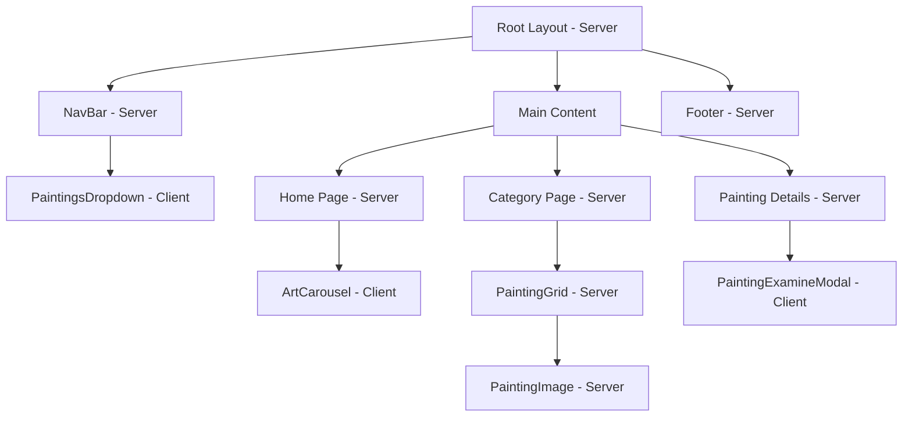

# Next.js Best Practices Analysis

This document identifies deviations from current Next.js (v16) and React (v19) best practices in the clientapp.

## Summary

| Priority | Issue | Impact |
|----------|-------|--------|
| High | Unnecessary client components | Performance, bundle size |
| High | Client component for painting details page | SEO, initial load |
| Medium | Hardcoded carousel data | Maintainability |
| Medium | CSS module import paths | Code organization |
| Low | Missing Image optimization props | Performance |
| Low | Limited error boundaries | User experience |

---

## 1. Unnecessary Client Components

### Issue: [`Footer.tsx`](clientapp/src/components/Footer.tsx:1)
**Current:** Uses `'use client'` directive
**Problem:** Footer has no interactivity - no state, no events, no browser APIs
**Best Practice:** Convert to server component

```typescript
// Current (client component)
'use client'
export default function Footer() { ... }

// Recommended (server component)
export default function Footer() { ... }
```

**Impact:** Reduces JavaScript bundle size sent to client

---

### Issue: [`PaintingImage.tsx`](clientapp/src/components/PaintingImage.tsx:1)
**Current:** Uses `'use client'` directive
**Problem:** Hover effects can be achieved with CSS `:hover` pseudo-class
**Best Practice:** Convert to server component and use CSS hover states

```css
/* Current: JavaScript hover overlay */
.hoverOverlay { ... }

/* Recommended: CSS hover */
.imageWrapper:hover .hoverOverlay {
    opacity: 1;
}
.hoverOverlay {
    opacity: 0;
    transition: opacity 0.2s;
}
```

**Impact:** Reduces client-side JavaScript, improves performance

---

### Issue: [`NavBar.tsx`](clientapp/src/components/NavBar.tsx:1)
**Current:** Entire component is client-side
**Problem:** Only the dropdown needs interactivity
**Best Practice:** Split into server layout + client dropdown component

```typescript
// NavBar.tsx (server component)
export default async function NavBar() {
    const categories = await getAllPaintingCategories();
    
    return (
        <nav>
            <Links />
            <PaintingsDropdown categories={categories} /> {/* client component */}
        </nav>
    );
}

// PaintingsDropdown.tsx (client component)
'use client'
export function PaintingsDropdown({ categories }) {
    // dropdown logic here
}
```

**Impact:** Reduces client bundle, enables server-side rendering of static links

---

## 2. Client Component for Dynamic Route Page

### Issue: [`paintings/[category]/[slug]/page.tsx`](clientapp/src/app/paintings/[category]/[slug]/page.tsx:1)
**Current:** Uses `'use client'` with `useEffect` for data fetching
**Problem:** 
- Content loads asynchronously in browser (poor SEO)
- No streaming/Suspense support
- Flash of loading state

**Best Practice:** Convert to server component with proper data fetching

```typescript
// Current (client component)
'use client'
export default function PaintingDetailsPage({ params }) {
    const [painting, setPainting] = useState(null);
    useEffect(() => {
        async function fetchPainting() {
            const data = await getPaintingBySlug(slug);
            setPainting(data);
        }
        fetchPainting();
    }, [slug]);
    // ...
}

// Recommended (server component)
export default async function PaintingDetailsPage({ params }) {
    const { slug } = await params;
    const painting = await getPaintingBySlug(slug);
    
    if (!painting) {
        return <NotFoundMessage />;
    }
    
    return (
        <div>
            <PaintingContent painting={painting} />
            <PaintingExamineModal painting={painting} /> {/* client component */}
        </div>
    );
}
```

**Impact:** Better SEO, faster initial paint, streaming support

---

## 3. Hardcoded Carousel Data

### Issue: [`ArtCarousel.tsx`](clientapp/src/components/ArtCarousel.tsx:10)
**Current:** Hardcoded image array
**Problem:** 
- Not connected to API
- Manual updates required
- Inconsistent with rest of app

**Best Practice:** Fetch from API with server component wrapper

```typescript
// ArtCarouselWrapper.tsx (server component)
export default async function ArtCarouselWrapper() {
    const images = await getCarouselImages();
    return <ArtCarousel images={images} />;
}

// ArtCarousel.tsx (client component)
'use client'
export function ArtCarousel({ images }) {
    // carousel logic with prop images
}
```

**Impact:** Data consistency, easier maintenance

---

## 4. CSS Module Import Paths

### Issue: [`PaintingGrid.tsx`](clientapp/src/components/PaintingGrid.tsx:2) and [`PaintingImage.tsx`](clientapp/src/components/PaintingImage.tsx:5)
**Current:** Import CSS from page directory
```typescript
import styles from '../app/paintings/[category]/page.module.css';
```

**Problem:** 
- Components depend on specific page structure
- Not reusable
- Tight coupling

**Best Practice:** Move styles to component directory

```typescript
// PaintingGrid.tsx
import styles from './PaintingGrid.module.css';

// PaintingImage.tsx
import styles from './PaintingImage.module.css';
```

**Impact:** Better component encapsulation, reusability

---

## 5. Image Optimization

### Issue: Multiple Image components missing `sizes` prop
**Files:** 
- [`ArtCarousel.tsx`](clientapp/src/components/ArtCarousel.tsx:61)
- [`PaintingImage.tsx`](clientapp/src/components/PaintingImage.tsx:57)

**Current:**
```typescript
<Image
    src={src}
    alt={alt}
    width={400}
    height={400}
    priority={priority}
/>
```

**Best Practice:** Add `sizes` prop for responsive images
```typescript
<Image
    src={src}
    alt={alt}
    width={400}
    height={400}
    sizes="(max-width: 768px) 100vw, 50vw"
    priority={priority}
/>
```

**Impact:** Better image optimization, faster loads on mobile

---

## 6. Error Handling

### Issue: Limited error boundaries
**Current:** Console.error() calls without user-facing error handling

**Best Practice:** 
1. Use Next.js error boundaries (`error.tsx` in routes)
2. Add global error handler
3. Consider React Error Boundaries for client components

```typescript
// app/paintings/[category]/[slug]/error.tsx
'use client'
export default function Error({ error, reset }) {
    return (
        <div>
            <h1>Error loading painting</h1>
            <button onClick={reset}>Try again</button>
        </div>
    );
}
```

**Impact:** Better user experience, graceful degradation

---

## 7. Data Fetching Patterns

### Issue: Mixed data fetching patterns
**Current:** 
- Server components use `await fetch()`
- Client components use `useEffect` with async/await

**Best Practice:** 
- Prefer server components for initial data
- Use React Query or SWR for client-side caching if needed
- Add caching headers: `{ next: { revalidate: 3600 } }`

```typescript
// In api.ts
export async function getAllPaintingCategories(): Promise<PaintingCategory[]> {
    const res = await fetch(`${API_BASE_URL}/paintingcategories`, {
        next: { revalidate: 86400 } // Cache for 24 hours
    });
    // ...
}
```

**Impact:** Better caching, reduced API calls

---

## 8. Component Structure

### Issue: Layout components not in layout directory
**Current:** NavBar and Footer in `/components`

**Best Practice:** Consider moving to `/app/components` or `/components/layout`
```
src/
├── app/
│   ├── layout.tsx
│   ├── page.tsx
│   └── components/
│       ├── NavBar.tsx
│       └── Footer.tsx
├── components/
│   ├── PaintingGrid.tsx
│   └── PaintingImage.tsx
```

**Impact:** Clearer separation of layout vs feature components

---

## Priority Recommendations

### High Priority (Performance Impact)
1. Convert Footer to server component
2. Convert painting details page to server component
3. Split NavBar into server + client components

### Medium Priority (Maintainability)
4. Connect ArtCarousel to API
5. Fix CSS module import paths
6. Add Next.js caching to API calls

### Low Priority (Polish)
7. Add `sizes` prop to Image components
8. Add error boundaries
9. Consider component directory reorganization

---

## Mermaid Diagram: Recommended Component Architecture



---

## Implementation Order

For minimal disruption, implement in this order:

1. **Footer** - Simple conversion, no logic changes
2. **API Caching** - Add revalidate headers to api.ts
3. **PaintingImage** - Convert hover to CSS
4. **ArtCarousel** - Add API integration
5. **NavBar** - Split into server/client
6. **Painting Details Page** - Convert to server component
7. **CSS Modules** - Reorganize style files
8. **Error Boundaries** - Add error.tsx files
9. **Image Optimization** - Add sizes props