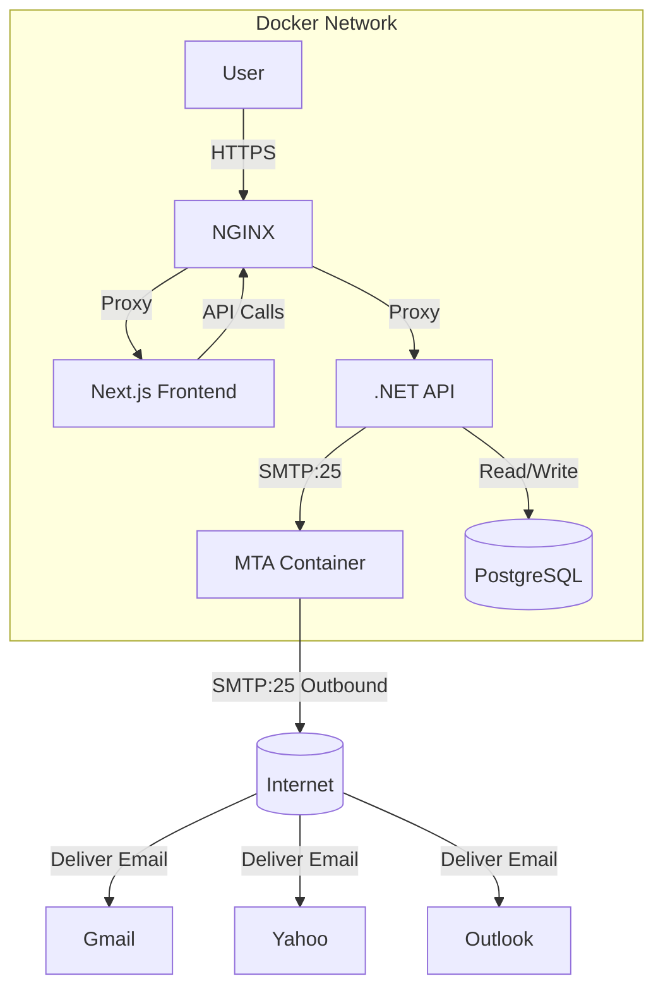
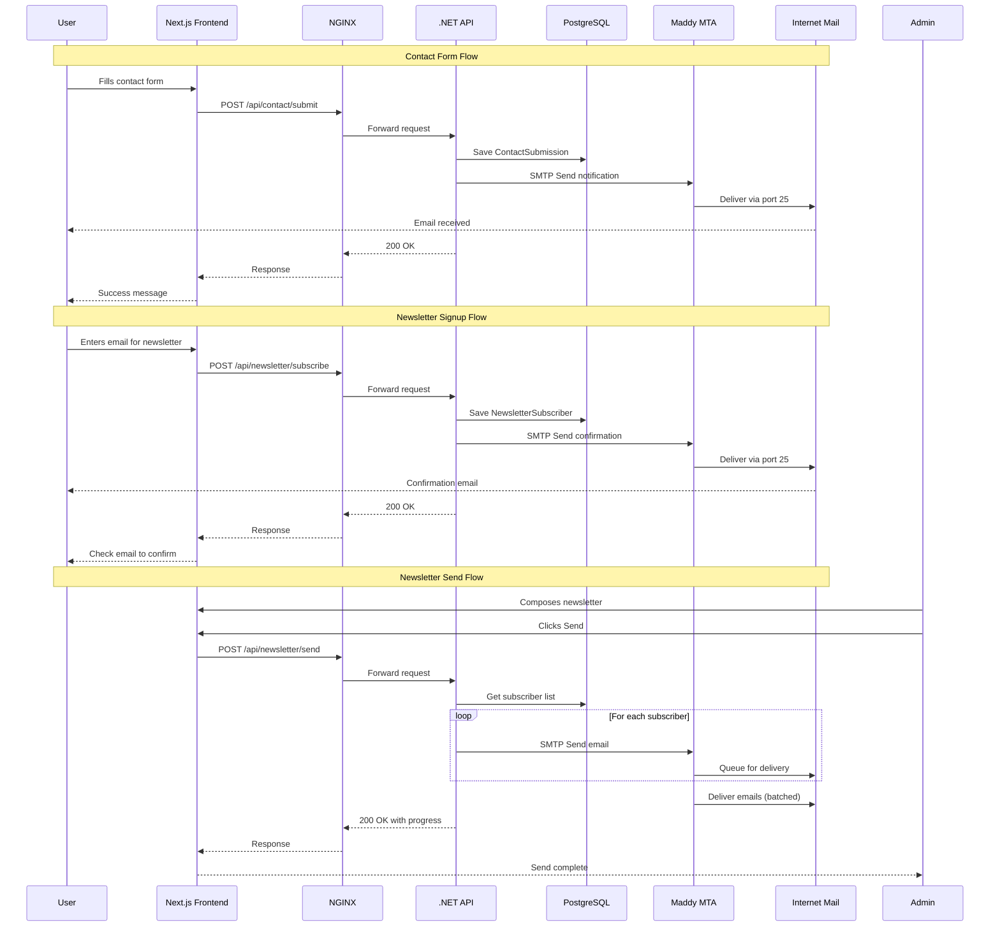

# Contact Form & Newsletter Feature Analysis

## Overview

This document analyzes the requirements, options, and trade-offs for adding two new features to the painting gallery website:

1. **Contact Form** - Form fields on each site's contact page that send automated notification emails
2. **Newsletter Signup** - Email subscription system for sending website update notifications

## Current Architecture Context

### Technology Stack
- **Frontend**: Next.js with App Router, React TypeScript, Bootstrap
- **Backend**: .NET 8 with CQRS pattern (MediatR), EF Core, PostgreSQL
- **Deployment**: Docker Compose with multi-site support (ggpaintings.com, flynnart.com)
- **Reverse Proxy**: NGINX with SSL termination
- **Server**: 10th Gen i5, Linux, **static IP with Cloudflare DNS, port 25 confirmed OPEN**

### Relevant Existing Patterns
- **CQRS Pattern**: Commands (`ServerApp.Application/Commands/`) with handlers, separated from Queries
- **Multi-Site Support**: Site-specific seed data via [`ISiteSeedDataProvider`](ServerApp/ServerApp.Infrastructure/SeedData/SiteSpecific/ISiteSeedDataProvider.cs:7)
- **Environment Config**: Site-specific env vars in [`.env.multi.example`](docker-compose/.env.multi.example:1)
- **Contact Page**: Currently renders static HTML from [`PageContent`](clientapp/src/components/PageContent.tsx:19) entity with address="contact"
- **No Existing Email Infrastructure**: Project has ZERO email/Mail/SMTP references in codebase

---

## Feature Requirements

### Contact Form
- Add form fields to contact page (name, email, message, optionally painting reference)
- Submit form data to backend API
- Send notification email to site owner (email address from env vars)
- Store submissions in database for admin review
- Admin panel to view/manage submissions

### Newsletter Signup
- Email subscription form (inline or modal)
- Store subscriber emails in database
- Admin panel to manage subscribers (view, export, delete)
- Send bulk emails to subscribers
- Unsubscribe mechanism (required by CAN-SPAM/GDPR)

---

## Individual Feature Options

### Contact Form Options

#### Option A: Direct SMTP from .NET Backend

**How it works**: Add `MailKit` NuGet package to backend, configure SMTP settings via env vars, send emails directly from command handlers.

**Pros:**
- Simplest implementation - single service, no external dependencies
- Full control over email content and timing
- Works reliably with any SMTP provider (Gmail, SendGrid free tier, custom mail server)
- No additional infrastructure costs
- Fits existing CQRS pattern naturally

**Cons:**
- SMTP configuration required per site (different credentials in env vars)
- Email delivery reliability depends on SMTP provider
- No built-in email tracking (opens, clicks, bounces)
- Rate limiting handled by SMTP provider only
- SMTP credentials stored in environment (security consideration)

**Implementation Effort:** Low-Medium

#### Option B: Transactional Email Service (SendGrid/Resend/AWS SES)

**How it works**: Integrate with a dedicated email API service. SendGrid offers free tier (100 emails/day), Resend offers 3,000 emails/month free.

**Pros:**
- Professional email delivery with tracking (opens, clicks, bounces)
- Better deliverability rates (dedicated IPs, reputation management)
- Webhook support for bounce/complaint handling
- Template support for consistent email formatting
- Free tiers sufficient for low-volume art gallery sites

**Cons:**
- External dependency on third-party service
- API key management required
- Slight learning curve for template setup
- Rate limits on free tiers (SendGrid: 100/day, Resend: 3,000/month)
- Requires additional env var per site

**Implementation Effort:** Medium

#### Option C: Serverless Email via Next.js API Route

**How it works**: Handle form submission entirely in Next.js API route, bypass .NET backend, call email service directly from frontend container.

**Pros:**
- Simpler frontend-only solution
- No backend changes required

**Cons:**
- Breaks existing architecture pattern (all data flows through .NET API)
- Email credentials exposed in frontend container
- No database storage of submissions
- Harder to manage multi-site config
- No admin panel integration

**Implementation Effort:** Low (but architecturally inconsistent)

### Newsletter Options

#### Option A: Database-Driven with SMTP/Bulk Email

**How it works**: Store subscribers in PostgreSQL, admin composes emails in admin panel, backend sends via SMTP or email service API.

**Pros:**
- Full ownership of subscriber data
- No external service costs
- Integrates with existing admin panel
- Can segment by site (gg vs flynn)

**Cons:**
- Bulk email sending from single server has limitations:
  - SMTP rate limits (Gmail: 500/day, most providers: 100-500/day)
  - No built-in deliverability optimization
  - No unsubscribe tracking without building it
  - No open/click analytics
- Requires careful implementation to avoid spam flags
- CAN-SPAM/GDPR compliance requires unsubscribe link management

**Implementation Effort:** Medium-High

#### Option B: Third-Party Newsletter Service (Mailchimp/ConvertKit/Brevo)

**How it works**: Embed signup form from service, manage subscribers and campaigns externally, optionally sync data to database.

**Pros:**
- Professional email templates and drag-and-drop editor
- Built-in unsubscribe management (GDPR/CAN-SPAM compliant)
- Analytics (opens, clicks, bounces, unsubscribes)
- Automated sending with scheduling
- Free tiers available (Mailchimp: 500 contacts, Brevo: 300/day)
- No server-side email sending required

**Cons:**
- External dependency
- Subscriber data stored externally
- Additional API integration required
- Branding may include service name on free tiers
- Per-site API keys required

**Implementation Effort:** Medium

#### Option C: Hybrid Approach

**How it works**: Use third-party service for email sending but store subscriber list locally in database. Admin manages subscribers in admin panel, syncs to external service for sending.

**Pros:**
- Best of both worlds: local data ownership + professional sending
- Can switch email providers without losing data

**Cons:**
- Most complex implementation
- Sync logic between local DB and external service
- Two sources of truth to manage

**Implementation Effort:** High

---

## Unified MTA Container Option

### Concept

Add a dedicated **Mail Transfer Agent (MTA)** container to docker-compose that serves as the email infrastructure for **both** contact form notifications and newsletter bulk sends. The .NET API communicates with the MTA via SMTP on the Docker internal network (port 25), and the MTA handles outbound delivery directly to recipient mail servers.

**Key advantage**: Single email infrastructure serving both features, eliminating the need to mix technologies (e.g., SMTP for contact + Brevo for newsletter).

### MTA Technology Comparison

| Feature | Postfix | Maddy | OpenSMTPD | Exim |
|---------|---------|-------|-----------|------|
| **Maturity** | Industry standard, 30+ years | Modern, ~5 years | Mature, ~15 years | Industry standard, 30+ years |
| **Config Complexity** | High (multiple files) | **Low (single file)** | Medium | High |
| **Docker Image** | Many available | `foxcpp/maddy` | `ghcr.io/smartcat/ddns` | Available |
| **Memory Footprint** | ~100-200MB | **~30-50MB** | ~50-100MB | ~100-200MB |
| **Built-in DKIM** | No (need OpenDKIM) | **Yes** | No (need additional) | Yes |
| **Queue Management** | Excellent | Good | Good | Excellent |
| **Rate Limiting** | Good | Basic | Good | Excellent |
| **TLS/STARTTLS** | Yes | **Yes** | Yes | Yes |
| **Virtual Domains** | Yes | **Yes** | Yes | Yes |
| **Learning Curve** | Steep | **Gentle** | Moderate | Steep |
| **Community** | **Massive** | Small | Medium | Large |
| **Active Development** | Yes | **Yes** | Slower | Yes |

### MTA Container Architecture



### MTA Container Configuration (docker-compose)

```yaml
mailservice:
  image: foxcpp/maddy:latest  # or postfix image
  container_name: artgallery-mta
  volumes:
    - ./mailservice/config/maddy.conf:/etc/maddy/maddy.conf:ro
    - mailservice_data:/data
  environment:
    - MADDY_DOMAINS=ggpaintings.com,flynnart.com
  networks:
    - artgallery-network
  restart: unless-stopped
  deploy:
    resources:
      limits:
        cpus: '1'
        memory: 256M
      reservations:
        cpus: '0.25'
        memory: 64M
```

### How .NET API Communicates with MTA

The .NET backend uses `MailKit` to send emails to the MTA container via Docker internal network:

```csharp
// Configuration via env vars
var smtpHost = Environment.GetEnvironmentVariable("SMTP_HOST") ?? "mailservice";
var smtpPort = int.Parse(Environment.GetEnvironmentVariable("SMTP_PORT") ?? "25");

// Send email to MTA container
using var client = new SmtpClient();
client.Connect(smtpHost, smtpPort, SecureSocketOptions.None);
client.Send(message);
client.Disconnect(true);
```

### DNS Requirements (Cloudflare)

Regardless of MTA choice, these DNS records are required for deliverability:

| Record | Purpose | Example |
|--------|---------|---------|
| **A Record** | Mail server IP | `mail.ggpaintings.com` → `your_static_ip` |
| **MX Record** | Mail routing | `ggpaintings.com` → `mail.ggpaintings.com` (priority 10) |
| **SPF** | Authorized senders | `v=spf1 ip4:your_static_ip -all` |
| **DKIM** | Email signing | MTA-generated key published as TXT record |
| **DMARC** | Policy | `v=DMARC1; p=none; rua=mailto:admin@ggpaintings.com` |
| **PTR (rDNS)** | Reverse DNS | `your_static_ip` → `mail.ggpaintings.com` |

**PTR Record Note**: This requires ISP support. With a static IP, some ISPs allow PTR configuration through their portal or support ticket. Without PTR, emails may land in spam despite SPF/DKIM/DMARC.

### MTA Container - Pros (Unified Approach)

| Advantage | Impact |
|-----------|--------|
| **Single email infrastructure** | One container handles both contact form AND newsletter |
| **No external dependencies** | Fully self-hosted, no third-party email services |
| **No per-email costs** | Unlimited sending (no free tier limits) |
| **Full data ownership** | All email data stays on your server |
| **Built-in queue management** | MTA handles retries, bounces, deferred delivery |
| **Consistent technology** | Same sending mechanism for both features |
| **No rate limits** | Send unlimited emails (ISP bandwidth limited) |
| **Shared SMTP config** | One MTA config serves both sites |
| **Port 25 confirmed open** | Direct delivery possible |

### MTA Container - Cons

| Challenge | Severity | Mitigation |
|-----------|----------|------------|
| **DNS setup required** | Medium | SPF/DKIM/DMARC in Cloudflare; PTR may need ISP help |
| **Initial config complexity** | Medium | Maddy has simplest config; Postfix has most docs |
| **IP reputation management** | Medium | Start slow, warm up IP; monitor spam complaints |
| **No built-in analytics** | Low | Build basic tracking in .NET (open pixels, click links) |
| **Bounce handling** | Low | MTA logs bounces; parse logs or use LMTP |
| **Spam folder risk** | Medium | Proper DNS + gradual volume increase |
| **Maintenance responsibility** | Low | MTA is set-and-forget; occasional log review |
| **Resource usage** | Low | Maddy: ~50MB RAM; Postfix: ~150MB RAM |

---

## Comprehensive Comparison Matrix

### All Approaches Compared

| Criteria | MTA Container (Unified) | Direct SMTP + Brevo (Mixed) | All Third-Party (SendGrid+Brevo) | Direct SMTP Only (.NET) |
|----------|------------------------|----------------------------|--------------------------------|------------------------|
| **Contact Form** | ✅ MTA handles | ✅ .NET SMTP | ✅ SendGrid API | ✅ .NET SMTP |
| **Newsletter** | ✅ MTA handles | ✅ Brevo handles | ✅ Brevo handles | ⚠️ .NET SMTP (rate limited) |
| **Containers Added** | +1 (MTA) | 0 | 0 | 0 |
| **External Dependencies** | 0 | 1 (Brevo) | 2 (SendGrid + Brevo) | 0 |
| **Monthly Cost** | $0 | $0 (free tiers) | $0 (free tiers) | $0 |
| **Per-Email Cost** | $0 | $0 (within limits) | $0 (within limits) | $0 |
| **Rate Limits** | None (self-managed) | Brevo: 300/day | SendGrid: 100/day, Brevo: 300/day | SMTP provider limits |
| **Data Ownership** | Full | Partial (subscribers external) | Partial | Full |
| **Analytics** | Build yourself | Brevo provides | Both provide | Build yourself |
| **GDPR Compliance** | Build yourself | Brevo handles | Both handle | Build yourself |
| **Deliverability** | Depends on DNS setup | Good (Brevo reputation) | Excellent | Depends on SMTP provider |
| **Setup Complexity** | Medium (DNS + MTA config) | Low-Medium | Low | Low |
| **Ongoing Maintenance** | Medium (MTA + DNS) | Low | Low | Low |
| **Scalability** | High (self-managed) | Limited by free tiers | Limited by free tiers | Limited by SMTP provider |
| **Tech Stack Consistency** | **High** (one email tech) | Medium (SMTP + API) | Low (two different APIs) | **High** (one email tech) |

### Difficulty Assessment

| Approach | Initial Setup | Ongoing Maintenance | Debugging |
|----------|--------------|---------------------|-----------|
| **MTA Container (Maddy)** | ⭐⭐⭐ Medium | ⭐⭐ Low-Medium | ⭐⭐⭐ Medium |
| **MTA Container (Postfix)** | ⭐⭐⭐⭐ High | ⭐⭐ Low-Medium | ⭐⭐ Low |
| **Direct SMTP + Brevo** | ⭐⭐ Low-Medium | ⭐ Low | ⭐⭐ Low-Medium |
| **All Third-Party** | ⭐⭐ Low-Medium | ⭐ Low | ⭐ Low |
| **Direct SMTP Only** | ⭐⭐ Low-Medium | ⭐ Low | ⭐⭐ Low-Medium |

---

## Recommendation

### Recommended Approach: **MTA Container with Maddy**

**Rationale:**

1. **Port 25 is confirmed open** - This is the critical prerequisite that makes the MTA approach viable
2. **Unified infrastructure** - Single container serves both contact form AND newsletter, keeping technology consistent
3. **Maddy chosen over Postfix** because:
   - Simpler configuration (single file vs multiple files)
   - Built-in DKIM signing (Postfix requires OpenDKIM sidecar)
   - Smaller memory footprint (~50MB vs ~150MB)
   - Gentler learning curve
   - Active development
4. **No external dependencies** - Full data ownership, no rate limits, no per-email costs
5. **Static IP + Cloudflare DNS** - You already have the prerequisites for proper DNS setup
6. **Low volume use case** - Art gallery sites send infrequent emails; MTA is overkill for volume but perfect for control

### When NOT to use MTA Container

| Scenario | Better Alternative |
|----------|-------------------|
| No PTR record available from ISP | Direct SMTP (MailKit) through Gmail/relay |
| Need professional analytics (opens, clicks, A/B testing) | Third-party (Brevo/SendGrid) |
| Want zero maintenance | Third-party service |
| High volume (1000+ emails/day) | Third-party with paid plan |
| No time for DNS setup | Third-party service |

---

## Database Schema Changes

### Contact Submissions
```sql
CREATE TABLE ContactSubmissions (
    Id UUID PRIMARY KEY DEFAULT gen_random_uuid(),
    Name VARCHAR(200) NOT NULL,
    Email VARCHAR(256) NOT NULL,
    Subject VARCHAR(500),
    Message TEXT NOT NULL,
    PaintingId UUID REFERENCES Paintings(Id),
    IsRead BOOLEAN DEFAULT FALSE,
    CreatedAt TIMESTAMP WITH TIME ZONE DEFAULT NOW()
);
CREATE INDEX IX_ContactSubmissions_IsRead ON ContactSubmissions(IsRead);
CREATE INDEX IX_ContactSubmissions_CreatedAt ON ContactSubmissions(CreatedAt DESC);
```

### Newsletter Subscribers
```sql
CREATE TABLE NewsletterSubscribers (
    Id UUID PRIMARY KEY DEFAULT gen_random_uuid(),
    Email VARCHAR(256) NOT NULL UNIQUE,
    SubscribedAt TIMESTAMP WITH TIME ZONE DEFAULT NOW(),
    IsConfirmed BOOLEAN DEFAULT FALSE,
    ConfirmationToken VARCHAR(256),
    UnsubscribedAt TIMESTAMP WITH TIME ZONE,
    UnsubscribeToken VARCHAR(256)
);
CREATE INDEX IX_NewsletterSubscribers_Email ON NewsletterSubscribers(Email);
CREATE INDEX IX_NewsletterSubscribers_IsConfirmed ON NewsletterSubscribers(IsConfirmed);
```

---

## Environment Variables (per site)

### MTA Container
```bash
# MTA virtual domains
MTA_DOMAINS=ggpaintings.com,flynnart.com
```

### Per-Site API Configuration
```bash
# SMTP connection to MTA container (Docker internal)
SMTP_HOST=mailservice
SMTP_PORT=25

# Site-specific sender configuration
SMTP_FROM_ADDRESS=noreply@ggpaintings.com
SMTP_FROM_NAME=Gloria Gronowicz Fine Art
CONTACT_NOTIFICATION_EMAIL=gloriagronowicz@gmail.com

# Newsletter configuration
NEWSLETTER_FROM_ADDRESS=newsletter@ggpaintings.com
NEWSLETTER_FROM_NAME=Gloria Gronowicz Fine Art Newsletter
NEWSLETTER_UNSUBSCRIBE_URL=https://ggpaintings.com/unsubscribe
```

---

## Implementation Phases

### Phase 0: MTA Container Setup
1. Choose MTA technology (Maddy recommended)
2. Create `docker-compose/mail/` directory with configuration
3. Add `mailservice` container to docker-compose files
4. Configure virtual domains for both sites
5. Set up DKIM keys
6. Configure Cloudflare DNS records (MX, SPF, DKIM, DMARC)
7. Request PTR record from ISP (if not auto-configured)
8. Test email delivery with `swaks` or `sendmail` command

### Phase 1: Contact Form
1. Add `MailKit` NuGet package to backend
2. Create `IEmailService` interface and `SmtpEmailService` implementation
3. Create `ContactSubmission` entity with value objects
4. Create `SubmitContact` command with handler
5. Create `ContactController` with POST endpoint (public, no auth required)
6. Add rate limiting middleware for contact endpoint
7. Create contact form component in Next.js
8. Add admin panel to view submissions

### Phase 2: Newsletter Signup
1. Create `NewsletterSubscriber` entity
2. Create `SubscribeNewsletter` command with handler
3. Create `NewsletterController` with POST subscribe endpoint
4. Create newsletter signup form component
5. Implement double opt-in (send confirmation email via MTA)
6. Implement unsubscribe endpoint with token verification
7. Add admin panel to view/export subscribers

### Phase 3: Newsletter Email Composer
1. Create email composer in admin panel (HTML editor)
2. Create `SendNewsletter` command with handler
3. Implement batch sending with rate limiting (e.g., 10 emails/minute)
4. Add progress tracking for large sends
5. Add basic open tracking (optional)

### Phase 4: Polish & Monitoring
1. Add email delivery monitoring (parse MTA logs)
2. Add bounce handling
3. Add spam complaint handling
4. Set up log rotation for MTA
5. Health check endpoint for MTA container

---

## Maddy Configuration Example

```conf
# maddy.conf - Maddy MTA Configuration for Painting Gallery

# General settings
log stdout

listen smtp :25 {
    protocol smtp {
        # Accept mail from .NET API containers
        allow if src_ip_in 172.16.0.0/12 {
            accept
        }
        
        # Reject everything else (prevent open relay)
        reject "Relay access denied"
    }
}

# Virtual domains
domain ggpaintings.com {
    storage filesystem {
        root /data/ggpaintings.com
    }
    
    dkim_key default /data/dkim/ggpaintings.com.default
    
    hostname mail.ggpaintings.com
    
    # Outbound delivery
    deliver smtp {
        host {destination}
        port 25
    }
}

domain flynnart.com {
    storage filesystem {
        root /data/flynnart.com
    }
    
    dkim_key default /data/dkim/flynnart.com.default
    
    hostname mail.flynnart.com
    
    deliver smtp {
        host {destination}
        port 25
    }
}
```

---

## Security Considerations

### Contact Form
- **Rate limiting**: Prevent abuse with IP-based rate limiting (e.g., 5 submissions/hour/IP)
- **Honeypot field**: Add hidden field to detect bots
- **Input sanitization**: Use existing `IHtmlSanitizer` for message content
- **No auth required**: Form is public, but rate-limited

### Newsletter
- **Double opt-in**: Send confirmation email before activating subscription
- **Unsubscribe token**: Secure token-based unsubscribe (no auth required)
- **Email validation**: Validate email format before storing
- **GDPR compliance**: Clear privacy notice, easy unsubscribe

### MTA Container
- **Closed relay**: Only accept mail from Docker internal network (172.16.0.0/12)
- **No external SMTP auth needed**: API containers authenticate via network isolation
- **TLS for outbound**: Maddy supports automatic TLS negotiation
- **Regular updates**: Keep Maddy image updated for security patches

---

## Server Capacity Considerations

### Current Server: 10th Gen i5, Linux, Port 25 Open

| Resource | Current Usage | MTA Addition | Total |
|----------|--------------|--------------|-------|
| **CPU** | ~2 cores (API + Frontend) | ~0.25 core (MTA idle) | ~2.25 cores |
| **Memory** | ~3GB (all containers) | ~50MB (Maddy) | ~3.05GB |
| **Disk** | PostgreSQL + images | ~100MB (queue + DKIM) | Minimal |
| **Network** | HTTPS traffic | SMTP outbound | Minimal |

### Email Volume Estimates

| Type | Estimated Volume | Impact |
|------|-----------------|--------|
| Contact form notifications | 5-20/month | Negligible |
| Newsletter sends | 1-4/month × 50-200 subscribers | Low |
| Confirmation emails | 5-20/month | Negligible |
| **Total** | ~500-1000 emails/month | **Well within capacity** |

### No capacity concerns identified for MTA approach.

---

## Mermaid Architecture Diagram



---

## Files to Create/Modify

### MTA Container
**New Files:**
- `docker-compose/mail/maddy.conf` - Maddy configuration
- `docker-compose/mail/Dockerfile` - Optional custom Maddy image
- `docker-compose/mail/generate-dkim.sh` - DKIM key generation script

**Modified Files:**
- `docker-compose/docker-compose.multi.yml` - Add `mailservice` container
- `docker-compose/docker-compose.multi.local.yml` - Add `mailservice` for local dev
- `docker-compose/.env.multi.example` - Add MTA env vars

### Backend (.NET)
**New Files:**
- `ServerApp.Domain/Entities/ContactSubmission.cs`
- `ServerApp.Domain/Entities/NewsletterSubscriber.cs`
- `ServerApp.Domain/ValueObjects/Contact/ContactName.cs`
- `ServerApp.Domain/ValueObjects/Contact/ContactEmail.cs`
- `ServerApp.Domain/ValueObjects/Contact/ContactMessage.cs`
- `ServerApp.Domain/Services/IEmailService.cs`
- `ServerApp.Domain/Events/ContactSubmittedEvent.cs`
- `ServerApp.Domain/Events/NewsletterSubscribedEvent.cs`
- `ServerApp.Application/Commands/SubmitContact.cs`
- `ServerApp.Application/Commands/SubscribeNewsletter.cs`
- `ServerApp.Application/Commands/SendNewsletter.cs`
- `ServerApp.Application/Commands/Handlers/SubmitContactHandler.cs`
- `ServerApp.Application/Commands/Handlers/SubscribeNewsletterHandler.cs`
- `ServerApp.Application/Commands/Handlers/SendNewsletterHandler.cs`
- `ServerApp.Application/DTOs/ContactSubmissionDto.cs`
- `ServerApp.Application/DTOs/NewsletterSubscriberDto.cs`
- `ServerApp.Api/Controllers/ContactController.cs`
- `ServerApp.Api/Controllers/NewsletterController.cs`
- `ServerApp.Infrastructure/Services/SmtpEmailService.cs`
- `ServerApp.Infrastructure/EF/Config/ContactSubmissionConfiguration.cs`
- `ServerApp.Infrastructure/EF/Config/NewsletterSubscriberConfiguration.cs`
- `ServerApp.Infrastructure/EF/Repositories/Read/ContactSubmissionReadRepository.cs`
- `ServerApp.Infrastructure/EF/Repositories/Write/ContactSubmissionWriteRepository.cs`
- `ServerApp.Domain/Repositories/Read/IContactSubmissionReadRepository.cs`
- `ServerApp.Domain/Repositories/Write/IContactSubmissionWriteRepository.cs`

**Modified Files:**
- `ServerApp.Infrastructure/Extensions.cs` - Register `IEmailService`
- `ServerApp.Api/Program.cs` - Add rate limiting for contact endpoint
- `ServerApp.Api/ServerApp.Api.csproj` - Add `MailKit` NuGet package

### Frontend (Next.js)
**New Files:**
- `clientapp/src/components/ContactForm.tsx`
- `clientapp/src/components/ContactForm.module.css`
- `clientapp/src/components/NewsletterSignup.tsx`
- `clientapp/src/components/NewsletterSignup.module.css`
- `clientapp/src/app/(admin)/admin/contact-submissions/page.tsx`
- `clientapp/src/app/(admin)/admin/newsletter/page.tsx`
- `clientapp/src/app/(admin)/admin/newsletter/compose/page.tsx`
- `clientapp/src/app/(public)/unsubscribe/[token]/page.tsx`
- `clientapp/src/app/(public)/confirm-newsletter/[token]/page.tsx`
- `clientapp/src/types/contact.ts`
- `clientapp/src/types/newsletter.ts`

**Modified Files:**
- `clientapp/src/app/(public)/contact/page.tsx` - Add ContactForm and NewsletterSignup
- `clientapp/src/lib/api.ts` - Add contact and newsletter API functions
- `clientapp/src/app/(admin)/admin/content/page.tsx` - Add links to new admin pages
- `clientapp/src/types/index.ts` - Export new types

---

## Risk Assessment

| Risk | Likelihood | Impact | Mitigation |
|------|------------|--------|------------|
| PTR record unavailable from ISP | Medium | High (spam folder) | Test deliverability; fallback to relay SMTP |
| IP flagged as spam | Low | High | Gradual warm-up; monitor complaints |
| MTA misconfiguration | Medium | Medium | Thorough testing with test accounts |
| Contact form spam | High | Low | Rate limiting, honeypot field |
| Newsletter spam complaints | Low | High | Double opt-in, clear unsubscribe |
| DNS propagation delays | Low | Low | Wait 24-48h after DNS changes |
| Email credential leak | Low | High | Env vars only, no hardcoded creds |
| MTA container crashes | Low | Medium | Health check + auto-restart in docker-compose |

---

## Next Steps

1. **Verify PTR record availability** - Contact ISP to confirm reverse DNS can be set for static IP
2. **Generate DKIM keys** - Run `maddy generate dkim` for both domains
3. **Configure Cloudflare DNS** - Add MX, SPF, DKIM, DMARC records
4. **Phase 0**: Set up MTA container and verify delivery
5. **Phase 1**: Implement contact form with email notifications
6. **Phase 2**: Implement newsletter signup with double opt-in
7. **Phase 3**: Build newsletter composer in admin panel
8. **Phase 4**: Add monitoring and polish
9. **Testing**: End-to-end testing with Gmail, Yahoo, Outlook accounts
10. **Deployment**: Update docker-compose with MTA container
