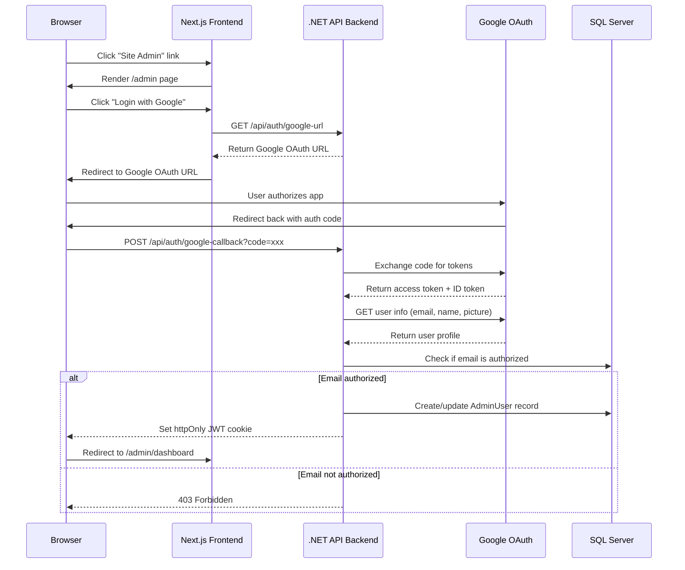

# Google OAuth Admin Login - Simplified Implementation Plan

## Scope

Implement Google OAuth login only:
- "Site Admin" link in footer
- Admin login page with Google OAuth button
- Backend OAuth endpoints with JWT authentication
- Admin user tracking in database
- **No admin dashboard** (to be added in future)

---

## Architecture



---

## Implementation Steps

### Step 1: Backend - Add NuGet Packages

Add to `ServerApp.Api/ServerApp.Api.csproj`:
```xml
<PackageReference Include="Google.Apis.Auth" Version="x.x.x" />
<PackageReference Include="Microsoft.AspNetCore.Authentication.JwtBearer" Version="8.x.x" />
<PackageReference Include="System.IdentityModel.Tokens.Jwt" Version="x.x.x" />
```

### Step 2: Backend - Create Domain Layer Files

**New files in `ServerApp.Domain/`:**

```
ServerApp.Domain/
├── Entities/
│   └── AdminUser.cs
└── ValueObjects/Admin/
    ├── AdminEmail.cs
    ├── AdminName.cs
    ├── AdminPictureUrl.cs
    ├── AdminGoogleSub.cs
    ├── AdminLastLoginAt.cs
    ├── AdminCreatedAt.cs
    └── AdminIsActive.cs
```

**AdminUser Entity:**
```csharp
public class AdminUser : AggregateRoot<Guid>
{
    public AdminEmail Email { get; private set; }
    public AdminName DisplayName { get; private set; }
    public AdminPictureUrl? PictureUrl { get; private set; }
    public AdminGoogleSub GoogleSubjectId { get; private set; }
    public AdminLastLoginAt LastLoginAt { get; private set; }
    public AdminCreatedAt CreatedAt { get; private set; }
    public AdminIsActive IsActive { get; private set; }

    private AdminUser() { }

    internal AdminUser(AdminEmail email, AdminName displayName,
        AdminPictureUrl? pictureUrl, AdminGoogleSub googleSubjectId)
    {
        Email = email;
        DisplayName = displayName;
        PictureUrl = pictureUrl;
        GoogleSubjectId = googleSubjectId;
        CreatedAt = new AdminCreatedAt(DateTime.UtcNow);
        LastLoginAt = new AdminLastLoginAt(DateTime.UtcNow);
        IsActive = new AdminIsActive(true);
    }

    public void UpdateLoginInfo(AdminName? displayName = null,
        AdminPictureUrl? pictureUrl = null)
    {
        if (displayName != null) DisplayName = displayName;
        if (pictureUrl != null) PictureUrl = pictureUrl;
        LastLoginAt = new AdminLastLoginAt(DateTime.UtcNow);
    }
}
```

### Step 3: Backend - Create Infrastructure Layer Files

**New files in `ServerApp.Infrastructure/`:**

```
ServerApp.Infrastructure/
├── EF/
│   ├── Config/
│   │   └── AdminUserConfiguration.cs
│   ├── Contexts/
│   │   ├── ReadDbContext.cs      [MODIFY - add DbSet]
│   │   └── WriteDbContext.cs     [MODIFY - add DbSet]
│   └── Repositories/
│       ├── Read/
│       │   ├── IAdminUserReadRepository.cs
│       │   └── SQLServerAdminUserReadRepository.cs
│       └── Write/
│           ├── IAdminUserWriteRepository.cs
│           └── SQLServerAdminUserWriteRepository.cs
└── Services/
    └── GoogleAuthService.cs
```

**AdminUserConfiguration:**
```csharp
public class AdminUserConfiguration : IEntityTypeConfiguration<AdminUser>
{
    public void Configure(EntityTypeBuilder<AdminUser> builder)
    {
        builder.ToTable("AdminUsers");
        builder.HasKey(e => e.Id);
        builder.Property(e => e.Email).IsRequired().HasMaxLength(256);
        builder.HasIndex(e => e.Email).IsUnique();
        builder.Property(e => e.DisplayName).IsRequired().HasMaxLength(100);
        builder.Property(e => e.PictureUrl).HasMaxLength(500);
        builder.Property(e => e.GoogleSubjectId).IsRequired().HasMaxLength(100);
        builder.HasIndex(e => e.GoogleSubjectId).IsUnique();
        builder.Property(e => e.LastLoginAt).IsRequired();
        builder.Property(e => e.CreatedAt).IsRequired();
        builder.Property(e => e.IsActive).IsRequired();
    }
}
```

**GoogleAuthService:**
```csharp
public interface IGoogleAuthService
{
    string GetAuthorizationUrl(string state);
    Task<GoogleUserProfile?> ExchangeCodeForUserProfileAsync(string code);
}

public class GoogleAuthService : IGoogleAuthService
{
    private readonly string _clientId;
    private readonly string _clientSecret;
    private readonly string _redirectUri;

    public GoogleAuthService(IConfiguration config)
    {
        _clientId = config["GoogleAuth:ClientId"]!;
        _clientSecret = config["GoogleAuth:ClientSecret"]!;
        _redirectUri = config["GoogleAuth:RedirectUri"]!;
    }

    public string GetAuthorizationUrl(string state)
    {
        var request = new AuthorizationUrlBuilder
        {
            ClientId = _clientId,
            RedirectUri = _redirectUri,
            Scope = "email profile openid",
            State = state,
            ResponseType = ResponseType.Code,
            AccessType = AccessType.Offline,
            Prompt = Prompt.SelectAccount
        };
        return request.Build();
    }

    public async Task<GoogleUserProfile?> ExchangeCodeForUserProfileAsync(string code)
    {
        // Exchange code for tokens
        var tokenClient = new TokenResponseRetriever();
        var tokenResponse = await tokenClient.RetrieveAsyncAsync(
            _clientId, _clientSecret, code, _redirectUri);

        // Get user info
        var peopleService = new PeopleServiceBuilder(new BaseClientService.Initializer
        {
            HttpClientInitializer = new Credential(
                Google.Apis.Auth.OAuth2.GoogleAuthConsts.OAuth2,
                tokenResponse)
            .CreateScoped("profile email")
        }).Initialize();

        var person = await peopleService.People.Get("people/me")
            .ExecuteAsync();

        return new GoogleUserProfile(
            person.Emails?.FirstOrDefault()?.Value,
            person.Names?.FirstOrDefault()?.DisplayName,
            person.Picture?.Url,
            person.Metadata?.Sources?.FirstOrDefault()?.Id);
    }
}
```

### Step 4: Backend - Create Application Layer Files

**New files in `ServerApp.Application/`:**

```
ServerApp.Application/
├── Commands/
│   └── LoginWithGoogle.cs
├── Queries/
│   └── GetCurrentUser.cs
├── DTOs/
│   ├── GoogleAuthRequest.cs
│   ├── GoogleAuthResponse.cs
│   └── AdminUserDto.cs
└── Extensions.cs    [MODIFY]
```

**LoginWithGoogle Command:**
```csharp
public class LoginWithGoogle : IRequest<GoogleAuthResponse>
{
    public string Code { get; }
    public string State { get; }
    public LoginWithGoogle(string code, string state)
    {
        Code = code;
        State = state;
    }
}

public class LoginWithGoogleHandler : IRequestHandler<LoginWithGoogle, GoogleAuthResponse>
{
    private readonly IGoogleAuthService _googleAuth;
    private readonly IAdminUserReadRepository _readRepo;
    private readonly IAdminUserWriteRepository _writeRepo;
    private readonly IConfiguration _config;
    private readonly IJwtTokenService _jwtService;

    // Constructor injection...

    public async Task<GoogleAuthResponse> Handle(LoginWithGoogle request, CancellationToken ct)
    {
        // Exchange code for user profile
        var profile = await _googleAuth.ExchangeCodeForUserProfileAsync(request.Code);
        if (profile == null) throw new UnauthorizedException();

        // Check if email is authorized
        var authorizedEmails = _config.GetValue<string>("Admin:AuthorizedEmails")!
            .Split(',', StringSplitOptions.RemoveEmptyEntries | StringSplitOptions.TrimEntries);

        if (!authorizedEmails.Contains(profile.Email, StringComparison.OrdinalIgnoreCase))
            throw new UnauthorizedException("Email not authorized");

        // Find or create admin user
        var adminUser = await _readRepo.GetByGoogleSubjectIdAsync(profile.GoogleSubjectId, ct);
        if (adminUser == null)
        {
            adminUser = new AdminUser(
                new AdminEmail(profile.Email),
                new AdminName(profile.DisplayName),
                new AdminPictureUrl(profile.PictureUrl),
                new AdminGoogleSub(profile.GoogleSubjectId));
            await _writeRepo.AddAsync(adminUser, ct);
        }
        else
        {
            adminUser.UpdateLoginInfo(
                new AdminName(profile.DisplayName),
                new AdminPictureUrl(profile.PictureUrl));
        }

        // Generate JWT
        var token = _jwtService.GenerateToken(adminUser);

        return new GoogleAuthResponse(token, adminUser.ToDto());
    }
}
```

### Step 5: Backend - Create Auth Controller

**New file: `ServerApp.Api/Controllers/AuthController.cs`**

```csharp
[ApiController]
[Route("api/[controller]")]
public class AuthController : BaseController
{
    private readonly IConfiguration _config;
    private readonly IGoogleAuthService _googleAuth;
    private readonly IMediator _mediator;

    [HttpGet("google-url")]
    public IActionResult GetGoogleAuthUrl()
    {
        var state = GenerateStateToken(); // CSRF protection
        var url = _googleAuth.GetAuthorizationUrl(state);
        return Ok(new { url, state });
    }

    [HttpPost("google-callback")]
    public async Task<IActionResult> GoogleCallback([FromBody] GoogleAuthRequest request)
    {
        try
        {
            var response = await _mediator.Send(
                new LoginWithGoogle(request.Code, request.State));

            // Set httpOnly cookie with JWT
            Response.Cookies.Append("admin_jwt", response.Token, new CookieOptions
            {
                HttpOnly = true,
                Secure = true,
                SameSite = SameSiteMode.Strict,
                Expires = DateTime.UtcNow.AddMinutes(
                    _config.GetValue<int>("Admin:JwtExpiryMinutes"))
            });

            return Ok(response.AdminUser);
        }
        catch (UnauthorizedException)
        {
            return Forbid();
        }
    }

    [HttpGet("me")]
    [Authorize]
    public async Task<IActionResult> GetCurrentUser()
    {
        // Return current admin user info
    }

    [HttpPost("logout")]
    public IActionResult Logout()
    {
        Response.Cookies.Delete("admin_jwt");
        return Ok();
    }
}
```

### Step 6: Backend - Configure JWT Authentication

**Modify `ServerApp.Api/Program.cs`:**

```csharp
// Add JWT authentication
builder.Services.AddAuthentication(JwtBearerDefaults.AuthenticationScheme)
    .AddJwtBearer(options =>
    {
        options.TokenValidationParameters = new TokenValidationParameters
        {
            ValidateIssuerSigningKey = true,
            IssuerSigningKey = new SymmetricSecurityKey(
                Encoding.UTF8.GetBytes(builder.Configuration["Admin:JwtSecretKey"]!)),
            ValidateIssuer = false,
            ValidateAudience = false,
            ValidateLifetime = true,
            ClockSkew = TimeSpan.Zero
        };

        // Read token from cookie
        options.Events = new JwtBearerEvents
        {
            OnMessageReceived = context =>
            {
                context.Token = context.Request.Cookies["admin_jwt"];
                return Task.CompletedTask;
            }
        };
    });

builder.Services.AddAuthorization();
```

**Modify `ServerApp.Api/Program.cs` middleware:**

```csharp
app.UseAuthentication();
app.UseAuthorization();
```

### Step 7: Backend - Add Configuration

**Modify `ServerApp.Api/appsettings.Production.json`:**

```json
{
  "GoogleAuth": {
    "ClientId": "",
    "ClientSecret": "",
    "RedirectUri": "https://ggpaintings.com/api/auth/google-callback",
    "Scope": "email profile openid"
  },
  "Admin": {
    "AuthorizedEmails": "",
    "JwtSecretKey": "",
    "JwtExpiryMinutes": 60
  }
}
```

**Modify `docker-compose/.env.example`:**

```bash
# Google OAuth Configuration
GOOGLE_AUTH_CLIENT_ID=
GOOGLE_AUTH_CLIENT_SECRET=
GOOGLE_AUTH_REDIRECT_URI=https://ggpaintings.com/api/auth/google-callback

# Admin Configuration
ADMIN_AUTHORIZED_EMAILS=admin1@gmail.com,admin2@gmail.com
ADMIN_JWT_SECRET_KEY=
ADMIN_JWT_EXPIRY_MINUTES=60
```

**Modify `docker-compose/docker-compose.prod.yml`:**

```yaml
api:
  environment:
    GoogleAuth__ClientId: ${GOOGLE_AUTH_CLIENT_ID}
    GoogleAuth__ClientSecret: ${GOOGLE_AUTH_CLIENT_SECRET}
    GoogleAuth__RedirectUri: ${GOOGLE_AUTH_REDIRECT_URI}
    Admin__AuthorizedEmails: ${ADMIN_AUTHORIZED_EMAILS}
    Admin__JwtSecretKey: ${ADMIN_JWT_SECRET_KEY}
    Admin__JwtExpiryMinutes: ${ADMIN_JWT_EXPIRY_MINUTES}
```

### Step 8: Backend - Create Database Migration

Run EF Core migration:
```bash
dotnet ef migrations add AddAdminUsers --project ServerApp.Infrastructure --startup-project ServerApp.Api
```

### Step 9: Frontend - Add Footer Link

**Modify `clientapp/src/components/Footer.tsx`:**

```tsx
import Link from 'next/link';

export default function Footer() {
    return (
        <footer className="bg-[var(--navbar-footer-bg)] text-white">
            <div className="h-px bg-white w-full"></div>
            <div className="container mx-auto px-4 py-8">
                <div className="grid grid-cols-1 md:grid-cols-2 gap-8">
                    <div className="flex flex-col items-center text-center">
                        <h3 className="text-xl font-bold mb-4" style={{ color: 'var(--title-color)' }}>Email</h3>
                        <p className="text-lg">gloriagronowicz@gmail.com</p>
                    </div>
                    <div className="flex flex-col items-center text-center">
                        <h3 className="text-xl font-bold mb-4" style={{ color: 'var(--title-color)' }}>Phone</h3>
                        <p className="text-lg">860.670.0799</p>
                    </div>
                </div>
                <div className="mt-8 text-center">
                    <Link href="/admin" className="text-xs text-gray-400 hover:text-white transition-colors">
                        Site Admin
                    </Link>
                </div>
            </div>
        </footer>
    );
}
```

### Step 10: Frontend - Create Admin Pages

**New file: `clientapp/src/app/admin/page.tsx`**

```tsx
'use client';

import { useEffect, useState } from 'react';
import { useRouter } from 'next/navigation';

export default function AdminPage() {
    const router = useRouter();
    const [loading, setLoading] = useState(true);

    useEffect(() => {
        // Check if already authenticated
        checkAuth();
    }, []);

    async function checkAuth() {
        try {
            const res = await fetch('/api/auth/me', { credentials: 'include' });
            if (res.ok) {
                router.push('/admin/dashboard');
            } else {
                setLoading(false);
            }
        } catch {
            setLoading(false);
        }
    }

    if (loading) return <div>Loading...</div>;

    return (
        <div className="min-h-screen flex items-center justify-center">
            <div className="text-center">
                <h1 className="text-2xl mb-4">Admin Login</h1>
                <p className="mb-6">Sign in with your authorized Google account</p>
                <GoogleLoginButton />
            </div>
        </div>
    );
}
```

**New file: `clientapp/src/components/GoogleLoginButton.tsx`**

```tsx
'use client';

import { useRouter } from 'next/navigation';

export default function GoogleLoginButton() {
    const router = useRouter();

    const handleLogin = async () => {
        const res = await fetch('/api/auth/google-url');
        const { url } = await res.json();
        window.location.href = url;
    };

    return (
        <button
            onClick={handleLogin}
            className="flex items-center gap-3 bg-white text-gray-700 px-6 py-3 rounded-lg border border-gray-300 hover:bg-gray-50 transition"
        >
            <svg className="w-5 h-5" viewBox="0 0 24 24">
                <path fill="#4285F4" d="M22.56 12.25c0-.78-.07-1.53-.2-2.25H12v4.26h5.92c-.26 1.37-1.04 2.53-2.21 3.31v2.77h3.57c2.08-1.92 3.28-4.74 3.28-8.09z"/>
                <path fill="#34A853" d="M12 23c2.97 0 5.46-.98 7.28-2.66l-3.57-2.77c-.98.66-2.23 1.06-3.71 1.06-2.86 0-5.29-1.93-6.16-4.53H2.18v2.84C3.99 20.53 7.7 23 12 23z"/>
                <path fill="#FBBC05" d="M5.84 14.09c-.22-.66-.35-1.36-.35-2.09s.13-1.43.35-2.09V7.07H2.18C1.43 8.55 1 10.22 1 12s.43 3.45 1.18 4.93l2.85-2.22.81-.62z"/>
                <path fill="#EA4335" d="M12 5.38c1.62 0 3.06.56 4.21 1.64l3.15-3.15C17.45 2.09 14.97 1 12 1 7.7 1 3.99 3.47 2.18 7.07l3.66 2.84c.87-2.6 3.3-4.53 6.16-4.53z"/>
            </svg>
            Sign in with Google
        </button>
    );
}
```

**New file: `clientapp/src/app/admin/dashboard/page.tsx`**

```tsx
import { getCurrentUser } from '@/lib/auth';

export default async function AdminDashboard() {
    const user = await getCurrentUser();

    if (!user) {
        return <div>Unauthorized</div>;
    }

    return (
        <div className="container mx-auto px-4 py-8">
            <h1 className="text-2xl mb-4">Admin Dashboard</h1>
            <p>Welcome, {user.displayName}</p>
            <p className="text-sm text-gray-500">{user.email}</p>
            <div className="mt-6">
                <p className="text-gray-600">Admin management features coming soon.</p>
            </div>
        </div>
    );
}
```

### Step 11: Frontend - Create Auth Utility

**New file: `clientapp/src/lib/auth.ts`**

```typescript
const API_URL = process.env.NEXT_PUBLIC_API_URL || '/api';

export interface AdminUser {
    id: string;
    email: string;
    displayName: string;
    pictureUrl?: string;
}

export async function getCurrentUser(): Promise<AdminUser | null> {
    try {
        const res = await fetch(`${API_URL}/auth/me`, {
            credentials: 'include',
            cache: 'no-store'
        });
        if (res.status === 401 || res.status === 403) return null;
        if (!res.ok) throw new Error('Auth failed');
        return await res.json();
    } catch {
        return null;
    }
}

export async function logout(): Promise<void> {
    await fetch(`${API_URL}/auth/logout`, {
        method: 'POST',
        credentials: 'include'
    });
}
```

### Step 12: Frontend - Add API Route Proxy

**New file: `clientapp/src/app/api/auth/[...route]/route.ts`**

This proxies auth requests from the Next.js frontend to the .NET backend:

```typescript
import { NextRequest, NextResponse } from 'next/server';

const API_URL = process.env.SERVER_API_URL || 'http://api:8080/api';

export async function GET(request: NextRequest) {
    const url = new URL(request.url);
    const path = url.pathname.replace('/api/auth/', '');

    const res = await fetch(`${API_URL}/auth/${path}`, {
        headers: {
            'Cookie': request.cookies.toString()
        }
    });

    const cookieHeader = res.headers.get('set-cookie');
    const response = NextResponse.json(await res.json(), { status: res.status });

    if (cookieHeader) {
        response.headers.set('set-cookie', cookieHeader);
    }

    return response;
}

export async function POST(request: NextRequest) {
    const body = await request.json();
    const url = new URL(request.url);
    const path = url.pathname.replace('/api/auth/', '');

    const res = await fetch(`${API_URL}/auth/${path}`, {
        method: 'POST',
        headers: {
            'Content-Type': 'application/json',
            'Cookie': request.cookies.toString()
        },
        body: JSON.stringify(body)
    });

    const cookieHeader = res.headers.get('set-cookie');
    const response = NextResponse.json(await res.json(), { status: res.status });

    if (cookieHeader) {
        response.headers.set('set-cookie', cookieHeader);
    }

    return response;
}
```

---

## File Summary

### New Backend Files (15 files)
| File | Purpose |
|------|---------|
| `ServerApp.Domain/Entities/AdminUser.cs` | Admin user entity |
| `ServerApp.Domain/ValueObjects/Admin/AdminEmail.cs` | Email value object |
| `ServerApp.Domain/ValueObjects/Admin/AdminName.cs` | Display name value object |
| `ServerApp.Domain/ValueObjects/Admin/AdminPictureUrl.cs` | Picture URL value object |
| `ServerApp.Domain/ValueObjects/Admin/AdminGoogleSub.cs` | Google subject ID value object |
| `ServerApp.Domain/ValueObjects/Admin/AdminLastLoginAt.cs` | Last login timestamp |
| `ServerApp.Domain/ValueObjects/Admin/AdminCreatedAt.cs` | Creation timestamp |
| `ServerApp.Domain/ValueObjects/Admin/AdminIsActive.cs` | Active status |
| `ServerApp.Application/Commands/LoginWithGoogle.cs` | Login command and handler |
| `ServerApp.Application/Queries/GetCurrentUser.cs` | Get current user query |
| `ServerApp.Application/DTOs/GoogleAuthRequest.cs` | OAuth request DTO |
| `ServerApp.Application/DTOs/GoogleAuthResponse.cs` | OAuth response DTO |
| `ServerApp.Application/DTOs/AdminUserDto.cs` | Admin user DTO |
| `ServerApp.Api/Controllers/AuthController.cs` | Auth API endpoints |
| `ServerApp.Infrastructure/Services/GoogleAuthService.cs` | Google OAuth service |

### New Infrastructure Repository Files (4 files)
| File | Purpose |
|------|---------|
| `IAdminUserReadRepository.cs` | Read repository interface |
| `SQLServerAdminUserReadRepository.cs` | SQL Server read implementation |
| `IAdminUserWriteRepository.cs` | Write repository interface |
| `SQLServerAdminUserWriteRepository.cs` | SQL Server write implementation |

### Modified Backend Files (6 files)
| File | Change |
|------|--------|
| `ServerApp.Api/ServerApp.Api.csproj` | Add NuGet packages |
| `ServerApp.Api/Program.cs` | Add JWT auth middleware |
| `ServerApp.Api/appsettings.Production.json` | Add Google/Auth config |
| `ServerApp.Application/Extensions.cs` | Register auth services |
| `ServerApp.Infrastructure/EF/Contexts/ReadDbContext.cs` | Add AdminUsers DbSet |
| `ServerApp.Infrastructure/EF/Contexts/WriteDbContext.cs` | Add AdminUsers DbSet |

### New Frontend Files (5 files)
| File | Purpose |
|------|---------|
| `clientapp/src/app/admin/page.tsx` | Admin login page |
| `clientapp/src/app/admin/dashboard/page.tsx` | Admin dashboard (placeholder) |
| `clientapp/src/components/GoogleLoginButton.tsx` | Google login button |
| `clientapp/src/lib/auth.ts` | Auth utility functions |
| `clientapp/src/app/api/auth/[...route]/route.ts` | API proxy route |

### Modified Frontend Files (1 file)
| File | Change |
|------|--------|
| `clientapp/src/components/Footer.tsx` | Add "Site Admin" link |

### Configuration Files (2 files)
| File | Change |
|------|--------|
| `docker-compose/.env.example` | Add Google/Auth env vars |
| `docker-compose/docker-compose.prod.yml` | Pass env vars to API container |

---

## Google Cloud Console Setup

1. Go to [Google Cloud Console](https://console.cloud.google.com/)
2. Create new project or select existing
3. Enable **People API** (not Google+ API which is deprecated)
4. Go to APIs & Services > Credentials
5. Create **OAuth 2.0 Client ID** (Web application type)
6. Add authorized JavaScript origins: `https://ggpaintings.com`
7. Add authorized redirect URIs: `https://ggpaintings.com/api/auth/google-callback`
8. Copy Client ID and Client Secret

---

## Environment Variables Required

| Variable | Description | Example |
|----------|-------------|---------|
| `GOOGLE_AUTH_CLIENT_ID` | Google OAuth Client ID | `123456.apps.googleusercontent.com` |
| `GOOGLE_AUTH_CLIENT_SECRET` | Google OAuth Client Secret | `GOCSPX-xxxxxxxxx` |
| `GOOGLE_AUTH_REDIRECT_URI` | OAuth redirect URI | `https://ggpaintings.com/api/auth/google-callback` |
| `ADMIN_AUTHORIZED_EMAILS` | Comma-separated admin emails | `admin1@gmail.com,admin2@gmail.com` |
| `ADMIN_JWT_SECRET_KEY` | JWT signing key (min 32 chars) | `YourSuperSecretKey32CharsMin` |
| `ADMIN_JWT_EXPIRY_MINUTES` | JWT token expiry | `60` |

---

## Security Considerations

| Concern | Mitigation |
|---------|------------|
| JWT Secret exposure | Store in Docker secrets / environment variable |
| Email spoofing | Google OAuth validates email; use Google subject ID as unique key |
| Session hijacking | httpOnly cookies, short JWT expiry (60 min) |
| CSRF | State parameter in OAuth flow |
| Unauthorized access | Email whitelist check before issuing JWT |
| CORS | Restrict to ggpaintings.com domain |
