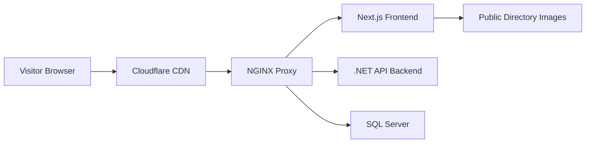

# Image 404 Failure Analysis

## Problem Summary

Image links consistently fail after a few weeks of running on a home internet Linux server. The broken picture link returns a 404, fails from multiple browsers (ruling out browser caching), and frequently affects the carousel. The architecture uses nginx proxy with Cloudflare for caching.

## Architecture Overview



**Request Flow for Images:**
1. Browser requests image (e.g., `/Carousel-Paintings/Wind_and_Water-Carousel.jpg`)
2. Cloudflare checks its cache
3. If miss, request goes to nginx
4. Nginx checks its proxy cache (`/var/cache/nginx/static`)
5. If miss, nginx proxies to Next.js frontend
6. Next.js serves from `/public` directory

---

## Possible Causes for Intermittent 404 Failures

### CAUSE 1: Cloudflare Caching 404 Responses (HIGH LIKELIHOOD)

**Description:** Cloudflare can cache error responses including 404s. If a 404 occurs during deployment, container restart, or any transient issue, Cloudflare may cache that 404 response and serve it to subsequent visitors.

**Why it fits the symptoms:**
- Affects multiple browsers (it's at the CDN level)
- Appears after weeks of running (a transient 404 during a restart gets cached)
- Link "looks correct" but returns 404 (Cloudflare serves cached 404)

**Cloudflare Default Behavior:**
- By default, Cloudflare does NOT cache 404 responses on the Free plan
- On Pro/Business/Enterprise plans, Cloudflare CAN cache error pages
- Cloudflare "Always Online" feature may serve cached pages when origin is down

**How to verify:**
```bash
# Check Cloudflare cache-status header in response
curl -I https://ggpaintings.com/Carousel-Paintings/Wind_and_Water-Carousel.jpg
# Look for: cf-cache-status: HIT (means Cloudflare served from cache)
```

**Fix:**
1. In Cloudflare dashboard: Cache Level -> Bypass Cache on Query String
2. Add Page Rule or Cache Rule: Bypass cache for error responses (4xx, 5xx)
3. Purge Cloudflare cache after deployments
4. Set Cache-Control headers on error responses to prevent caching

---

### CAUSE 2: Nginx tmpfs Cache Volatility (MEDIUM LIKELIHOOD)

**Description:** The nginx static cache is stored in tmpfs (in-memory filesystem):

```yaml
# docker-compose.prod.yml line 108-114
tmpfs:
  - /var/log/nginx
  - /var/cache/nginx        # Main nginx cache
  - /var/cache/nginx/static # Static asset proxy cache
```

**Problem:** tmpfs is volatile. When nginx container restarts:
- All cached entries are lost
- First requests after restart go to Next.js
- If Next.js is slow to start or unhealthy, requests fail with 404
- These 404s might get cached by Cloudflare (see Cause 1)

**Nginx cache configuration:**
```nginx
# nginx.conf line 109
proxy_cache_path /var/cache/nginx/static levels=1:2 keys_zone=static_cache:10m max_size=1g inactive=24h use_temp_path=off;

# nginx.conf line 176-178
proxy_cache static_cache;
proxy_cache_valid 200 30d;
proxy_cache_use_stale error timeout updating http_500 http_502 http_503 http_504;
```

**Issue:** `proxy_cache_valid 200 30d;` only caches 200 responses. However, `proxy_cache_use_stale` serves stale content during errors. If the cache is empty (after restart) and the backend is unavailable, nginx returns an error.

**How to verify:**
```bash
# Check nginx cache status header
curl -I https://ggpaintings.com/Seascapes-Full/Cloud_Creatures.jpg
# Look for: X-Cache-Status: MISS/HIT/EXPIRED
```

---

### CAUSE 3: Nginx Regex Location Block Does NOT Match Carousel Paths (CONFIRMED BUG)

**Description:** The nginx static asset caching location block uses this regex:

```nginx
# nginx.conf line 170
location ~ ^/(Animals|Flowers|Landscapes|Seascapes|Carousel-Paintings|Other)-(Full|Thumbnail)/ {
```

**This regex requires `-(Full|Thumbnail)` suffix after the category name.**

**Actual carousel image path:** `/Carousel-Paintings/Wind_and_Water-Carousel.jpg`

**Regex match attempt:**
- `/Carousel-Paintings/Wind_and_Water-Carousel.jpg` - **DOES NOT MATCH** (no `-Full` or `-Thumbnail`)
- `/Carousel-Paintings-Full/...` - Would match but directory doesn't exist
- `/Carousel-Paintings-Thumbnail/...` - Would match but directory doesn't exist

**Impact:** Carousel images fall through to the generic `location /` block:
```nginx
# nginx.conf line 245-258
location / {
    proxy_pass http://frontend_backend;
    ...
    # NO proxy_cache directive!
}
```

**This means:**
1. Carousel images are NOT cached at nginx level
2. Every carousel request hits Next.js directly
3. Higher load on Next.js for carousel rotations
4. If Next.js has any issue, carousel images fail first

**Same issue affects `/Other/` directory:**
- `/Other/AboutPagePhoto.JPG` does not match the regex
- Falls through to uncached `location /` block

**Fix:** Update nginx regex to also match paths without `-Full`/`-Thumbnail` suffix:
```nginx
location ~ ^/(Animals|Flowers|Landscapes|Seascapes|Carousel-Paintings|Other)(-(Full|Thumbnail))?/ {
```

---

### CAUSE 4: Next.js Standalone Mode Public Directory Issue (MEDIUM LIKELIHOOD)

**Description:** The production Dockerfile uses Next.js standalone output:

```dockerfile
# Dockerfile line 70-77
COPY --from=builder /app/package.json ./
COPY --from=builder /app/package-lock.json ./
COPY --from=builder /app/next.config.ts ./
COPY --from=builder /app/public ./public
COPY --from=builder /app/.next/standalone ./
COPY --from=builder /app/.next/static ./.next/static
```

**Potential Issues:**
1. **Read-only filesystem:** Production frontend has `read_only: true`. Next.js standalone server should work with read-only public directory, but there could be edge cases.
2. **Missing files in build:** If any image files are added to `/public` after the Docker image is built, they won't be available in the running container.
3. **File permission issues:** The production stage runs as user `nextjs` (UID 1001). If file permissions are incorrect, files may not be readable.

**How to verify:**
```bash
# Check if files exist in container
docker exec artgallery-frontend ls -la /app/public/Carousel-Paintings/

# Check file permissions
docker exec artgallery-frontend stat /app/public/Carousel-Paintings/Wind_and_Water-Carousel.jpg
```

---

### CAUSE 5: Database Image URL Mismatch (LOW LIKELIHOOD - STATIC CAROUSEL)

**Description:** The carousel uses **hardcoded** image paths in [`ArtCarousel.tsx`](clientapp/src/components/ArtCarousel.tsx:10):

```typescript
const images = [
    { src: "/Carousel-Paintings/Wind_and_Water-Carousel.jpg", alt: "..." },
    { src: "/Carousel-Paintings/Manatees-Carousel.jpg", alt: "..." },
    // ...
];
```

These paths are NOT fetched from the database. However, painting category pages DO use database-stored URLs:

```typescript
// [category]/page.tsx line 48-49
const images: PaintingImageItem[] = categoryData.paintings.map(painting => ({
    src: painting.imageUrl,
    thumbnailUrl: painting.thumbnailUrl,
```

**If database URLs don't match actual filenames, 404s occur.** Comparing seed data with public files shows consistency for most files, but any manual database edits could introduce mismatches.

---

### CAUSE 6: Container Restart Without Proper Health Check (MEDIUM LIKELIHOOD)

**Description:** Production containers have health checks:

```yaml
# docker-compose.prod.yml
frontend:
  healthcheck:
    test: ["CMD", "wget", "-q", "--spider", "http://127.0.0.1:3000"]
    interval: 30s
    timeout: 10s
    retries: 5
    start_period: 40s

nginx:
  depends_on:
    frontend:
      condition: service_healthy
```

**Problem Scenario:**
1. Frontend container restarts (e.g., OOM kill, crash)
2. During `start_period` (40 seconds), nginx may still route traffic
3. Next.js is not fully ready, returning 404s
4. These 404s get cached by Cloudflare

**After weeks of running:**
- Memory leaks in Next.js could cause OOM kills
- Docker may restart containers due to resource constraints
- Home internet connections may have intermittent issues

---

### CAUSE 7: Disk Space or Inode Exhaustion (LOW LIKELIHOOD)

**Description:** After weeks of running:
- Docker logs may fill up disk space
- tmpfs mounts consume RAM (not disk)
- SQL Server data grows

**If disk is full:**
- Docker containers may fail to write temporary files
- Next.js may fail to serve static assets
- Docker may fail to restart containers

**How to verify:**
```bash
df -h          # Check disk space
df -i          # Check inodes
docker system df  # Check Docker disk usage
```

---

### CAUSE 8: Cloudflare Origin Connection Issues (LOW LIKELIHOOD)

**Description:** Home internet connections may have:
- Dynamic IP addresses
- NAT issues
- Port blocking by ISP
- Intermittent connectivity

**If Cloudflare cannot reach the origin:**
- Requests timeout
- Cloudflare may serve error pages
- If "Always Online" is enabled, Cloudflare serves stale cached content

---

## Summary of Likely Causes (Ranked)

| Rank | Cause | Likelihood | Impact |
|------|-------|------------|--------|
| 1 | Cloudflare caching 404 responses | HIGH | High - affects all users |
| 2 | Nginx regex not matching carousel paths | HIGH | Medium - no nginx caching for carousel |
| 3 | Container restart with health check gap | MEDIUM | Medium - transient 404s |
| 4 | Nginx tmpfs cache volatility | MEDIUM | Low - cache rebuilds after restart |
| 5 | Next.js standalone mode issues | MEDIUM | High if occurring |
| 6 | Database URL mismatch | LOW | High if occurring |
| 7 | Disk space exhaustion | LOW | High if occurring |
| 8 | Cloudflare origin connectivity | LOW | High if occurring |

---

## Recommended Diagnostic Steps

1. **Check Cloudflare cache status:**
   ```bash
   curl -I https://ggpaintings.com/Carousel-Paintings/Wind_and_Water-Carousel.jpg
   ```
   Look for `cf-cache-status` and `Cache-Control` headers.

2. **Check nginx cache status:**
   ```bash
   curl -I https://ggpaintings.com/Seascapes-Full/Cloud_Creatures.jpg
   ```
   Look for `X-Cache-Status` header.

3. **Check container health:**
   ```bash
   docker ps --format "table {{.Names}}\t{{.Status}}\t{{.Health}}"
   ```

4. **Check Docker logs for errors:**
   ```bash
   docker-compose -f docker-compose.prod.yml logs --tail=100 frontend
   docker-compose -f docker-compose.prod.yml logs --tail=100 nginx
   ```

5. **Verify files exist in container:**
   ```bash
   docker exec artgallery-frontend ls -la /app/public/Carousel-Paintings/
   ```

6. **Check Cloudflare cache rules:**
   - Review Page Rules / Cache Rules in Cloudflare dashboard
   - Check if error responses are being cached

---

## Recommended Fixes

### Immediate Fixes

1. **Fix nginx regex for carousel and other paths:**
   Update [`nginx.conf`](docker-compose/nginx/nginx.conf:170) to match paths without `-Full`/`-Thumbnail` suffix.

2. **Purge Cloudflare cache:**
   Purge everything in Cloudflare dashboard to clear any cached 404s.

3. **Add Cache-Control headers for error responses:**
   Ensure 404 responses have `Cache-Control: no-store, no-cache, must-revalidate`.

### Long-term Fixes

4. **Add nginx upstream failover:**
   Configure nginx to handle backend failures gracefully.

5. **Persist nginx cache to disk:**
   Replace tmpfs with a named volume for `/var/cache/nginx/static`.

6. **Add monitoring:**
   Set up health monitoring and alerting for container restarts.

7. **Review Cloudflare cache settings:**
   Ensure error responses are not cached.
