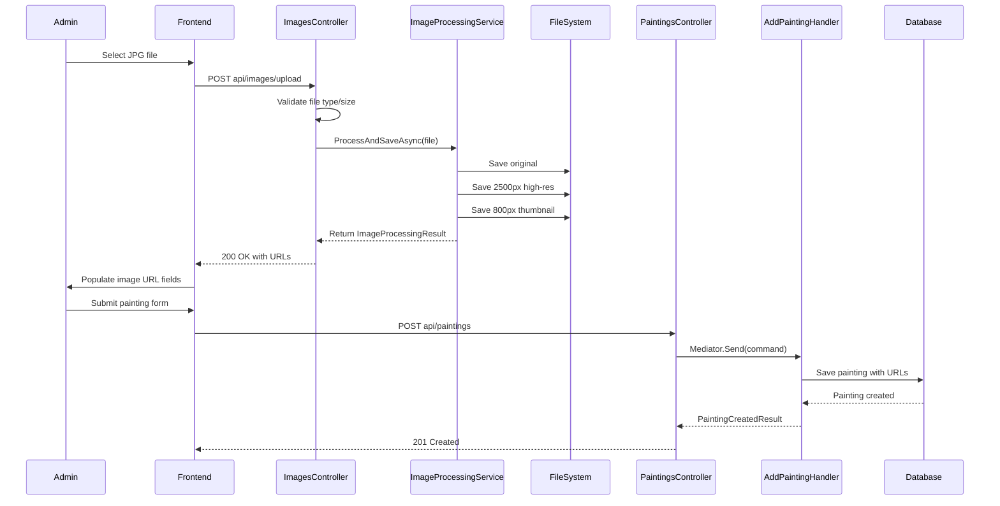
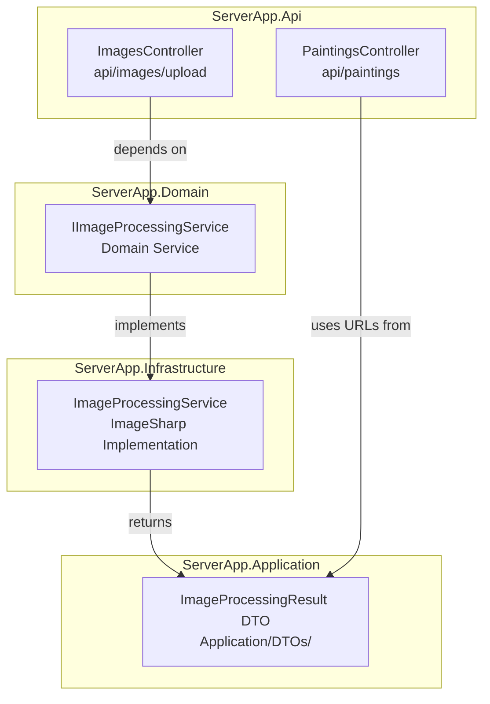

# Image Upload Architecture Plan

## Overview

This plan describes the architecture for uploading JPG images through the "Add Painting" page, processing them into two sizes (2500px high-res and 800px thumbnail), and serving them efficiently through the existing infrastructure.

## Constraints & Considerations

| Factor | Impact |
|--------|--------|
| **Home fiber connection** | Upload speeds may be limited; keep payload sizes reasonable |
| **No GPU** | Use CPU-based image processing (ImageSharp) |
| **Intel Core i5 (2020)** | Sufficient for synchronous image resizing; async only if concurrent uploads expected |
| **Cloudflare proxy** | Leverage Cloudflare CDN for image caching and delivery |
| **DDD + CQRS** | Image processing is a domain service (like `IHtmlSanitizer`), not a command |
| **Docker containers** | Use named volumes for persistent image storage |

## Architecture Analysis

### Existing Service Patterns

The codebase follows two distinct service patterns:

| Pattern | Interface Location | Implementation | Examples |
|---------|-------------------|----------------|----------|
| **Domain Service** | `ServerApp.Domain/Services/` | `ServerApp.Infrastructure/Services/` | [`IHtmlSanitizer`](ServerApp/ServerApp.Domain/Services/IHtmlSanitizer.cs) → [`HtmlSanitizer`](ServerApp/ServerApp.Infrastructure/Services/HtmlSanitizer.cs) |
| **Application Service** | `ServerApp.Application/Services/` | `ServerApp.Infrastructure/Services/` | [`IJwtTokenService`](ServerApp/ServerApp.Application/Services/IJwtTokenService.cs) → [`JwtTokenService`](ServerApp/ServerApp.Infrastructure/Services/JwtTokenService.cs) |

**Image processing is a Domain Service** — it's a technical capability required by the domain (painting images), analogous to HTML sanitization. It does not orchestrate application workflows.

### Existing DI Registration Pattern

All infrastructure services are registered in [`InfrastructureExtensions.AddInfrastructureServices()`](ServerApp/ServerApp.Infrastructure/Extensions.cs:28):

```csharp
// Pattern: Interface in Domain/Application, Implementation in Infrastructure
services.AddScoped<IHtmlSanitizer, HtmlSanitizer>();
services.AddScoped<IGoogleAuthService, GoogleAuthService>();
services.AddScoped<IJwtTokenService, JwtTokenService>();
```

### Existing Configuration Pattern

Configuration is read directly from `IConfiguration` in service constructors (no Options pattern):

```csharp
// Example from JwtTokenService
public JwtTokenService(IConfiguration configuration)
{
    _secretKey = configuration["Admin:JwtSecretKey"];
    _expiryMinutes = int.Parse(configuration["Admin:JwtExpiryMinutes"] ?? "60");
}
```

### Existing Controller Pattern

Controllers are thin and delegate to MediatR for CQRS commands/queries:

```csharp
// Example from PaintingsController
[HttpPost]
public async Task<IActionResult> Add([FromBody] AddPainting command)
{
    var result = await _mediator.Send(command);
    return CreatedAtAction(nameof(GetBySlug), new { slug = result.Slug }, result);
}
```

**Image upload is NOT a CQRS command** — it's an infrastructure operation (file I/O) that returns URLs. The controller calls the domain service directly, similar to how authentication works.

## Recommended Architecture

### Approach: Synchronous Upload with Domain Service

Given the low upload frequency (admin adds paintings occasionally), a **synchronous upload** is simpler and more reliable than async background processing. The upload endpoint processes the image, generates both sizes, and returns the URLs immediately.





## Component Design

### 1. Domain Service Interface

**Location**: `ServerApp/ServerApp.Domain/Services/IImageProcessingService.cs` (new)

Follows the [`IHtmlSanitizer`](ServerApp/ServerApp.Domain/Services/IHtmlSanitizer.cs) pattern — domain service for technical capability. Uses `Stream` instead of `IFormFile` to keep the Domain layer framework-agnostic (no AspNetCore dependency).

```csharp
namespace ServerApp.Domain.Services;

using ServerApp.Application.DTOs;

public interface IImageProcessingService
{
    Task<ImageProcessingResult> ProcessAndSaveAsync(Stream imageStream, string fileName, CancellationToken cancellationToken = default);
    Task DeleteAsync(string fileName, CancellationToken cancellationToken = default);
}
```

**Why not in Shared?** The Shared project has zero dependencies (no NuGet packages, no project references). It contains only foundational abstractions like `AggregateRoot`, `IUnitOfWork`, and value object base classes. `IImageProcessingService` is a domain-specific service, not a kernel-level abstraction. Placing it in Shared would either pollute the kernel with framework dependencies or create an artificial abstraction.

### 2. DTO for Result

**Location**: `ServerApp/ServerApp.Application/DTOs/ImageProcessingResult.cs` (new)

```csharp
namespace ServerApp.Application.DTOs;

public record ImageProcessingResult(
    string OriginalUrl,
    string HighResUrl,
    string ThumbnailUrl
);
```

### 3. Infrastructure Implementation

**Location**: `ServerApp/ServerApp.Infrastructure/Services/ImageProcessingService.cs` (new)

- Uses **SixLabors.ImageSharp** (CPU-based, no GPU required)
- Resizes to 2500px long edge (high-res) and 800px long edge (thumbnail)
- Maintains aspect ratio
- Outputs high-quality JPG with optimized compression
- Generates unique filenames using GUID + safe filename
- Reads configuration from `IConfiguration` directly (matching existing pattern)

### 4. DI Registration

**Location**: [`ServerApp/ServerApp.Infrastructure/Extensions.cs`](ServerApp/ServerApp.Infrastructure/Extensions.cs)

Add to `AddInfrastructureServices()`:
```csharp
// Register image processing service
services.AddScoped<IImageProcessingService, ImageProcessingService>();
```

### 5. Images Controller

**Location**: `ServerApp/ServerApp.Api/Controllers/ImagesController.cs` (new)

```csharp
[ApiController]
[Route("api/[controller]")]
[ServerApp.Api.Filters.AdminAuthorized]
public class ImagesController : BaseController
{
    private readonly IImageProcessingService _imageService;

    public ImagesController(IImageProcessingService imageService)
    {
        _imageService = imageService;
    }

    [HttpPost("upload")]
    public async Task<IActionResult> UploadImage(IFormFile file)
    {
        if (file == null || file.Length == 0)
            return BadRequest("No file uploaded");

        var result = await _imageService.ProcessAndSaveAsync(file);
        return Ok(result);
    }

    [HttpDelete("{fileName}")]
    public async Task<IActionResult> DeleteImage(string fileName)
    {
        await _imageService.DeleteAsync(fileName);
        return NoContent();
    }
}
```

### 6. NuGet Package

**Location**: `ServerApp/ServerApp.Infrastructure/ServerApp.Infrastructure.csproj`

Add:
```xml
<PackageReference Include="SixLabors.ImageSharp" Version="3.1.5" />
```

## Storage Configuration

### Docker Volume

```yaml
# docker-compose/docker-compose.prod.yml
volumes:
  image_data:
    driver: local

services:
  api:
    # Note: Container is read_only: true, so images volume is an exception
    volumes:
      - image_data:/app/images:rw
```

### Directory Structure

```
/app/images/
  original/     # Original uploaded files
  high-res/     # 2500px long edge images
  thumbnail/    # 800px long edge images
```

### NGINX Static File Serving

**Configuration Update**: Add to [`docker-compose/nginx/nginx.conf`](docker-compose/nginx/nginx.conf)

```nginx
location /images/ {
    alias /app/images/;
    expires 30d;
    add_header Cache-Control "public, immutable";
    add_header X-Content-Type-Options nosniff;
    
    # Security: Prevent execution of uploaded files
    location ~* \.(php|asp|jsp|sh|cgi)$ {
        deny all;
    }
}
```

## Image Processing Details

### SixLabors.ImageSharp Processing Pipeline

```csharp
using var image = Image.Load(file.OpenReadStream());

// Resize to 2500px long edge (high-res)
image.Mutate(x => x.Resize(new ResizeOptions {
    Mode = ResizeMode.Max,
    Size = new Size(2500, 2500)
}));
image.SaveAsJpeg(highResPath, new JpegEncoder { Quality = 92 });

// Resize to 800px long edge (thumbnail)
image.Mutate(x => x.Resize(new ResizeOptions {
    Mode = ResizeMode.Max,
    Size = new Size(800, 800)
}));
image.SaveAsJpeg(thumbnailPath, new JpegEncoder { Quality = 85 });
```

### Performance Considerations

| Operation | Estimated Time (i5 2020) | Notes |
|-----------|-------------------------|-------|
| Load 10MB JPG | ~50ms | Memory efficient |
| Resize to 2500px | ~100ms | Single thread |
| Resize to 800px | ~50ms | Single thread |
| Save both files | ~100ms | SSD recommended |
| **Total** | **~300ms** | Well within timeout |

### Resource Limits

- Max file size: 20MB (configurable)
- Allowed formats: JPG/JPEG only
- Max dimensions: 20000px (prevent billion laughs attack)
- Memory limit per image: 256MB

## Configuration

### appsettings.json

```json
{
  "ImageProcessing": {
    "HighResMaxEdge": 2500,
    "ThumbnailMaxEdge": 800,
    "HighResQuality": 92,
    "ThumbnailQuality": 85,
    "MaxFileSizeMb": 20,
    "StoragePath": "/app/images"
  }
}
```

### Environment Variables

| Variable | Default | Description |
|----------|---------|-------------|
| `ImageProcessing__HighResMaxEdge` | 2500 | Long edge for high-res image |
| `ImageProcessing__ThumbnailMaxEdge` | 800 | Long edge for thumbnail |
| `ImageProcessing__MaxFileSizeMb` | 20 | Maximum upload file size |
| `ImageProcessing__StoragePath` | `/app/images` | Base storage directory |

## Security Considerations

1. **File Validation**: Verify magic bytes, not just extension
2. **Size Limits**: Enforce max file size and dimensions
3. **Path Traversal**: Sanitize filenames, use GUID-based naming
4. **NGINX Protection**: Block execution of uploaded files
5. **Admin Only**: Upload endpoint protected by `[AdminAuthorized]`
6. **Container Security**: Minimal write access, read-only where possible

## Files to Create/Modify

### New Files

| File | Layer | Description |
|------|-------|-------------|
| `ServerApp/ServerApp.Domain/Services/IImageProcessingService.cs` | Domain | Domain service interface |
| `ServerApp/ServerApp.Application/DTOs/ImageProcessingResult.cs` | Application | Result DTO |
| `ServerApp/ServerApp.Infrastructure/Services/ImageProcessingService.cs` | Infrastructure | ImageSharp implementation |
| `ServerApp/ServerApp.Api/Controllers/ImagesController.cs` | API | Upload/delete endpoints |

### Modified Files

| File | Layer | Change |
|------|-------|--------|
| `ServerApp/ServerApp.Infrastructure/Extensions.cs` | Infrastructure | Register `IImageProcessingService` |
| `ServerApp/ServerApp.Infrastructure/ServerApp.Infrastructure.csproj` | Infrastructure | Add ImageSharp NuGet package |
| `ServerApp/ServerApp.Api/appsettings.json` | API | Add `ImageProcessing` config section |
| `ServerApp/ServerApp.Api/appsettings.Production.json` | API | Add `ImageProcessing` config section |
| `ServerApp/ServerApp.Api/Dockerfile` | API | Ensure images directory exists |
| `docker-compose/docker-compose.prod.yml` | DevOps | Add `image_data` volume |
| `docker-compose/docker-compose.arm64.yml` | DevOps | Add `image_data` volume |
| `docker-compose/nginx/nginx.conf` | DevOps | Serve `/images/` path |
| `clientapp/src/lib/api.ts` | Frontend | Add `uploadImage` function |
| `clientapp/src/app/(admin)/admin/paintings/add/[slug]/page.tsx` | Frontend | Use upload API |
| `clientapp/src/app/(admin)/admin/paintings/edit/[categorySlug]/[paintingSlug]/page.tsx` | Frontend | Use upload API |

## Alternative Approaches Considered

| Approach | Pros | Cons | Decision |
|----------|------|------|----------|
| **Async Background Queue** | Non-blocking | Complex, overkill for low volume | Rejected |
| **Cloud Storage (S3)** | Scalable | External dependency, cost | Rejected |
| **Client-side Processing** | Reduces server load | Inconsistent results, browser limits | Rejected |
| **CQRS Command for Upload** | Consistent pattern | Over-engineering for file I/O | Rejected |

## Migration Path

1. **Phase 1**: Create domain service interface and infrastructure implementation
2. **Phase 2**: Create ImagesController with upload/delete endpoints
3. **Phase 3**: Configure Docker volumes and NGINX static file serving
4. **Phase 4**: Update frontend add/edit painting pages to use upload API
5. **Phase 5**: Add image cleanup when paintings are deleted (optional)
