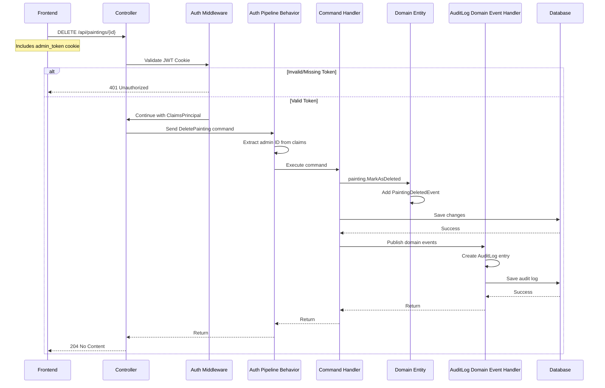
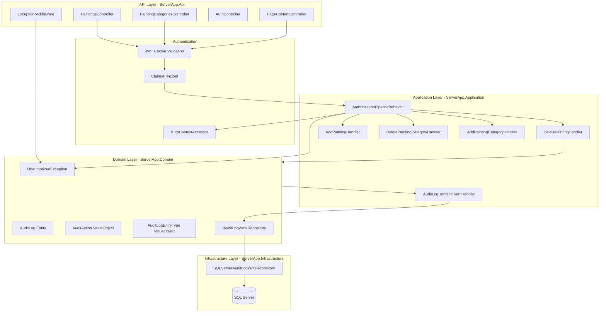

# JWT Authorization and Audit Trail Implementation Plan

## Overview

This plan adds JWT-based authorization to all mutating API calls (POST/DELETE) and implements an audit trail that records which admin performed each operation. The solution follows DDD and CQRS best practices.

---

## Architecture Overview





---

## Phase 1: JWT Authentication Setup

### 1.1 Add NuGet Package

Add to `ServerApp.Api/ServerApp.Api.csproj`:

```xml
<PackageReference Include="Microsoft.AspNetCore.Authentication.JwtBearer" Version="8.x.x" />
```

### 1.2 Configure JWT Authentication in Program.cs

Add to [`Program.cs`](ServerApp/ServerApp.Api/Program.cs) after `AddControllers()`:

```csharp
var jwtSecretKey = builder.Configuration["Admin:JwtSecretKey"];

// Add JWT Authentication
builder.Services.AddAuthentication(options =>
{
    options.DefaultAuthenticateScheme = JwtBearerDefaults.AuthenticationScheme;
    options.DefaultChallengeScheme = JwtBearerDefaults.AuthenticationScheme;
})
.AddJwtBearer(options =>
{
    options.TokenValidationParameters = new TokenValidationParameters
    {
        ValidateIssuerSigningKey = true,
        IssuerSigningKey = new SymmetricSecurityKey(Encoding.UTF8.GetBytes(jwtSecretKey)),
        ValidateIssuer = false,
        ValidateAudience = false,
        ValidateLifetime = true,
        ClockSkew = TimeSpan.Zero
    };

    // Read token from cookie instead of Authorization header
    options.Events = new JwtBearerEvents
    {
        OnMessageReceived = context =>
        {
            if (context.Request.Cookies.ContainsKey("admin_token"))
            {
                context.Token = context.Request.Cookies["admin_token"];
            }
            return Task.CompletedTask;
        }
    };
});

// Add Authorization
builder.Services.AddAuthorization();

// Register IHttpContextAccessor
builder.Services.AddHttpContextAccessor();
```

Add middleware in pipeline after `UseCors`:

```csharp
app.UseAuthentication();
app.UseAuthorization();
```

---

## Phase 2: Authorization Pipeline Behavior

### 2.1 Create AuthorizationPipelineBehavior

**New file:** `ServerApp/ServerApp.Application/Pipeline/AuthorizationPipelineBehavior.cs`

```csharp
namespace ServerApp.Application.Pipeline;

using System.Security.Claims;
using MediatR;
using Microsoft.AspNetCore.Http;
using ServerApp.Domain.Exceptions;

public class AuthorizationPipelineBehavior<TRequest, TResponse> 
    : IPipelineBehavior<TRequest, TResponse>
    where TRequest : IRequest<TResponse>
{
    private readonly IHttpContextAccessor _httpContextAccessor;

    public AuthorizationPipelineBehavior(IHttpContextAccessor httpContextAccessor)
    {
        _httpContextAccessor = httpContextAccessor;
    }

    public async Task<TResponse> Handle(
        TRequest request, 
        RequestHandlerDelegate<TResponse> next, 
        CancellationToken cancellationToken)
    {
        // Only require authorization for commands (mutations)
        if (request is not ICommand)
        {
            return await next();
        }

        var user = _httpContextAccessor.HttpContext?.User;
        
        if (user == null || !user.Identity?.IsAuthenticated ?? true)
        {
            throw new UnauthorizedException("Authentication required to perform this action");
        }

        // Extract admin context for audit trail
        var adminId = user.FindFirst(ClaimTypes.NameIdentifier)?.Value;
        var adminEmail = user.FindFirst(ClaimTypes.Email)?.Value;

        // Set admin context on request if it supports it
        if (request is IAdminContextCommand adminCommand)
        {
            adminCommand.SetAdminContext(
                Guid.TryParse(adminId, out var id) ? id : Guid.Empty,
                adminEmail ?? string.Empty);
        }

        return await next();
    }
}
```

### 2.2 Create ICommand marker interface

**New file:** `ServerApp/ServerApp.Application/Commands/ICommand.cs`

```csharp
namespace ServerApp.Application.Commands;

using MediatR;

/// <summary>
/// Marker interface for commands that require authorization.
/// All write operations should implement this interface.
/// </summary>
public interface ICommand : IRequest { }

/// <summary>
/// Generic command interface for commands that return a result.
/// </summary>
public interface ICommand<TResponse> : IRequest<TResponse> { }
```

### 2.3 Create IAdminContextCommand interface

**New file:** `ServerApp/ServerApp.Application/Commands/IAdminContextCommand.cs`

```csharp
namespace ServerApp.Application.Commands;

/// <summary>
/// Interface for commands that need admin context for audit trail.
/// </summary>
public interface IAdminContextCommand
{
    Guid AdminId { get; }
    string AdminEmail { get; }
    void SetAdminContext(Guid adminId, string adminEmail);
}
```

### 2.4 Register pipeline behavior in Extensions.cs

Update [`Extensions.cs`](ServerApp/ServerApp.Application/Extensions.cs):

```csharp
using Microsoft.Extensions.DependencyInjection;
using MediatR;
using ServerApp.Application.Commands.Handlers;
using ServerApp.Application.Queries.Handlers;
using ServerApp.Application.Pipeline;

namespace ServerApp.Application;

public static class ApplicationExtensions
{
    public static IServiceCollection AddApplicationServices(this IServiceCollection services)
    {
        services.AddMediatR(cfg => cfg.RegisterServicesFromAssembly(typeof(AddPaintingHandler).Assembly));

        // Register authorization pipeline behavior
        services.AddScoped(typeof(IPipelineBehavior<,>), typeof(AuthorizationPipelineBehavior<,>));

        return services;
    }
}
```

### 2.5 Update existing commands to implement ICommand

Update command records to implement `ICommand` or `ICommand<TResponse>`:

**[`DeletePainting.cs`](ServerApp/ServerApp.Application/Commands/DeletePainting.cs):**
```csharp
public record DeletePainting(Guid Id) : ICommand, IAdminContextCommand
{
    public Guid AdminId { get; private set; }
    public string AdminEmail { get; private set; } = string.Empty;

    public void SetAdminContext(Guid adminId, string adminEmail)
    {
        AdminId = adminId;
        AdminEmail = adminEmail;
    }
}
```

Similar updates for:
- `AddPainting.cs` - implements `ICommand<PaintingCreatedResult>` and `IAdminContextCommand`
- `DeletePaintingCategory.cs` - implements `ICommand` and `IAdminContextCommand`
- `AddPaintingCategory.cs` - implements `ICommand<PaintingCategoryCreatedResult>` and `IAdminContextCommand`
- `AddPageContent.cs` - implements `ICommand<PageContentCreatedResult>` and `IAdminContextCommand`
- `DeletePageContent.cs` - implements `ICommand` and `IAdminContextCommand`

---

## Phase 3: Controller Authorization

### 3.1 Add [Authorize] to mutating endpoints

**[`PaintingsController.cs`](ServerApp/ServerApp.Api/Controllers/PaintingsController.cs):**
```csharp
using Microsoft.AspNetCore.Authorization;

[HttpPost]
[Authorize]
public async Task<IActionResult> Add([FromBody] AddPainting command) { ... }

[HttpDelete("{id:guid}")]
[Authorize]
public async Task<IActionResult> Delete([FromRoute] DeletePainting command) { ... }
```

**[`PaintingCategoriesController.cs`](ServerApp/ServerApp.Api/Controllers/PaintingCategoriesController.cs):**
```csharp
[HttpPost]
[Authorize]
public async Task<IActionResult> Add([FromBody] AddPaintingCategory command) { ... }

[HttpDelete("{id:guid}")]
[Authorize]
public async Task<IActionResult> Delete([FromRoute] DeletePaintingCategory command) { ... }
```

**[`PageContentController.cs`](ServerApp/ServerApp.Api/Controllers/PageContentController.cs):**
```csharp
[HttpPost]
[Authorize]
public async Task<IActionResult> Add([FromBody] AddPageContent command) { ... }

[HttpDelete("{address}")]
[Authorize]
public async Task<IActionResult> Delete([FromRoute] DeletePageContent command) { ... }
```

### 3.2 Update GetCurrentUser to use JWT claims

**[`AuthController.cs`](ServerApp/ServerApp.Api/Controllers/AuthController.cs):**
```csharp
[HttpGet("me")]
[Authorize]
public async Task<ActionResult<AdminUserDto>> GetCurrentUser()
{
    var adminIdClaim = User.FindFirst(System.Security.Claims.ClaimTypes.NameIdentifier)?.Value;
    if (!Guid.TryParse(adminIdClaim, out var adminId))
        return Unauthorized();

    var result = await _mediator.Send(new GetCurrentUser(adminId));
    return OkOrNotFound(result);
}
```

---

## Phase 4: Domain Layer - Unauthorized Exception

### 4.1 Create UnauthorizedException

**New file:** `ServerApp/ServerApp.Domain/Exceptions/UnauthorizedException.cs`

```csharp
namespace ServerApp.Domain.Exceptions;

using ServerApp.Shared.Exceptions;

public class UnauthorizedException : ServerAppException
{
    public UnauthorizedException(string message = "Unauthorized access")
        : base(message) { }
}
```

### 4.2 Update ExceptionMiddleware

**[`ExceptionMiddleware.cs`](ServerApp/ServerApp.Api/Middleware/ExceptionMiddleware.cs):**
```csharp
case UnauthorizedException ex:
    response.StatusCode = StatusCodes.Status401Unauthorized;
    await response.WriteAsJsonAsync(new { error = "Unauthorized", message = ex.Message });
    break;
```

---

## Phase 5: Audit Trail Implementation

### 5.1 Create AuditLog Domain Entity

**New file:** `ServerApp/ServerApp.Domain/Entities/AuditLog.cs`

```csharp
namespace ServerApp.Domain.Entities;

using ServerApp.Shared.Domain;
using ServerApp.Domain.ValueObjects.Audit;

public class AuditLog : AggregateRoot<Guid>
{
    public AuditAdminId AdminId { get; private set; } = default!;
    public AuditAdminEmail AdminEmail { get; private set; } = default!;
    public AuditAction Action { get; private set; } = default!;
    public AuditEntityType EntityType { get; private set; } = default!;
    public AuditEntityId EntityId { get; private set; } = default!;
    public AuditEntityTitle EntityTitle { get; private set; } = default!;
    public AuditTimestamp Timestamp { get; private set; } = default!;
    public AuditDetails? Details { get; private set; }

    private AuditLog() { }

    internal AuditLog(
        AuditAdminId adminId,
        AuditAdminEmail adminEmail,
        AuditAction action,
        AuditEntityType entityType,
        AuditEntityId entityId,
        AuditEntityTitle entityTitle,
        AuditDetails? details = null)
    {
        Id = Guid.NewGuid();
        AdminId = adminId;
        AdminEmail = adminEmail;
        Action = action;
        EntityType = entityType;
        EntityId = entityId;
        EntityTitle = entityTitle;
        Timestamp = new AuditTimestamp(DateTime.UtcNow);
        Details = details;
    }
}
```

### 5.2 Create Audit Value Objects

**New files in `ServerApp/ServerApp.Domain/ValueObjects/Audit/`:**

```csharp
// AuditAdminId.cs
public class AuditAdminId : StringValueObject
{
    public AuditAdminId(string value) : base(value)
    {
        if (string.IsNullOrWhiteSpace(value))
            throw new ArgumentException("Admin ID cannot be empty");
    }
}

// AuditAdminEmail.cs
public class AuditAdminEmail : StringValueObject
{
    public AuditAdminEmail(string value) : base(value)
    {
        if (string.IsNullOrWhiteSpace(value))
            throw new ArgumentException("Admin email cannot be empty");
    }
}

// AuditAction.cs
public class AuditAction : StringValueObject
{
    public static readonly AuditAction Create = new("CREATE");
    public static readonly AuditAction Update = new("UPDATE");
    public static readonly AuditAction Delete = new("DELETE");

    public AuditAction(string value) : base(value) { }
}

// AuditEntityType.cs
public class AuditEntityType : StringValueObject
{
    public static readonly AuditEntityType Painting = new("PAINTING");
    public static readonly AuditEntityType PaintingCategory = new("PAINTING_CATEGORY");
    public static readonly AuditEntityType PageContent = new("PAGE_CONTENT");

    public AuditEntityType(string value) : base(value) { }
}

// AuditEntityId.cs
public class AuditEntityId : StringValueObject
{
    public AuditEntityId(string value) : base(value)
    {
        if (string.IsNullOrWhiteSpace(value))
            throw new ArgumentException("Entity ID cannot be empty");
    }
}

// AuditEntityTitle.cs
public class AuditEntityTitle : StringValueObject
{
    public AuditEntityTitle(string value) : base(value) { }
}

// AuditTimestamp.cs
public class AuditTimestamp : StringValueObject
{
    public DateTime ValueAsDateTime => DateTime.Parse(Value);
    public AuditTimestamp(DateTime value) : base(value.ToString("O")) { }
}

// AuditDetails.cs
public class AuditDetails : StringValueObject
{
    public AuditDetails(string value) : base(value) { }
}
```

### 5.3 Create AuditLog Repository Interface

**New file:** `ServerApp/ServerApp.Domain/Repositories/Write/IAuditLogWriteRepository.cs`

```csharp
namespace ServerApp.Domain.Repositories.Write;

using ServerApp.Domain.Entities;

public interface IAuditLogWriteRepository
{
    Task AddAsync(AuditLog auditLog, CancellationToken cancellationToken = default);
}
```

### 5.4 Implement AuditLog Repository

**New file:** `ServerApp/ServerApp.Infrastructure/EF/Repositories/Write/SQLServerAuditLogWriteRepository.cs`

```csharp
namespace ServerApp.Infrastructure.EF.Repositories.Write;

using Microsoft.EntityFrameworkCore;
using ServerApp.Domain.Entities;
using ServerApp.Domain.Repositories.Write;

public class SQLServerAuditLogWriteRepository : IAuditLogWriteRepository
{
    private readonly WriteDbContext _context;

    public SQLServerAuditLogWriteRepository(WriteDbContext context)
    {
        _context = context;
    }

    public async Task AddAsync(AuditLog auditLog, CancellationToken cancellationToken = default)
    {
        await _context.AuditLogs.AddAsync(auditLog, cancellationToken);
        await _context.SaveChangesAsync(cancellationToken);
    }
}
```

### 5.5 Create AuditLog Domain Event Handler

**New file:** `ServerApp/ServerApp.Application/Events/AuditLogDomainEventHandler.cs`

```csharp
namespace ServerApp.Application.Events;

using MediatR;
using ServerApp.Domain.Entities;
using ServerApp.Domain.Events;
using ServerApp.Domain.Repositories.Write;
using ServerApp.Domain.ValueObjects.Audit;

public class AuditLogDomainEventHandler : 
    INotificationHandler<PaintingCreatedEvent>,
    INotificationHandler<PaintingDeletedEvent>,
    INotificationHandler<PaintingUpdatedEvent>
{
    private readonly IAuditLogWriteRepository _auditLogRepository;

    public AuditLogDomainEventHandler(IAuditLogWriteRepository auditLogRepository)
    {
        _auditLogRepository = auditLogRepository;
    }

    public async Task Handle(PaintingCreatedEvent notification, CancellationToken cancellationToken)
    {
        // Admin context will be passed via the event or retrieved from context
        var auditLog = new AuditLog(
            new AuditAdminId(notification.AdminId.ToString()),
            new AuditAdminEmail(notification.AdminEmail),
            AuditAction.Create,
            AuditEntityType.Painting,
            new AuditEntityId(notification.PaintingId.ToString()),
            new AuditEntityTitle(notification.Title)
        );
        await _auditLogRepository.AddAsync(auditLog, cancellationToken);
    }

    public async Task Handle(PaintingDeletedEvent notification, CancellationToken cancellationToken)
    {
        var auditLog = new AuditLog(
            new AuditAdminId(notification.AdminId.ToString()),
            new AuditAdminEmail(notification.AdminEmail),
            AuditAction.Delete,
            AuditEntityType.Painting,
            new AuditEntityId(notification.PaintingId.ToString()),
            new AuditEntityTitle(notification.Title)
        );
        await _auditLogRepository.AddAsync(auditLog, cancellationToken);
    }

    public async Task Handle(PaintingUpdatedEvent notification, CancellationToken cancellationToken)
    {
        var auditLog = new AuditLog(
            new AuditAdminId(notification.AdminId.ToString()),
            new AuditAdminEmail(notification.AdminEmail),
            AuditAction.Update,
            AuditEntityType.Painting,
            new AuditEntityId(notification.PaintingId.ToString()),
            new AuditEntityTitle(notification.Title)
        );
        await _auditLogRepository.AddAsync(auditLog, cancellationToken);
    }
}
```

### 5.6 Extend Domain Events with Admin Context

Update existing domain event records to include admin context:

**[`PaintingCreatedEvent.cs`](ServerApp/ServerApp.Domain/Events/PaintingCreatedEvent.cs):**
```csharp
public record PaintingCreatedEvent(
    Guid PaintingId, 
    string Title, 
    string CategorySlug,
    Guid AdminId,
    string AdminEmail
) : IDomainEvent;
```

**[`PaintingDeletedEvent.cs`](ServerApp/ServerApp.Domain/Events/PaintingDeletedEvent.cs):**
```csharp
public record PaintingDeletedEvent(
    Guid PaintingId, 
    string Title,
    Guid AdminId,
    string AdminEmail
) : IDomainEvent;
```

**[`PaintingUpdatedEvent.cs`](ServerApp/ServerApp.Domain/Events/PaintingUpdatedEvent.cs):**
```csharp
public record PaintingUpdatedEvent(
    Guid PaintingId, 
    string Title, 
    string CategorySlug,
    Guid AdminId,
    string AdminEmail
) : IDomainEvent;
```

### 5.7 Update Entity Methods to Accept Admin Context

Update [`Painting.cs`](ServerApp/ServerApp.Domain/Entities/Painting.cs) methods:

```csharp
public void MarkAsDeleted(Guid adminId, string adminEmail)
{
    AddEvent(new PaintingDeletedEvent(Id, Title.Value, adminId, adminEmail));
}

// Similar updates for other methods that raise events
```

### 5.8 Update Command Handlers to Pass Admin Context

Update [`DeletePaintingHandler.cs`](ServerApp/ServerApp.Application/Commands/Handlers/DeletePaintingHandler.cs):

```csharp
public async Task Handle(DeletePainting command, CancellationToken cancellationToken = default)
{
    // ... existing code ...
    painting.MarkAsDeleted(command.AdminId, command.AdminEmail);
    // ... rest of handler ...
}
```

---

## Phase 6: Infrastructure Registration

### 6.1 Register AuditLog Repository

Update [`Extensions.cs`](ServerApp/ServerApp.Infrastructure/Extensions.cs):

```csharp
// Register audit log repository
services.AddScoped<IAuditLogWriteRepository, SQLServerAuditLogWriteRepository>();
```

### 6.2 Add DbSet to WriteDbContext

Update `WriteDbContext.cs`:

```csharp
public DbSet<AuditLog> AuditLogs => Set<AuditLog>();
```

### 6.3 Add EF Core Configuration

**New file:** `ServerApp/ServerApp.Infrastructure/EF/Config/AuditLogConfiguration.cs`

```csharp
public class AuditLogConfiguration : IEntityTypeConfiguration<AuditLog>
{
    public void Configure(EntityTypeBuilder<AuditLog> builder)
    {
        builder.ToTable("AuditLogs");
        builder.HasKey(e => e.Id);
        
        builder.Property(e => e.AdminId).IsRequired().HasMaxLength(50);
        builder.Property(e => e.AdminEmail).IsRequired().HasMaxLength(256);
        builder.HasIndex(e => e.AdminEmail);
        
        builder.Property(e => e.Action).IsRequired().HasMaxLength(20);
        builder.Property(e => e.EntityType).IsRequired().HasMaxLength(50);
        builder.Property(e => e.EntityId).IsRequired().HasMaxLength(50);
        builder.HasIndex(e => e.EntityId);
        builder.Property(e => e.EntityTitle).IsRequired().HasMaxLength(200);
        builder.Property(e => e.Timestamp).IsRequired();
        builder.HasIndex(e => e.Timestamp);
        builder.Property(e => e.Details).HasMaxLength(1000);
    }
}
```

### 6.4 Create Database Migration

Run EF Core migration:

```bash
cd ServerApp/ServerApp.Infrastructure
dotnet ef migrations add AddAuditLog -p ServerApp.Infrastructure.csproj -s ServerApp.Api.csproj
```

---

## Phase 7: Query Audit Logs (Optional)

### 7.1 Create GetAuditLogs Query

**New file:** `ServerApp/ServerApp.Application/Queries/GetAuditLogs.cs`

```csharp
public record GetAuditLogs(
    string? EntityType,
    DateTime? FromDate,
    DateTime? ToDate,
    int Page = 1,
    int PageSize = 50
) : IRequest<PaginatedResult<AuditLogDto>>;
```

### 7.2 Create AuditLogDto

**New file:** `ServerApp/ServerApp.Application/DTOs/AuditLogDto.cs`

```csharp
public class AuditLogDto
{
    public Guid Id { get; set; }
    public Guid AdminId { get; set; }
    public string AdminEmail { get; set; } = string.Empty;
    public string Action { get; set; } = string.Empty;
    public string EntityType { get; set; } = string.Empty;
    public string EntityId { get; set; } = string.Empty;
    public string EntityTitle { get; set; } = string.Empty;
    public DateTime Timestamp { get; set; }
    public string? Details { get; set; }
}
```

---

## File Summary

### New Files

| File | Layer | Purpose |
|------|-------|---------|
| `ServerApp.Application/Pipeline/AuthorizationPipelineBehavior.cs` | Application | MediatR pipeline for authorization |
| `ServerApp.Application/Commands/ICommand.cs` | Application | Marker interface for commands |
| `ServerApp.Application/Commands/IAdminContextCommand.cs` | Application | Interface for admin context |
| `ServerApp.Application/Events/AuditLogDomainEventHandler.cs` | Application | Handles domain events for audit logging |
| `ServerApp.Application/Queries/GetAuditLogs.cs` | Application | Query for retrieving audit logs |
| `ServerApp.Application/DTOs/AuditLogDto.cs` | Application | DTO for audit log responses |
| `ServerApp.Domain/Exceptions/UnauthorizedException.cs` | Domain | Authorization exception |
| `ServerApp.Domain/Entities/AuditLog.cs` | Domain | Audit log entity |
| `ServerApp.Domain/ValueObjects/Audit/*.cs` | Domain | Audit value objects |
| `ServerApp.Domain/Repositories/Write/IAuditLogWriteRepository.cs` | Domain | Audit log repository interface |
| `ServerApp.Infrastructure/EF/Repositories/Write/SQLServerAuditLogWriteRepository.cs` | Infrastructure | Audit log repository implementation |
| `ServerApp.Infrastructure/EF/Config/AuditLogConfiguration.cs` | Infrastructure | EF Core configuration |

### Modified Files

| File | Change |
|------|--------|
| `ServerApp.Api/Program.cs` | Add JWT authentication and authorization middleware |
| `ServerApp.Api/Controllers/PaintingsController.cs` | Add [Authorize] to POST/DELETE |
| `ServerApp.Api/Controllers/PaintingCategoriesController.cs` | Add [Authorize] to POST/DELETE |
| `ServerApp.Api/Controllers/PageContentController.cs` | Add [Authorize] to POST/DELETE |
| `ServerApp.Api/Controllers/AuthController.cs` | Update GetCurrentUser to use JWT claims |
| `ServerApp.Api/Middleware/ExceptionMiddleware.cs` | Handle UnauthorizedException |
| `ServerApp.Application/Extensions.cs` | Register pipeline behavior |
| `ServerApp.Application/Commands/*.cs` | Implement ICommand and IAdminContextCommand |
| `ServerApp.Application/Commands/Handlers/*.cs` | Pass admin context to domain events |
| `ServerApp.Domain/Events/*.cs` | Add admin context to event records |
| `ServerApp.Domain/Entities/Painting.cs` | Accept admin context in mutation methods |
| `ServerApp.Infrastructure/Extensions.cs` | Register audit log repository |
| `ServerApp.Infrastructure/EF/Contexts/WriteDbContext.cs` | Add AuditLogs DbSet |

---

## Risk Assessment

| Risk | Level | Mitigation |
|------|-------|------------|
| Breaking existing API clients | Medium | [Authorize] only affects POST/DELETE; GET endpoints remain public |
| Domain event signature changes | Medium | All event handlers must be updated to accept new parameters |
| Performance impact of audit logging | Low | Audit logs written asynchronously via domain event handler |
| JWT secret key exposure | High | Use environment variables; never commit to source control |

---

## Testing Strategy

1. **Unit Tests:** Test `AuthorizationPipelineBehavior` with mocked `IHttpContextAccessor`
2. **Integration Tests:** Test controller endpoints with/without JWT cookie
3. **Domain Tests:** Test audit log creation via domain events
4. **E2E Tests:** Test full OAuth flow with authorization enforcement

---

## Environment Variables

Ensure the following are configured:

```env
Admin__JwtSecretKey=your-secret-key-here
Admin__JwtExpiryMinutes=60
Admin__AuthorizedEmails=admin@example.com,admin2@example.com
```
