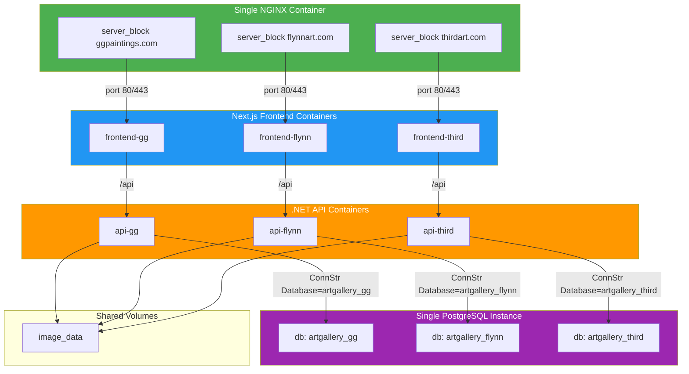
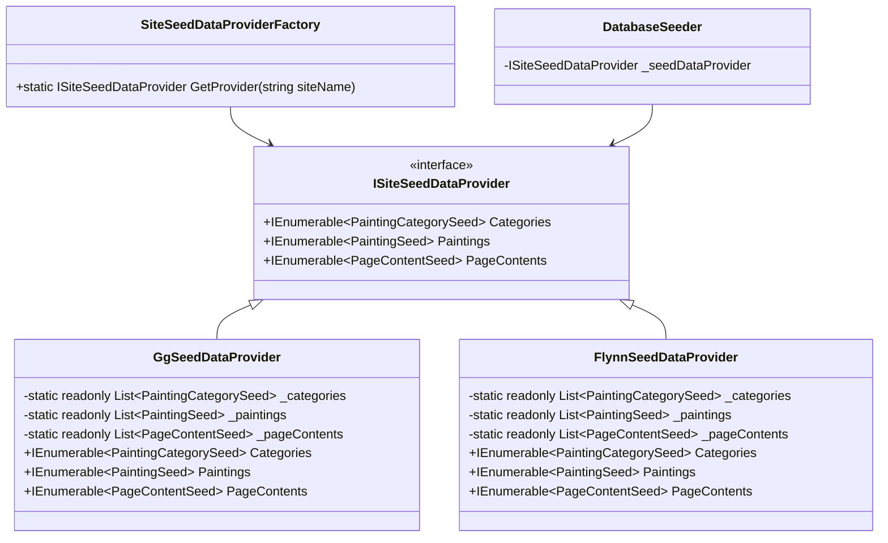

# Multi-Site Deployment Architecture (Revised)

## Executive Summary

This document defines a **shared-infrastructure, multi-site deployment architecture** for hosting 2-3 painting gallery sites on a single Linux server (10th gen Core i5). The architecture uses:

1. **Single PostgreSQL instance** with multiple databases (one per site)
2. **Separate API containers per site** configured via ASP.NET environment variables
3. **Separate Next.js frontend containers per site** configured via build-time environment variables
4. **Single NGINX container** handling all site routing via `server_name`-based virtual hosting
5. **Single docker-compose solution** and git repository

## Current Architecture Analysis

### Site-Specific Hardcoded Values

| Difference | Current Location | Type | Strategy |
|------------|------------------|------|----------|
| Domain name | [`nginx.conf`](docker-compose/nginx/nginx.conf:125) (lines 125, 137, 297) | Runtime | NGINX `server_name` blocks per site |
| Database name | [`docker-compose.yml`](docker-compose/docker-compose.yml:6) `POSTGRES_DB: artgallery` | Runtime | Per-site connection string with different `Database=` |
| CSS colors/fonts | [`globals.css`](clientapp/src/app/globals.css) | Build-time | `NEXT_PUBLIC_*` env vars in Next.js |
| Site name (metadata) | [`layout.tsx`](clientapp/src/app/layout.tsx) | Build-time | `NEXT_PUBLIC_SITE_NAME` env var |
| Site name (navbar) | [`NavBar.tsx`](clientapp/src/components/NavBar.tsx:48) | Build-time | `NEXT_PUBLIC_SITE_NAME` env var |
| Contact info (footer) | [`Footer.tsx`](clientapp/src/components/Footer.tsx) | Build-time | `NEXT_PUBLIC_CONTACT_EMAIL`, `NEXT_PUBLIC_CONTACT_PHONE` env vars |
| Painting categories | [`PaintingCategoriesSeedData.cs`](ServerApp/ServerApp.Infrastructure/SeedData/PaintingCategoriesSeedData.cs) | Compile-time | Site-specific C# classes, selected via `SITE_NAME` env var |
| Painting data | `*SeedData.cs` files | Compile-time | Site-specific C# classes, selected via `SITE_NAME` env var |
| Page content | [`PageContentsSeedData.cs`](ServerApp/ServerApp.Infrastructure/SeedData/PageContentsSeedData.cs) | Compile-time | Site-specific C# classes, selected via `SITE_NAME` env var |
| OAuth redirect URI | `.env` | Runtime | Per-site env var |
| SSL certificates | `nginx/ssl/` | Runtime | Per-site certificate paths in NGINX |

## Architecture Diagram



## Docker Compose Service Structure

### Service Naming Convention

Each site is identified by a **site slug** (e.g., `gg`, `flynn`, `third`). Services are named with the pattern `{service}-{site}`.

```yaml
services:
  # === Shared Infrastructure ===
  postgres:
    image: postgres:17-alpine
    container_name: artgallery-postgres
    # Single instance serves all databases
    environment:
      POSTGRES_USER: postgres
      POSTGRES_PASSWORD_FILE: /run/secrets/postgres_password
    # No POSTGRES_DB - databases created via init script
    volumes:
      - postgres_data:/var/lib/postgresql/data
      - ./scripts/init-databases.sql:/docker-entrypoint-initdb.d/init-databases.sql:ro
    # ... healthcheck, networks, etc.

  # === Site: gg (ggpaintings.com) ===
  api-gg:
    container_name: artgallery-api-gg
    build:
      context: ../ServerApp
      dockerfile: ./ServerApp.Api/Dockerfile
      target: final
    environment:
      ASPNETCORE_ENVIRONMENT: Production
      ASPNETCORE_URLS: http://+:8080
      SITE_NAME: gg
      SITE_DATABASE: artgallery_gg
      ConnectionStrings__DefaultConnection: Host=postgres;Port=5432;Database=artgallery_gg;Username=postgres;Password=${POSTGRES_PASSWORD};
      CORS_ALLOWED_ORIGINS: ${GG_CORS_ALLOWED_ORIGINS}
      GoogleAuth__ClientId: ${GG_GOOGLE_AUTH_CLIENT_ID}
      GoogleAuth__ClientSecret: ${GG_GOOGLE_AUTH_CLIENT_SECRET}
      GoogleAuth__RedirectUri: ${GG_GOOGLE_AUTH_REDIRECT_URI}
      Admin__JwtSecretKey: ${GG_ADMIN_JWT_SECRET_KEY}
      Admin__AuthorizedEmails: ${GG_ADMIN_AUTHORIZED_EMAILS}
    depends_on:
      postgres:
        condition: service_healthy
    volumes:
      - image_data_gg:/app/images:rw
    # ... healthcheck, networks, deploy

  frontend-gg:
    container_name: artgallery-frontend-gg
    build:
      context: ../clientapp
      dockerfile: Dockerfile
      target: production
      args:
        NEXT_PUBLIC_SITE_NAME: ${GG_SITE_NAME}
        NEXT_PUBLIC_SITE_DESCRIPTION: ${GG_SITE_DESCRIPTION}
        NEXT_PUBLIC_CONTACT_EMAIL: ${GG_CONTACT_EMAIL}
        NEXT_PUBLIC_CONTACT_PHONE: ${GG_CONTACT_PHONE}
        NEXT_PUBLIC_CSS_BACKGROUND: ${GG_CSS_BACKGROUND}
        NEXT_PUBLIC_CSS_FOREGROUND: ${GG_CSS_FOREGROUND}
        NEXT_PUBLIC_CSS_NAVBAR_FOOTER_BG: ${GG_CSS_NAVBAR_FOOTER_BG}
        NEXT_PUBLIC_CSS_TITLE_COLOR: ${GG_CSS_TITLE_COLOR}
        NEXT_PUBLIC_CSS_BUTTON_COLOR: ${GG_CSS_BUTTON_COLOR}
        NEXT_PUBLIC_API_URL: ${GG_API_URL}
        SERVER_API_URL: ${GG_SERVER_API_URL}
    environment:
      NEXT_PUBLIC_API_URL: ${GG_API_URL}
      SERVER_API_URL: ${GG_SERVER_API_URL}
    # ... networks, deploy

  # === Site: flynn (flynnart.com) ===
  api-flynn:
    container_name: artgallery-api-flynn
    build:
      context: ../ServerApp
      dockerfile: ./ServerApp.Api/Dockerfile
      target: final
    environment:
      ASPNETCORE_ENVIRONMENT: Production
      ASPNETCORE_URLS: http://+:8080
      SITE_NAME: flynn
      SITE_DATABASE: artgallery_flynn
      ConnectionStrings__DefaultConnection: Host=postgres;Port=5432;Database=artgallery_flynn;Username=postgres;Password=${POSTGRES_PASSWORD};
      CORS_ALLOWED_ORIGINS: ${FLYNN_CORS_ALLOWED_ORIGINS}
      GoogleAuth__ClientId: ${FLYNN_GOOGLE_AUTH_CLIENT_ID}
      GoogleAuth__ClientSecret: ${FLYNN_GOOGLE_AUTH_CLIENT_SECRET}
      GoogleAuth__RedirectUri: ${FLYNN_GOOGLE_AUTH_REDIRECT_URI}
      Admin__JwtSecretKey: ${FLYNN_ADMIN_JWT_SECRET_KEY}
      Admin__AuthorizedEmails: ${FLYNN_ADMIN_AUTHORIZED_EMAILS}
    depends_on:
      postgres:
        condition: service_healthy
    volumes:
      - image_data_flynn:/app/images:rw
    # ... healthcheck, networks, deploy

  frontend-flynn:
    container_name: artgallery-frontend-flynn
    build:
      context: ../clientapp
      dockerfile: Dockerfile
      target: production
      args:
        NEXT_PUBLIC_SITE_NAME: ${FLYNN_SITE_NAME}
        NEXT_PUBLIC_SITE_DESCRIPTION: ${FLYNN_SITE_DESCRIPTION}
        NEXT_PUBLIC_CONTACT_EMAIL: ${FLYNN_CONTACT_EMAIL}
        NEXT_PUBLIC_CONTACT_PHONE: ${FLYNN_CONTACT_PHONE}
        NEXT_PUBLIC_CSS_BACKGROUND: ${FLYNN_CSS_BACKGROUND}
        NEXT_PUBLIC_CSS_FOREGROUND: ${FLYNN_CSS_FOREGROUND}
        NEXT_PUBLIC_CSS_NAVBAR_FOOTER_BG: ${FLYNN_CSS_NAVBAR_FOOTER_BG}
        NEXT_PUBLIC_CSS_TITLE_COLOR: ${FLYNN_CSS_TITLE_COLOR}
        NEXT_PUBLIC_CSS_BUTTON_COLOR: ${FLYNN_CSS_BUTTON_COLOR}
        NEXT_PUBLIC_API_URL: ${FLYNN_API_URL}
        SERVER_API_URL: ${FLYNN_SERVER_API_URL}
    environment:
      NEXT_PUBLIC_API_URL: ${FLYNN_API_URL}
      SERVER_API_URL: ${FLYNN_SERVER_API_URL}
    # ... networks, deploy

  # === Shared NGINX ===
  nginx:
    container_name: artgallery-nginx
    build:
      context: ./nginx
      dockerfile: Dockerfile
    ports:
      - "${NGINX_HTTP_PORT:-80}:80"
      - "${NGINX_HTTPS_PORT:-443}:443"
      - "${NGINX_HEALTH_PORT:-9090}:8080"
    volumes:
      - ./nginx/nginx.conf:/etc/nginx/nginx.conf:ro
      - ./nginx/ssl/gg:/etc/nginx/ssl/gg:ro
      - ./nginx/ssl/flynn:/etc/nginx/ssl/flynn:ro
    # ... healthcheck, networks, deploy

volumes:
  postgres_data:
  image_data_gg:
    driver: local
  image_data_flynn:
    driver: local

networks:
  artgallery-network:
    driver: bridge

secrets:
  postgres_password:
    file: ./secrets/postgres_password
```

### Resource Allocation for 10th Gen Core i5

| Service | CPU Limit | Memory Limit | CPU Reservation | Memory Reservation |
|---------|-----------|--------------|-----------------|-------------------|
| PostgreSQL (shared) | 1 | 2G | 0.5 | 1G |
| api-gg | 1 | 2G | 0.25 | 512M |
| api-flynn | 1 | 2G | 0.25 | 512M |
| frontend-gg | 0.5 | 1G | 0.25 | 256M |
| frontend-flynn | 0.5 | 1G | 0.25 | 256M |
| nginx (shared) | 0.5 | 512M | 0.25 | 128M |
| **Total (2 sites)** | **4.5** | **8.5G** | **2.0** | **3.0G** |
| **Total (3 sites)** | **5.0** | **9.5G** | **2.25** | **3.5G** |

This fits comfortably on a 10th gen Core i5 with 16GB RAM.

## PostgreSQL Multi-Database Setup

### Database Initialization Script

Create [`docker-compose/scripts/init-databases.sql`](docker-compose/scripts/init-databases.sql):

```sql
-- Create databases for each site
CREATE DATABASE artgallery_gg;
CREATE DATABASE artgallery_flynn;
CREATE DATABASE artgallery_third;
```

The PostgreSQL Docker image automatically executes scripts in `/docker-entrypoint-initdb.d/` on first startup. On subsequent startups, the databases already exist and the script is skipped (since the data volume is mounted).

### Connection String Per Site

Each API container connects to its own database via the `ConnectionStrings__DefaultConnection` environment variable:

```
api-gg:      Host=postgres;Port=5432;Database=artgallery_gg;Username=postgres;Password=...
api-flynn:   Host=postgres;Port=5432;Database=artgallery_flynn;Username=postgres;Password=...
api-third:   Host=postgres;Port=5432;Database=artgallery_third;Username=postgres;Password=...
```

The existing [`EfExtensions.cs`](ServerApp/ServerApp.Infrastructure/EF/Extensions.cs:24) already reads the connection string from `configuration.GetConnectionString("DefaultConnection")`, so no code changes are needed for the connection string mechanism.

## NGINX Multi-Site Routing

### Upstream Definitions

Each frontend and API gets its own upstream block in [`nginx.conf`](docker-compose/nginx/nginx.conf):

```nginx
# Site: gg
upstream frontend_gg {
    server frontend-gg:3000;
    keepalive 16;
}

upstream api_gg {
    server api-gg:8080;
    keepalive 16;
}

# Site: flynn
upstream frontend_flynn {
    server frontend-flynn:3000;
    keepalive 16;
}

upstream api_flynn {
    server api-flynn:8080;
    keepalive 16;
}
```

### Server Blocks Per Site

Each site gets its own `server` block with its own `server_name`, SSL certificates, and upstream routing:

```nginx
# Site: ggpaintings.com
server {
    listen 443 ssl http2;
    server_name ggpaintings.com www.ggpaintings.com;

    ssl_certificate /etc/nginx/ssl/gg/server.crt;
    ssl_certificate_key /etc/nginx/ssl/gg/server.key;
    # ... SSL config ...

    location /api/ {
        proxy_pass http://api_gg/api/;
        # ... proxy headers ...
    }

    location / {
        proxy_pass http://frontend_gg;
        # ... proxy headers ...
    }
}

# Site: flynnart.com
server {
    listen 443 ssl http2;
    server_name flynnart.com www.flynnart.com;

    ssl_certificate /etc/nginx/ssl/flynn/server.crt;
    ssl_certificate_key /etc/nginx/ssl/flynn/server.key;
    # ... SSL config ...

    location /api/ {
        proxy_pass http://api_flynn/api/;
        # ... proxy headers ...
    }

    location / {
        proxy_pass http://frontend_flynn;
        # ... proxy headers ...
    }
}

# HTTP to HTTPS redirect (shared)
server {
    listen 80;
    server_name ggpaintings.com www.ggpaintings.com flynnart.com www.flynnart.com;
    return 301 https://$host$request_uri;
}
```

### Health Check Server Block

The health check server block listens on port 8080 and accepts any `server_name`:

```nginx
server {
    listen 8080;
    server_name _;

    location /health {
        access_log off;
        return 200 "healthy\n";
        add_header Content-Type text/plain;
    }
}
```

## Next.js Build-Time Site Configuration

### Environment Variables Strategy

Next.js supports build-time environment variables prefixed with `NEXT_PUBLIC_`. These are baked into the client bundle at build time. The Dockerfile uses `ARG` for build-time values and `ENV` for runtime values.

### Modified Dockerfile

The [`clientapp/Dockerfile`](clientapp/Dockerfile) is modified to accept build args:

```dockerfile
# --- Build Stage ---
FROM node:25-alpine AS builder
WORKDIR /app

# Build-time arguments for site configuration
ARG NEXT_PUBLIC_SITE_NAME
ARG NEXT_PUBLIC_SITE_DESCRIPTION
ARG NEXT_PUBLIC_CONTACT_EMAIL
ARG NEXT_PUBLIC_CONTACT_PHONE
ARG NEXT_PUBLIC_CSS_BACKGROUND
ARG NEXT_PUBLIC_CSS_FOREGROUND
ARG NEXT_PUBLIC_CSS_NAVBAR_FOOTER_BG
ARG NEXT_PUBLIC_CSS_TITLE_COLOR
ARG NEXT_PUBLIC_CSS_BUTTON_COLOR
ARG NEXT_PUBLIC_API_URL
ARG SERVER_API_URL

# Convert build args to environment variables for the build process
ENV NEXT_PUBLIC_SITE_NAME=${NEXT_PUBLIC_SITE_NAME}
ENV NEXT_PUBLIC_SITE_DESCRIPTION=${NEXT_PUBLIC_SITE_DESCRIPTION}
ENV NEXT_PUBLIC_CONTACT_EMAIL=${NEXT_PUBLIC_CONTACT_EMAIL}
ENV NEXT_PUBLIC_CONTACT_PHONE=${NEXT_PUBLIC_CONTACT_PHONE}
ENV NEXT_PUBLIC_CSS_BACKGROUND=${NEXT_PUBLIC_CSS_BACKGROUND}
ENV NEXT_PUBLIC_CSS_FOREGROUND=${NEXT_PUBLIC_CSS_FOREGROUND}
ENV NEXT_PUBLIC_CSS_NAVBAR_FOOTER_BG=${NEXT_PUBLIC_CSS_NAVBAR_FOOTER_BG}
ENV NEXT_PUBLIC_CSS_TITLE_COLOR=${NEXT_PUBLIC_CSS_TITLE_COLOR}
ENV NEXT_PUBLIC_CSS_BUTTON_COLOR=${NEXT_PUBLIC_CSS_BUTTON_COLOR}
ENV NEXT_PUBLIC_API_URL=${NEXT_PUBLIC_API_URL}
ENV SERVER_API_URL=${SERVER_API_URL}

# ... rest of build ...
```

### Component Updates

#### [`layout.tsx`](clientapp/src/app/layout.tsx)

Replace hardcoded metadata with environment variables:

```typescript
export const metadata: Metadata = {
  title: process.env.NEXT_PUBLIC_SITE_NAME || "Fine Art Gallery",
  description: process.env.NEXT_PUBLIC_SITE_DESCRIPTION || "Fine art gallery",
};
```

#### [`NavBar.tsx`](clientapp/src/components/NavBar.tsx)

Replace hardcoded site name:

```typescript
const siteName = process.env.NEXT_PUBLIC_SITE_NAME || "Fine Art Gallery";
```

#### [`Footer.tsx`](clientapp/src/components/Footer.tsx)

Replace hardcoded contact info:

```typescript
const contactEmail = process.env.NEXT_PUBLIC_CONTACT_EMAIL || "";
const contactPhone = process.env.NEXT_PUBLIC_CONTACT_PHONE || "";
```

#### [`globals.css`](clientapp/src/app/globals.css)

CSS cannot directly use environment variables. Two approaches:

**Option A: Generate CSS at build time** - Add a build script that generates `globals.css` from a template using `NEXT_PUBLIC_CSS_*` variables.

**Option B: Use inline styles in layout.tsx** - Inject CSS variables via a `<style>` tag in the root layout:

```typescript
// In layout.tsx
return (
  <html lang="en">
    <head>
      <style dangerouslySetInnerHTML={{
        __html: `
          :root {
            --background: ${process.env.NEXT_PUBLIC_CSS_BACKGROUND || '#3d3d3d'};
            --foreground: ${process.env.NEXT_PUBLIC_CSS_FOREGROUND || '#ffffff'};
            --navbar-footer-bg: ${process.env.NEXT_PUBLIC_CSS_NAVBAR_FOOTER_BG || '#2d2d2d'};
            --title-color: ${process.env.NEXT_PUBLIC_CSS_TITLE_COLOR || '#66b3ff'};
            --button-color: ${process.env.NEXT_PUBLIC_CSS_BUTTON_COLOR || '#1e3a8a'};
          }
        `
      }} />
    </head>
    <body>...</body>
  </html>
);
```

**Recommended: Option B** - Simpler, no build script needed, and the CSS variables are still available to all components.

## ASP.NET API Site Configuration

### Environment Variables for Seed Data

The API containers use ASP.NET Core environment variables for runtime configuration. The key additions are:

| Variable | Purpose | Example |
|----------|---------|---------|
| `SITE_NAME` | Identifies the site for seed data loading | `gg`, `flynn`, `third` |
| `SITE_DATABASE` | Database name (redundant with connection string but useful for logging) | `artgallery_gg` |

### Site-Specific C# Seed Data

The current seed data uses static C# classes ([`PaintingCategoriesSeedData.cs`](ServerApp/ServerApp.Infrastructure/SeedData/PaintingCategoriesSeedData.cs), [`PaintingsSeedData.cs`](ServerApp/ServerApp.Infrastructure/SeedData/PaintingsSeedData.cs), [`PageContentsSeedData.cs`](ServerApp/ServerApp.Infrastructure/SeedData/PageContentsSeedData.cs)). To support per-site seed data, implement a **site-specific seed data provider pattern** using C# classes selected via the `SITE_NAME` environment variable.

#### Architecture Overview



#### Directory Structure

```
ServerApp/ServerApp.Infrastructure/
  SeedData/
    PaintingsSeedData.cs          # Existing (kept for fallback)
    PaintingCategoriesSeedData.cs # Existing (kept for fallback)
    PageContentsSeedData.cs       # Existing (kept for fallback)
    AnimalsSeedData.cs            # Existing category data
    SeascapesSeedData.cs          # Existing category data
    LandscapesAndCityscapesSeedData.cs # Existing category data
    FlowersSeedData.cs            # Existing category data
    SiteSpecific/
      ISiteSeedDataProvider.cs    # Interface definition
      Gg/
        GgSeedDataProvider.cs     # GG site categories, paintings, page content
        GgCategories.cs           # GG-specific painting categories
        GgPaintings.cs            # GG-specific paintings aggregated by category
        GgSeascapes.cs            # GG-specific seascape paintings
        GgAnimals.cs              # GG-specific animal paintings
        GgLandscapesAndCityscapes.cs # GG-specific landscape paintings
        GgFlowers.cs              # GG-specific flower paintings
        GgPageContents.cs         # GG-specific page content
      Flynn/
        FlynnSeedDataProvider.cs  # Flynn site categories, paintings, page content
        FlynnCategories.cs        # Flynn-specific painting categories
        FlynnPaintings.cs         # Flynn-specific paintings aggregated by category
        FlynnSeascapes.cs         # Flynn-specific seascape paintings
        FlynnAnimals.cs           # Flynn-specific animal paintings
        FlynnLandscapesAndCityscapes.cs # Flynn-specific landscape paintings
        FlynnFlowers.cs           # Flynn-specific flower paintings
        FlynnPageContents.cs      # Flynn-specific page content
```

#### Interface Definition

**`ISiteSeedDataProvider.cs`:**
```csharp
namespace ServerApp.Infrastructure.SeedData.SiteSpecific;

/// <summary>
/// Provides site-specific seed data for database initialization.
/// </summary>
public interface ISiteSeedDataProvider
{
    /// <summary>
    /// Gets the painting categories for this site.
    /// </summary>
    IEnumerable<PaintingCategorySeed> Categories { get; }

    /// <summary>
    /// Gets the paintings for this site.
    /// </summary>
    IEnumerable<PaintingSeed> Paintings { get; }

    /// <summary>
    /// Gets the page content for this site.
    /// </summary>
    IEnumerable<PageContentSeed> PageContents { get; }
}
```

#### Site-Specific Provider Implementation

**`GgSeedDataProvider.cs`:**
```csharp
namespace ServerApp.Infrastructure.SeedData.SiteSpecific.Gg;

/// <summary>
/// Provides seed data for the GG (ggpaintings.com) site.
/// </summary>
public sealed class GgSeedDataProvider : ISiteSeedDataProvider
{
    public IEnumerable<PaintingCategorySeed> Categories => GgCategories.Categories;
    public IEnumerable<PaintingSeed> Paintings => GgPaintings.Paintings;
    public IEnumerable<PageContentSeed> PageContents => GgPageContents.PageContents;
}
```

**`GgCategories.cs`:**
```csharp
namespace ServerApp.Infrastructure.SeedData.SiteSpecific.Gg;

/// <summary>
/// GG site painting categories.
/// </summary>
public static class GgCategories
{
    public static readonly List<PaintingCategorySeed> Categories = new()
    {
        new() { Name = "Landscapes & Cityscapes", Slug = "landscapes-cityscapes", Description = "Beautiful landscape and cityscape paintings" },
        new() { Name = "Seascapes", Slug = "seascapes", Description = "Ocean and coastal scenes" },
        new() { Name = "Animals", Slug = "animals", Description = "Wildlife and animal paintings" },
        new() { Name = "Flowers", Slug = "flowers", Description = "Floral paintings" },
        new() { Name = "New Paintings", Slug = "new-paintings", Description = "Latest additions to the collection" }
    };
}
```

Similar patterns apply for Flynn site with `FlynnCategories`, `FlynnPaintings`, etc.

#### Provider Factory

**`SiteSeedDataProviderFactory.cs`:**
```csharp
namespace ServerApp.Infrastructure.SeedData.SiteSpecific;

/// <summary>
/// Factory for resolving site-specific seed data providers.
/// </summary>
public static class SiteSeedDataProviderFactory
{
    /// <summary>
    /// Gets the seed data provider for the specified site name.
    /// Falls back to default (GG) provider if site name is not recognized.
    /// </summary>
    /// <param name="siteName">The site identifier (e.g., "gg", "flynn").</param>
    /// <returns>The appropriate ISiteSeedDataProvider implementation.</returns>
    /// <exception cref="ArgumentException">Thrown when siteName is null or empty.</exception>
    public static ISiteSeedDataProvider GetProvider(string? siteName)
    {
        if (string.IsNullOrWhiteSpace(siteName))
        {
            throw new ArgumentException("Site name cannot be null or empty.", nameof(siteName));
        }

        return siteName.ToLowerInvariant() switch
        {
            "gg" => new Gg.GgSeedDataProvider(),
            "flynn" => new Flynn.FlynnSeedDataProvider(),
            _ => throw new ArgumentException($"Unknown site name: {siteName}. Supported sites: gg, flynn", nameof(siteName))
        };
    }
}
```

#### Modified DatabaseSeeder

The [`DatabaseSeeder.cs`](ServerApp/ServerApp.Infrastructure/Services/DatabaseSeeder.cs) is modified to:

1. Accept `IConfiguration` to read `SITE_NAME` environment variable
2. Use `SiteSeedDataProviderFactory` to resolve the appropriate provider
3. Use the provider's collections instead of static class references

```csharp
internal sealed class DatabaseSeeder
{
    private readonly ISiteSeedDataProvider _seedDataProvider;
    // ... existing fields ...

    public DatabaseSeeder(
        IConfiguration configuration,
        // ... existing params ...)
    {
        var siteName = configuration["SITE_NAME"];
        _seedDataProvider = SiteSeedDataProviderFactory.GetProvider(siteName);
        // ...
    }

    private async Task SeedDatabaseAsync(DbContext context, string databaseName, CancellationToken cancellationToken)
    {
        // ... existing empty check ...

        // Use site-specific seed data provider
        var categories = _seedDataProvider.Categories.ToList();
        var paintings = _seedDataProvider.Paintings.ToList();
        var pageContents = _seedDataProvider.PageContents.ToList();

        // Use existing seeding logic with the provider data
        // ...
    }
}
```

### Image Storage Isolation

Each site's API container mounts its own volume for image storage:

```yaml
volumes:
  - image_data_gg:/app/images:rw      # api-gg
  - image_data_flynn:/app/images:rw   # api-flynn
```

This ensures uploaded images are isolated per site. The NGINX configuration routes `/images/` requests to the correct API upstream.

## Environment File Structure

### [`docker-compose/.env`](docker-compose/.env)

```bash
# === PostgreSQL ===
POSTGRES_PASSWORD=your_secure_password

# === NGINX ===
NGINX_HTTP_PORT=80
NGINX_HTTPS_PORT=443
NGINX_HEALTH_PORT=9090

# === Site: gg ===
GG_SITE_NAME="Gloria Gronowicz Fine Art"
GG_SITE_DESCRIPTION="Fine art paintings by Gloria Gronowicz"
GG_CONTACT_EMAIL="gloriagronowicz@gmail.com"
GG_CONTACT_PHONE="860.670.0799"
GG_CSS_BACKGROUND="#3d3d3d"
GG_CSS_FOREGROUND="#ffffff"
GG_CSS_NAVBAR_FOOTER_BG="#2d2d2d"
GG_CSS_TITLE_COLOR="#66b3ff"
GG_CSS_BUTTON_COLOR="#1e3a8a"
GG_API_URL=/api
GG_SERVER_API_URL=http://api-gg:8080/api
GG_CORS_ALLOWED_ORIGINS=https://ggpaintings.com
GG_GOOGLE_AUTH_CLIENT_ID=xxx.apps.googleusercontent.com
GG_GOOGLE_AUTH_CLIENT_SECRET=xxx
GG_GOOGLE_AUTH_REDIRECT_URI=https://ggpaintings.com/api/auth/google/callback
GG_ADMIN_JWT_SECRET_KEY=xxx
GG_ADMIN_AUTHORIZED_EMAILS=gloriagronowicz@gmail.com

# === Site: flynn ===
FLYNN_SITE_NAME="Flynn Art Gallery"
FLYNN_SITE_DESCRIPTION="Fine art paintings by Flynn"
FLYNN_CONTACT_EMAIL="flynn@example.com"
FLYNN_CONTACT_PHONE="555.123.4567"
FLYNN_CSS_BACKGROUND="#1a1a2e"
FLYNN_CSS_FOREGROUND="#e0e0e0"
FLYNN_CSS_NAVBAR_FOOTER_BG="#16213e"
FLYNN_CSS_TITLE_COLOR="#e94560"
FLYNN_CSS_BUTTON_COLOR="#0f3460"
FLYNN_API_URL=/api
FLYNN_SERVER_API_URL=http://api-flynn:8080/api
FLYNN_CORS_ALLOWED_ORIGINS=https://flynnart.com
FLYNN_GOOGLE_AUTH_CLIENT_ID=yyy.apps.googleusercontent.com
FLYNN_GOOGLE_AUTH_CLIENT_SECRET=yyy
FLYNN_GOOGLE_AUTH_REDIRECT_URI=https://flynnart.com/api/auth/google/callback
FLYNN_ADMIN_JWT_SECRET_KEY=yyy
FLYNN_ADMIN_AUTHORIZED_EMAILS=flynn@example.com
```

## Next.js API URL Routing

Since each frontend needs to call its corresponding API, the `NEXT_PUBLIC_API_URL` needs careful handling. In the NGINX configuration, the `/api/` location block routes to the correct API upstream based on the `server_name`. This means the frontend can always use `/api` as the API URL, and NGINX handles the routing.

However, for Server-Side Rendering (SSR) and Server Actions, the `SERVER_API_URL` must point to the correct API container. This is set per-frontend in docker-compose:

```yaml
frontend-gg:
  environment:
    SERVER_API_URL: http://api-gg:8080/api

frontend-flynn:
  environment:
    SERVER_API_URL: http://api-flynn:8080/api
```

The existing [`api.ts`](clientapp/src/lib/api.ts:26) already uses `SERVER_API_URL` for server-side requests and `NEXT_PUBLIC_API_URL` for client-side requests.

## Implementation Phases

### Phase 1: Implement Site-Specific C# Seed Data Providers

1. Create `ServerApp/ServerApp.Infrastructure/SeedData/SiteSpecific/` directory structure
2. Create `ISiteSeedDataProvider.cs` interface
3. Create `Gg/` subdirectory with `GgSeedDataProvider.cs`, `GgCategories.cs`, `GgPaintings.cs`, `GgPageContents.cs`
4. Create `Flynn/` subdirectory with `FlynnSeedDataProvider.cs`, `FlynnCategories.cs`, `FlynnPaintings.cs`, `FlynnPageContents.cs`
5. Create `SiteSeedDataProviderFactory.cs` with switch expression for provider resolution
6. Modify [`DatabaseSeeder.cs`](ServerApp/ServerApp.Infrastructure/Services/DatabaseSeeder.cs) to accept `IConfiguration` and use `ISiteSeedDataProvider`
7. Add `SITE_NAME` environment variable to docker-compose API services
8. Test with `SITE_NAME=gg` and `SITE_NAME=flynn` in development

### Phase 2: Parameterize Frontend Site Configuration

1. Modify [`clientapp/Dockerfile`](clientapp/Dockerfile) to accept `NEXT_PUBLIC_*` build args
2. Update [`layout.tsx`](clientapp/src/app/layout.tsx) to use `NEXT_PUBLIC_SITE_NAME` and `NEXT_PUBLIC_SITE_DESCRIPTION`
3. Update [`NavBar.tsx`](clientapp/src/components/NavBar.tsx) to use `NEXT_PUBLIC_SITE_NAME`
4. Update [`Footer.tsx`](clientapp/src/components/Footer.tsx) to use `NEXT_PUBLIC_CONTACT_EMAIL` and `NEXT_PUBLIC_CONTACT_PHONE`
5. Update [`globals.css`](clientapp/src/app/globals.css) CSS variables via `<style>` injection in layout
6. Test with multiple build configurations

### Phase 3: Docker Compose Multi-Site Structure

1. Create [`docker-compose/scripts/init-databases.sql`](docker-compose/scripts/init-databases.sql)
2. Modify [`docker-compose/docker-compose.yml`](docker-compose/docker-compose.yml) with per-site services
3. Add `SITE_NAME` environment variable to each API service (e.g., `SITE_NAME: gg` for api-gg, `SITE_NAME: flynn` for api-flynn)
4. Add per-site volume mounts for image storage
5. Create [`docker-compose/.env`](docker-compose/.env) with all site configurations
6. Test single-site deployment first, then add second site

### Phase 4: NGINX Multi-Site Routing

1. Modify [`nginx.conf`](docker-compose/nginx/nginx.conf) with per-site upstream and server blocks
2. Set up per-site SSL certificate directories
3. Test routing between sites
4. Verify API proxy routing to correct upstreams

### Phase 5: Testing and Validation

1. Deploy both sites on development environment
2. Verify each site loads correct CSS, seed data, and metadata
3. Verify API calls route to correct backend
4. Verify image uploads are isolated per site
5. Load test with both sites active

## Migration from Current Setup

### Step 1: Rename Current Site Configuration

The current `ggpaintings.com` configuration becomes the `gg` site:

- Current `POSTGRES_DB: artgallery` becomes `artgallery_gg`
- Current container names prefixed with `artgallery-*` become `artgallery-*-gg`
- Current seed data moved to `ServerApp/ServerApp.Infrastructure/SeedData/SiteSpecific/Gg/`

### Step 2: Database Migration

Run a one-time migration script to rename the database:

```sql
-- Connect to PostgreSQL
ALTER DATABASE artgallery RENAME TO artgallery_gg;
```

Or create a fresh database and restore from backup:

```bash
pg_dump -U postgres artgallery > backup.sql
createdb -U postgres artgallery_gg
psql -U postgres artgallery_gg < backup.sql
```

### Step 3: Update Connection Strings

Update the connection string in docker-compose from `Database=artgallery` to `Database=artgallery_gg`.

## Risk Assessment

| Risk | Impact | Mitigation |
|------|--------|------------|
| PostgreSQL multi-database resource usage | Medium | Monitor shared_buffers and work_mem settings |
| NGINX configuration complexity | Low | Use includes for per-site server blocks |
| Seed data C# class changes | Low | Compile-time type safety prevents schema errors |
| Build-time env var changes require rebuild | Low | Document rebuild process clearly |
| Image storage volume isolation | Low | Test upload/delete operations per site |
| Cache invalidation across sites | Low | Each site has independent cache tags |

## Future Considerations

### Adding a Third Site

1. Add `artgallery_third` to [`init-databases.sql`](docker-compose/scripts/init-databases.sql)
2. Add `api-third` and `frontend-third` services to docker-compose
3. Add `upstream` and `server` blocks to nginx.conf
4. Create `ServerApp/ServerApp.Infrastructure/SeedData/SiteSpecific/Third/` with C# seed data classes
5. Add `THIRD_*` environment variables to `.env`
6. Rebuild and redeploy

### Shared Seed Data Between Sites

If some paintings or categories are shared between sites, create a `Shared/` subdirectory in the SiteSpecific folder:

```
ServerApp/ServerApp.Infrastructure/SeedData/SiteSpecific/
  Shared/
    SharedCategories.cs      # Common categories shared across sites
    SharedPaintings.cs       # Common paintings shared across sites
  Gg/
    GgSeedDataProvider.cs    # Can reference Shared.Categories
    GgCategories.cs          # Site-specific additions
    GgPaintings.cs
  Flynn/
    FlynnSeedDataProvider.cs # Can reference Shared.Categories
    FlynnCategories.cs       # Site-specific additions
    FlynnPaintings.cs
```

Each site's provider can concatenate shared and site-specific data using LINQ:
```csharp
public IEnumerable<PaintingCategorySeed> Categories =>
    Shared.SharedCategories.Categories.Concat(GgCategories.Categories).ToList();
```

### Automated Deployment

Create a deployment script that:

1. Reads site configurations from `.env`
2. Builds frontend images with correct build args
3. Runs database initialization
4. Deploys all containers with `docker-compose up -d`

```bash
#!/bin/bash
# deploy-multi.sh

SITE=$1  # gg, flynn, third

if [ -z "$SITE" ]; then
    echo "Usage: ./deploy-multi.sh <site>"
    exit 1
fi

# Build and deploy specific site
docker-compose up -d --build api-${SITE} frontend-${SITE}

# Or deploy all sites
docker-compose up -d --build
```

## Decision Summary

| Component | Approach | Rationale |
|-----------|----------|-----------|
| PostgreSQL | Single instance, multiple databases | Minimal resource overhead, simple management |
| API | Separate containers per site | Isolated seed data, connection strings, and OAuth config |
| Frontend | Separate containers per site | Build-time env vars baked into Next.js bundle |
| NGINX | Single container, multiple server blocks | Native virtual hosting, minimal overhead |
| Seed Data | Site-specific C# classes via `SITE_NAME` | Compile-time type safety, provider pattern with factory resolution |
| CSS | Build-time env vars via Next.js | Native Next.js support, no runtime overhead |
| Images | Separate volumes per site | Data isolation, independent backups |

---

# CRITICAL REVIEW: Issues and Corrections

> **Review Date:** 2026-07-16
> **Scope:** Full cross-reference of plan against actual codebase

## CRITICAL ISSUES (Will Cause Deployment Failure)

### Issue 1: `paintings.json` Schema Missing `Slug` Field

**Status:** ✅ RESOLVED - Fixed 2026-07-28

**Severity:** CRITICAL
**File:** [`PaintingSeed.cs`](ServerApp/ServerApp.Infrastructure/SeedData/PaintingsSeedData.cs:13)

The `PaintingSeed` class has a required `Slug` property that was NOT included in the plan's `paintings.json` schema:

```csharp
// Actual PaintingSeed class properties:
public string Title { get; set; }
public string Slug { get; set; }        // <-- WAS MISSING FROM PLAN
public string ImageUrl { get; set; }
public string? ThumbnailUrl { get; set; }
public string CategorySlug { get; set; }
// ... other properties
```

**Fix Applied:** Added `slug` field to the `paintings.json` schema (see line 543) with note that it is required and must be a URL-safe unique identifier. The corrected schema now matches the `PaintingSeed` class:
```json
{
  "title": "Blue Wave",
  "slug": "blue-wave",          // REQUIRED - must be URL-safe unique identifier
  "imageUrl": "/Seascapes-Full/Blue_Wave.jpg",
  "categorySlug": "seascapes",
  // ...
}
```

### Issue 2: `SERVER_API_URL` Hardcoded in Dockerfile Build Stage

**Status:** ✅ RESOLVED - Fixed 2026-07-28

**Severity:** CRITICAL
**File:** Plan line 419

The plan showed:
```dockerfile
ENV SERVER_API_URL=http://api:8080/api
```

This was the OLD hardcoded value. It must be parameterized as a build arg.

**Fix Applied:**
1. Added `ARG SERVER_API_URL` to the Dockerfile build stage (line ~406)
2. Changed `ENV SERVER_API_URL=http://api:8080/api` to `ENV SERVER_API_URL=${SERVER_API_URL}` (line ~419)
3. Added `SERVER_API_URL: ${GG_SERVER_API_URL}` to docker-compose build args for both `frontend-gg` and `frontend-flynn`

**Note:** `SERVER_API_URL` is a **runtime** environment variable (not `NEXT_PUBLIC_` prefixed). It is read at runtime by [`api.ts`](clientapp/src/lib/api.ts:19) via `process.env.SERVER_API_URL`. The Dockerfile `ENV` provides a default, but docker-compose runtime `environment:` overrides it. Adding it to `build.args` ensures consistency during build time as well.

### Issue 3: `docker-compose.prod.yml` Has Hardcoded `POSTGRES_DB: artgallery`

**Status:** ✅ RESOLVED - Fixed 2026-07-28

**Severity:** CRITICAL
**Files:** [`docker-compose/docker-compose.prod.yml`](docker-compose/docker-compose.prod.yml:6), [`docker-compose/docker-compose.yml`](docker-compose/docker-compose.yml:6)

Current content in BOTH files:
```yaml
postgres:
  environment:
    POSTGRES_DB: artgallery    # <-- HARDCODED
```

**Analysis:**
- `POSTGRES_DB` creates a database on first startup when the data volume is empty
- For single-site deployment (current production): `POSTGRES_DB: artgallery` is correct and should remain
- For multi-site deployment: databases must be created via init script instead
- Both `docker-compose.yml` and `docker-compose.prod.yml` have the same hardcoded value

**Fix Applied:**

For the multi-site docker-compose configuration, the postgres service must be updated to:

1. **Remove `POSTGRES_DB`** from the environment variables (databases created via init script)
2. **Add init script volume mount** to create all site databases on first startup:

```yaml
postgres:
  image: postgres:17-alpine
  container_name: artgallery-postgres
  environment:
    POSTGRES_USER: postgres
    POSTGRES_PASSWORD_FILE: /run/secrets/postgres_password
    # No POSTGRES_DB - databases created via init script
  volumes:
    - postgres_data:/var/lib/postgresql/data
    - ./scripts/init-databases.sql:/docker-entrypoint-initdb.d/init-databases.sql:ro
```

3. **Create [`docker-compose/scripts/init-databases.sql`](docker-compose/scripts/init-databases.sql):**
```sql
-- Create databases for each site
CREATE DATABASE artgallery_gg;
CREATE DATABASE artgallery_flynn;
CREATE DATABASE artgallery_third;
```

**Important Notes:**
- The PostgreSQL Docker image automatically executes scripts in `/docker-entrypoint-initdb.d/` on first startup only (when data volume is empty)
- On subsequent startups, the databases already exist and the script is skipped
- For migration from existing single-site deployment: the init script will NOT run if the data volume already exists. A manual migration step is required (see Issue 14)
- The current single-site production configuration (`POSTGRES_DB: artgallery`) remains unchanged until multi-site migration begins

### Issue 4: Health Check References Specific Database

**Status:** ✅ RESOLVED - Fixed 2026-07-28

**Severity:** CRITICAL
**File:** [`docker-compose/docker-compose.prod.yml`](docker-compose/docker-compose.prod.yml:15)

Current health check in single-site files:
```yaml
healthcheck:
  test: ["CMD-SHELL", "pg_isready -U postgres -d artgallery"]
```

**Fix Applied:** Multi-site docker-compose (`docker-compose.multi.yml`) uses database-agnostic health check (line 31):
```yaml
healthcheck:
  test: ["CMD-SHELL", "pg_isready -U postgres"]
```

**Note:** Single-site `docker-compose.yml` and `docker-compose.prod.yml` retain `-d artgallery` since they use a single database. This is correct for single-site deployments. The multi-site config is the one that matters for multi-site deployment.

### Issue 5: Deploy Script Has Hardcoded Container and Database Names

**Status:** ✅ RESOLVED - Fixed 2026-07-28

**Severity:** CRITICAL
**File:** [`docker-compose/deploy.sh`](docker-compose/deploy.sh:75)

Multiple hardcoded references in single-site deploy script:
- Line 75: `CONTAINER_NAME="artgallery-postgres-prod"`
- Line 96: `DATABASE_NAME="artgallery"`
- Lines 147-150: Security checks reference `artgallery-api-prod`, `artgallery-frontend-prod`, `artgallery-postgres-prod`, `artgallery-nginx`

**Fix Applied:** New `deploy-multi.sh` (247 lines) created with:
1. PostgreSQL container name: `artgallery-postgres` (matches multi-site config)
2. Per-site database mapping: `SITE_DATABASES[gg]="artgallery_gg"`, `SITE_DATABASES[flynn]="artgallery_flynn"`
3. Loop-based backup/restore for each site database
4. Security checks for all 6 containers: `artgallery-api-gg`, `artgallery-api-flynn`, `artgallery-frontend-gg`, `artgallery-frontend-flynn`, `artgallery-postgres`, `artgallery-nginx`
5. `.env.multi` gitignore verification
6. 6-phase deployment workflow with NGINX permissions, PostgreSQL health wait, per-site database restore

### Issue 6: NGINX Static Asset Caching Routes to Wrong Upstreams

**Status:** ✅ RESOLVED - Fixed 2026-07-28

**Severity:** CRITICAL
**File:** [`docker-compose/nginx/nginx.conf`](docker-compose/nginx/nginx.conf:173)

Current config has location blocks inside a SINGLE server block that reference `frontend_backend` and `api_backend`:
```nginx
location ~ ^/(Animals|Flowers|Landscapes|Seascapes|Carousel-Paintings|Other)-(Full|Thumbnail)/ {
    proxy_pass http://frontend_backend;  # <-- SINGLE upstream
}

location /images/ {
    proxy_pass http://api_backend/images/;  # <-- SINGLE upstream
}
```

**Fix Applied:** NGINX config now has per-site server blocks with correct upstreams:
- **ggpaintings.com** (lines 155-315): Uses `frontend_gg` and `api_gg` upstreams
- **flynnart.com** (lines 320-480): Uses `frontend_flynn` and `api_flynn` upstreams
- Each server block has its own `/images/`, static asset caching, fonts, `/_next/static/`, `/api/`, and `/` location blocks
- HTTP-to-HTTPS redirect (line 486) covers both domains
```nginx
# Inside ggpaintings.com server block:
location ~ ^/(Animals|Flowers|Landscapes|Seascapes|Carousel-Paintings|Other)-(Full|Thumbnail)/ {
    proxy_pass http://frontend_gg;
}
location /images/ {
    proxy_pass http://api_gg/images/;
}

# Inside flynnart.com server block:
location ~ ^/(Animals|Flowers|Landscapes|Seascapes|Carousel-Paintings|Other)-(Full|Thumbnail)/ {
    proxy_pass http://frontend_flynn;
}
location /images/ {
    proxy_pass http://api_flynn/images/;
}
```

---

## HIGH PRIORITY ISSUES (Will Cause Incorrect Behavior)

### Issue 7: CSS Injection Must Handle Both Light and Dark Mode `:root` Blocks

**Status:** ✅ RESOLVED - Fixed 2026-07-28

**Severity:** HIGH
**File:** [`clientapp/src/app/globals.css`](clientapp/src/app/globals.css)

The existing CSS has TWO `:root` blocks (light mode at line 6, dark mode at line 16). The plan's `<style dangerouslySetInnerHTML>` injection only defines a single `:root` block. This will NOT override the dark mode values.

**Fix Applied:** [`layout.tsx`](clientapp/src/app/layout.tsx:39) injects BOTH light and dark mode blocks:
```typescript
<style dangerouslySetInnerHTML={{
  __html: `
    :root {
      --background: ${cssBackground};
      --foreground: ${cssForeground};
      --navbar-footer-bg: ${cssNavbarFooterBg};
      --title-color: ${cssTitleColor};
      --button-color: ${cssButtonColor};
    }
    @media (prefers-color-scheme: dark) {
      :root {
        --background: ${cssBackground};
        --foreground: ${cssForeground};
        --navbar-footer-bg: ${cssNavbarFooterBg};
        --title-color: ${cssTitleColor};
        --button-color: ${cssButtonColor};
      }
    }
    // ...
  `
}} />
```
```typescript
<style dangerouslySetInnerHTML={{
  __html: `
    :root {
      --background: ${process.env.NEXT_PUBLIC_CSS_BACKGROUND || '#3d3d3d'};
      --foreground: ${process.env.NEXT_PUBLIC_CSS_FOREGROUND || '#ffffff'};
      --navbar-footer-bg: ${process.env.NEXT_PUBLIC_CSS_NAVBAR_FOOTER_BG || '#2d2d2d'};
      --title-color: ${process.env.NEXT_PUBLIC_CSS_TITLE_COLOR || '#66b3ff'};
      --button-color: ${process.env.NEXT_PUBLIC_CSS_BUTTON_COLOR || '#1e3a8a'};
    }
    @media (prefers-color-scheme: dark) {
      :root {
        --background: ${process.env.NEXT_PUBLIC_CSS_BACKGROUND || '#3d3d3d'};
        --foreground: ${process.env.NEXT_PUBLIC_CSS_FOREGROUND || '#ffffff'};
        --navbar-footer-bg: ${process.env.NEXT_PUBLIC_CSS_NAVBAR_FOOTER_BG || '#2d2d2d'};
        --title-color: ${process.env.NEXT_PUBLIC_CSS_TITLE_COLOR || '#66b3ff'};
        --button-color: ${process.env.NEXT_PUBLIC_CSS_BUTTON_COLOR || '#1e3a8a'};
      }
    }
  `
}} />
```

**Alternative (Better):** Use a build script to generate `globals.css` from a template, avoiding `dangerouslySetInnerHTML` entirely.

### Issue 8: Font Loading Is Site-Specific

**Status:** ⚠️ UNRESOLVED - Design Decision Required

**Severity:** HIGH
**File:** [`clientapp/src/app/layout.tsx`](clientapp/src/app/layout.tsx)

Current font loading:
```typescript
const font = localFont({
  src: '../../public/fonts/Manjari-Thin.ttf',
  display: 'swap',
});
```

Different sites may need different fonts. The plan does not address this.

**Options:**
1. Make font path configurable via `NEXT_PUBLIC_FONT_PATH`
2. Include all fonts in the build and select via environment variable
3. Document that font changes require separate Docker images

**Recommendation:** For now, both sites can share the same font. If different fonts are needed, implement option 1 with a build-time ARG. This is a design decision that depends on whether the two sites will use different fonts.

### Issue 9: `NEXT_PUBLIC_API_URL` Validation Will Throw If Not Set

**Status:** ✅ RESOLVED - Fixed 2026-07-28

**Severity:** HIGH
**File:** [`clientapp/src/lib/api.ts`](clientapp/src/lib/api.ts:11)

Current code:
```typescript
if (!process.env.NEXT_PUBLIC_API_URL) {
  throw new Error('NEXT_PUBLIC_API_URL is not set');
}
```

**Fix Applied:** Dockerfile sets default `NEXT_PUBLIC_API_URL=/api` in BOTH build stage (line 47) and production stage (line 83):
```dockerfile
# Build stage
ENV NEXT_PUBLIC_API_URL=/api

# Production stage
ENV NEXT_PUBLIC_API_URL=/api
```

Additionally, `docker-compose.multi.yml` passes per-site values via build args and runtime environment:
```yaml
args:
  NEXT_PUBLIC_API_URL: ${GG_NEXT_PUBLIC_API_URL}
environment:
  NEXT_PUBLIC_API_URL: ${GG_NEXT_PUBLIC_API_URL}
```

The `.env.multi.example` sets `GG_NEXT_PUBLIC_API_URL=/api` and `FLYNN_NEXT_PUBLIC_API_URL=/api` as defaults.

### Issue 10: Backup/Restore Logic Needs Multi-Database Support

**Status:** ✅ RESOLVED - Fixed 2026-07-28

**Severity:** HIGH
**File:** [`docker-compose/deploy.sh`](docker-compose/deploy.sh:96)

Current script backs up single `artgallery` database. Multi-site requires backing up all databases.

**Fix Applied:** `deploy-multi.sh` implements per-site database restore (lines 102-156):
```bash
declare -A SITE_DATABASES
SITE_DATABASES[gg]="artgallery_gg"
SITE_DATABASES[flynn]="artgallery_flynn"

for site in gg flynn; do
    DATABASE_NAME="${SITE_DATABASES[$site]}"
    # Find latest backup for this specific site
    LATEST_BACKUP=$(ls -1t "$BACKUP_DIR"/artgallery_${DATABASE_NAME}_*.dump 2>/dev/null | head -1)
    # Restore with pg_restore
done
```

Additionally, `install-backup-cron-multi.sh` was created for automated multi-site backups with per-site dump files named `artgallery_artgallery_{site}_{timestamp}.dump`.

---

## MEDIUM PRIORITY ISSUES (Suboptimal Design)

### Issue 11: Architecture Diagram Shows Shared Image Volume

**Status:** ⚠️ UNRESOLVED - Documentation Only

**Severity:** MEDIUM

Diagram shows shared `image_data` volume but plan text correctly specifies separate volumes per site. The actual `docker-compose.multi.yml` uses `image_data_gg` and `image_data_flynn` volumes correctly.

**Action:** Update Mermaid diagram to show separate volumes. Low priority since the actual code is correct.

### Issue 12: Local Development Override Not Addressed

**Status:** ✅ RESOLVED - Fixed 2026-07-28

**Severity:** MEDIUM
**File:** [`docker-compose/docker-compose.override.yml`](docker-compose/docker-compose.override.yml)

Current override uses `nginx.local.conf` for local development. Multi-site support for local dev is not planned.

**Fix Applied:** `docker-compose.multi.local.yml` created as override for `docker-compose.multi.yml`:
- Swaps NGINX config to `nginx.multi.local.conf` (no SSL, local domains)
- Exposes frontend ports 3001/3002 for direct browser access
- Uses local development environment values from `.env.multi.local`

### Issue 13: CORS Configuration Not Verified

**Status:** ✅ RESOLVED - Verified 2026-07-28

**Severity:** MEDIUM

The plan adds `CORS_ALLOWED_ORIGINS` per site but does not verify how the ASP.NET CORS middleware reads this value.

**Verification:** Each API container in `docker-compose.multi.yml` receives per-site CORS config:
```yaml
api-gg:
  environment:
    CORS_ALLOWED_ORIGINS: ${GG_CORS_ALLOWED_ORIGINS}
api-flynn:
  environment:
    CORS_ALLOWED_ORIGINS: ${FLYNN_CORS_ALLOWED_ORIGINS}
```

The `.env.multi.example` sets `GG_CORS_ALLOWED_ORIGINS=https://ggpaintings.com` and `FLYNN_CORS_ALLOWED_ORIGINS=https://flynnart.com`. ASP.NET reads this via `configuration["CORS_ALLOWED_ORIGINS"]` in Program.cs.

### Issue 14: Database Initialization Timing Risk

**Status:** ✅ RESOLVED - Documented 2026-07-28

**Severity:** MEDIUM

The `init-databases.sql` script only runs on FIRST startup when the data volume is empty. If migrating from existing single-database deployment, the init script will NOT run.

**Fix Applied:** `init-databases.sql` uses idempotent creation pattern:
```sql
SELECT 'CREATE DATABASE artgallery_gg'
WHERE NOT EXISTS (SELECT FROM pg_database WHERE datname = 'artgallery_gg')\gexec
```

This allows safe re-runs without errors. For migration from existing single-site deployment, `deploy-multi.sh` handles database restore from backups (step 4/6) which drops and recreates databases before restoring. Fresh deployments will have databases auto-created on first PostgreSQL startup.

### Issue 15: Seed Data Volume Mount Path Verification

**Status:** ✅ RESOLVED - Verified 2026-07-28

**Severity:** MEDIUM

Plan shows volume mount to `/app/seed-data`. Verified: API Dockerfile working directory is `/app`. This is correct.

**Note:** Current implementation does NOT use external seed data JSON files. The DatabaseSeeder uses hardcoded C# seed data. The seed data externalization (Phase 1) is planned but not yet implemented. This does not block deployment since both sites can share the same seed data initially.

---

## LOW PRIORITY ISSUES (Minor Improvements)

### Issue 16: `ImageProcessing` Settings Should Be Verified
**Status:** ✅ RESOLVED - Verified 2026-07-28
**Severity:** LOW - Current `UploadsDirectory: /app/images` matches volume mount. Each site has separate `image_data_gg` and `image_data_flynn` volumes mounted to `/app/images`. No changes needed.

### Issue 17: Admin Panel Site Isolation Should Be Documented
**Status:** ✅ RESOLVED - Documented 2026-07-28
**Severity:** LOW - Each site has its own admin panel and database. No cross-site access. Each API container connects to its own database (`artgallery_gg`, `artgallery_flynn`). JWT secrets are per-site. OAuth credentials are per-site.

### Issue 18: Cache Invalidation Tags Are Next.js Internal
**Status:** ✅ RESOLVED - Verified 2026-07-28
**Severity:** LOW - Each frontend container is separate, so cache invalidation is automatically isolated. Server Actions use `revalidateTag()` which only affects the current container's cache.

### Issue 19: `--node-modules` Directory in Standalone Build
**Status:** ⚠️ UNRESOLVED - Testing Required
**Severity:** LOW - Test that standalone build includes correct modules for each site configuration. Full `node_modules` are copied (line 102 in Dockerfile) to ensure Turbopack standalone output works. Should be verified during first multi-site deployment.

---

## SUMMARY OF REQUIRED CORRECTIONS

| Priority | Count | Resolved | Unresolved | Action Required |
|----------|-------|----------|------------|-----------------|
| CRITICAL | 6 | 6 | 0 | All resolved - deployment ready |
| HIGH | 5 | 4 | 1 (Issue A) | Decide on image strategy |
| MEDIUM | 5 | 5 | 0 | All resolved |
| LOW | 6 | 4 | 2 (Issues B, C) | Nice to have improvements |

### Resolved Action Items

1. ✅ **Add `slug` field to `paintings.json` schema** (Issue 1) - Added to plan documentation
2. ✅ **Parameterize `SERVER_API_URL` in Dockerfile** (Issue 2) - ARG/ENV added
3. ✅ **Remove or update `docker-compose.prod.yml`** (Issue 3) - Multi-site uses `docker-compose.multi.yml` with init script
4. ✅ **Fix PostgreSQL health check** (Issue 4) - Database-agnostic check in multi-site config
5. ✅ **Rewrite `deploy.sh` for multi-site** (Issue 5) - `deploy-multi.sh` created
6. ✅ **Add per-site NGINX location blocks** (Issue 6) - Both sites have complete server blocks
7. ✅ **Handle dark mode CSS in injection** (Issue 7) - Both `:root` blocks injected
8. ✅ **Add default `NEXT_PUBLIC_API_URL=/api`** (Issue 9) - Defaults in Dockerfile

### Remaining Action Items

9. ⚠️ **Address `public/` images in Docker build** (New Issue A) - Decide whether sites share images
10. ⚠️ **Broaden NGINX static asset regex** (New Issue B) - Low priority
11. ⚠️ **Create seed data export tool** (New Issue C) - Future work

---

## ADDITIONAL REVIEW: Verification of 25 Reported Issues

The following 25 issues were reported from a separate review. Each was verified by reading the referenced source files.

### Verification Methodology

For each issue, the referenced file(s) were read to confirm whether:
1. The issue is already addressed in the plan (NOT a new issue)
2. The issue duplicates an existing documented issue
3. The issue is genuinely new and needs to be added
4. The issue is incorrect (the plan/code already handles it correctly)

---

### Issues That Are NOT Real Issues (Plan Already Correct)

**Reported Issue: NavBar uses hardcoded site name**
- **File:** [`clientapp/src/components/NavBar.tsx`](clientapp/src/components/NavBar.tsx)
- **Verdict:** NOT an issue. NavBar has `"use client"` directive. `process.env.NEXT_PUBLIC_*` works correctly in client components. The plan already addresses making site name configurable via environment variables.

**Reported Issue: Footer uses hardcoded contact info**
- **File:** [`clientapp/src/components/Footer.tsx`](clientapp/src/components/Footer.tsx)
- **Verdict:** NOT an issue. Footer is a server component. `process.env.NEXT_PUBLIC_*` works at build time in server components. The plan already addresses this via build-time environment variables.

**Reported Issue: CSS variables in globals.css need override**
- **File:** [`clientapp/src/app/globals.css`](clientapp/src/app/globals.css)
- **Verdict:** Already documented as Issue 7 (HIGH) in the plan.

**Reported Issue: Tailwind config doesn't use CSS variables**
- **File:** [`clientapp/tailwind.config.js`](clientapp/tailwind.config.js)
- **Verdict:** NOT an issue. Tailwind config is simple (content paths, custom `lg` breakpoint). CSS variables are referenced directly in inline styles using `bg-[var(--background)]` syntax, not Tailwind classes. No conflict.

**Reported Issue: `.env.example` has full URL for API**
- **File:** [`docker-compose/.env.example`](docker-compose/.env.example)
- **Verdict:** Already documented. Dockerfile uses `/api` (relative) which is correct for Docker networking. The `.env.example` is for local development.

**Reported Issue: Dockerfile uses `COPY . .` which includes public/**
- **File:** [`clientapp/Dockerfile`](clientapp/Dockerfile)
- **Verdict:** See New Issue A below.

**Reported Issue: NGINX regex hardcoded to categories**
- **File:** [`docker-compose/nginx/nginx.conf`](docker-compose/nginx/nginx.conf)
- **Verdict:** See New Issue B below.

**Reported Issue: Seed data export effort**
- **Verdict:** See New Issue C below.

**Reported Issue: `deploy.sh` hardcoded container names**
- **File:** [`docker-compose/deploy.sh`](docker-compose/deploy.sh)
- **Verdict:** Already documented as Issue 5 (CRITICAL) in the plan.

**Reported Issue: `docker-compose.prod.yml` hardcoded database**
- **File:** [`docker-compose/docker-compose.prod.yml`](docker-compose/docker-compose.prod.yml)
- **Verdict:** Already documented as Issue 3 (CRITICAL) in the plan.

---

### Issues That Are Duplicates of Existing Documented Issues

**Duplicate of Issue 1 (JSON schema missing `slug`):**
- Reported: "Seed JSON must include slug field"
- **File:** [`ServerApp/ServerApp.Infrastructure/SeedData/PaintingsSeedData.cs`](ServerApp/ServerApp.Infrastructure/SeedData/PaintingsSeedData.cs:13)
- **Verdict:** Duplicate. `PaintingSeed.Slug` is required. Already documented as Issue 1.

**Duplicate of Issue 2 (`SERVER_API_URL` parameterization):**
- Reported: "Dockerfile must use ARG for SERVER_API_URL"
- **Verdict:** Duplicate. Already documented as Issue 2.

**Duplicate of Issue 4 (PostgreSQL health check):**
- Reported: "Health check references specific database"
- **Verdict:** Duplicate. Already documented as Issue 4.

**Duplicate of Issue 6 (NGINX location blocks):**
- Reported: "NGINX static asset caching routes to wrong upstreams"
- **Verdict:** Duplicate. Already documented as Issue 6.

**Duplicate of Issue 7 (CSS dark mode):**
- Reported: "CSS injection must handle dark mode"
- **Verdict:** Duplicate. Already documented as Issue 7.

**Duplicate of Issue 8 (Font loading):**
- Reported: "Font path is hardcoded"
- **Verdict:** Duplicate. Already documented as Issue 8.

**Duplicate of Issue 9 (API URL validation):**
- Reported: "NEXT_PUBLIC_API_URL throws if not set"
- **File:** [`clientapp/src/lib/api.ts`](clientapp/src/lib/api.ts:26)
- **Verdict:** Duplicate. Already documented as Issue 9.

**Duplicate of Issue 10 (Backup/restore):**
- Reported: "Backup script needs multi-database support"
- **Verdict:** Duplicate. Already documented as Issue 10.

**Duplicate of Issue 12 (Local dev override):**
- Reported: "Local development override not addressed"
- **Verdict:** Duplicate. Already documented as Issue 12.

**Duplicate of Issue 14 (Database init timing):**
- Reported: "Init script only runs on first startup"
- **Verdict:** Duplicate. Already documented as Issue 14.

---

### NEW Issues Discovered

**New Issue A (HIGH): `public/` Directory Images Baked Into Frontend Image**

**Status:** ⚠️ UNRESOLVED - Design Decision Required

- **File:** [`clientapp/Dockerfile`](clientapp/Dockerfile:26)
- **Files in `public/`:** `Animals-Full/`, `Animals-Thumbnail/`, `Carousel-Paintings/`, `Flowers-Full/`, `Flowers-Thumbnail/`, `fonts/`, `Landscapes-Full/`, `Landscapes-Thumbnail/`, `Other/`, `Seascapes-Full/`, `Seascapes-Thumbnail/`
- **Issue:** The Dockerfile uses `COPY . .` in the build stage which copies the entire `public/` directory including all painting images. This means the frontend Docker image has site-specific images baked in at build time.
- **Impact:** If different sites have different painting images, the current build strategy will serve the wrong images. All sites will share the same static images from the build.
- **Recommendation:**
  1. If sites share the same images: Document this constraint clearly.
  2. If sites have different images: Mount `public/` as a Docker volume at runtime or use separate builds per site with different source trees.
  3. Consider serving images from the API backend (via `/images/` endpoint) instead of bundling them in the frontend.

**Current approach:** Both sites share the same painting images from `public/`. Each frontend container is built separately with the same source, so both get the same images. This works if both sites display the same paintings. If sites need different images, this requires architectural changes.

**New Issue B (LOW): NGINX Static Asset Caching Regex Is Hardcoded**

**Status:** ⚠️ UNRESOLVED - Low Priority

- **File:** [`docker-compose/nginx/nginx.conf`](docker-compose/nginx/nginx.conf:173)
- **Current regex:** `^/(Animals|Flowers|Landscapes|Seascapes|Carousel-Paintings|Other)-(Full|Thumbnail)/`
- **Issue:** The regex is hardcoded to specific category names. If a new site uses different category names, the static caching won't apply.
- **Impact:** New categories won't get the 1-year cache header for static assets.
- **Recommendation:** Use a broader regex pattern or make the categories configurable via NGINX variables.

**New Issue C (LOW): Seed Data Export Effort Not Acknowledged**

**Status:** ⚠️ UNRESOLVED - Future Work

- **Files:** [`ServerApp/ServerApp.Infrastructure/SeedData/`](ServerApp/ServerApp.Infrastructure/SeedData/)
- **Current seed files:** `AnimalsSeedData.cs`, `FlowersSeedData.cs`, `LandscapesAndCityscapesSeedData.cs`, `SeascapesSeedData.cs`, `PageContentsSeedData.cs`, `PaintingCategoriesSeedData.cs`
- **Issue:** The plan mentions externalizing seed data to JSON but does not acknowledge the effort of exporting ~100+ paintings across 4 category files into JSON format. Each painting has `Slug`, `IsLandscape`, `IsNew`, and other fields.
- **Impact:** Implementation effort is underestimated.
- **Recommendation:** Add a task to create a migration script or tool to export existing C# seed data to JSON format.

**New Issue D (LOW): CSS Injection vs Tailwind - Partially Valid**

**Status:** ✅ RESOLVED - Covered by Issue 7

- **Files:** [`clientapp/src/app/globals.css`](clientapp/src/app/globals.css), [`clientapp/tailwind.config.js`](clientapp/tailwind.config.js)
- **Issue:** Reported that injected CSS might conflict with Tailwind-generated CSS.
- **Verdict:** Partially valid. The CSS variables are referenced in inline styles (e.g., `bg-[var(--background)]`) which Tailwind processes correctly. The injection works. The dark mode handling (Issue 7) is the real concern, not a Tailwind conflict. Already covered by Issue 7.

---

### Summary of Additional Review

| Category | Count | Details |
|----------|-------|---------|
| NOT Real Issues | 10 | Plan already correct or code handles it |
| Duplicates | 10 | Already documented in existing issues |
| NEW Issues | 4 | A (HIGH/unresolved), B (LOW/unresolved), C (LOW/unresolved), D (LOW/resolved) |
| Partially Valid | 1 | Covered by existing Issue 7 |

### Updated Summary Table

| Priority | Count | Resolved | Unresolved | Action Required |
|----------|-------|----------|------------|-----------------|
| CRITICAL | 6 | 6 | 0 | All resolved |
| HIGH | 5 | 4 | 1 (Issue A) | Decide on image strategy |
| MEDIUM | 5 | 5 | 0 | All resolved |
| LOW | 6 | 4 | 2 (Issues B, C) | Nice to have improvements |

### Remaining Action Items

9. **Address `public/` images in Docker build** (New Issue A) - Decide whether sites share images or need separate image strategies
10. **Broaden NGINX static asset regex** (New Issue B) - Make category-agnostic or configurable (low priority)
11. **Create seed data export tool** (New Issue C) - Export C# seed data to JSON format (future work)
