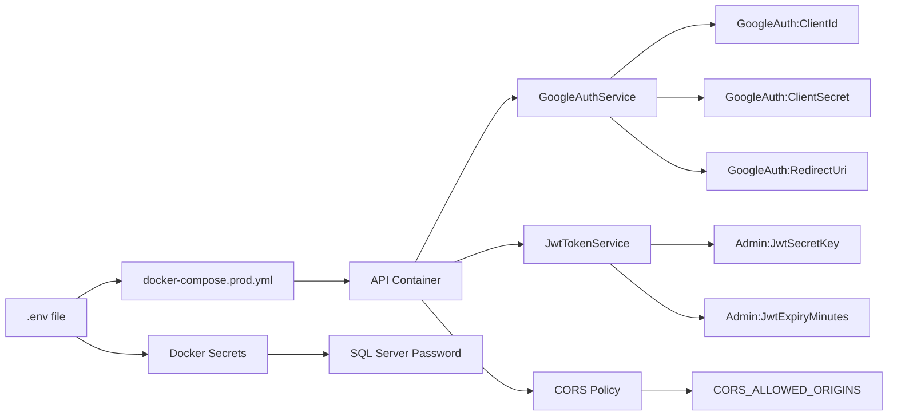

# Production Environment Setup

## Overview

This document provides the production `.env` file and deployment instructions for the Linux server.

**IMPORTANT:** When you pull code changes from GitHub, the `.env` files are NOT included (they are gitignored). You must manually create/update them on your Linux server based on the configuration keys used in the code.

---

## Code-to-Environment Variable Mapping

The following table shows every configuration key referenced in the codebase and the corresponding environment variable needed in `docker-compose/.env`:

| Code Location | Configuration Key | Docker Compose Variable | .env Variable | Required |
|--------------|-------------------|------------------------|---------------|----------|
| [`GoogleAuthService.cs:24`](ServerApp/ServerApp.Infrastructure/Services/GoogleAuthService.cs:24) | `GoogleAuth:ClientId` | `GoogleAuth__ClientId` | `GOOGLE_AUTH_CLIENT_ID` | Yes |
| [`GoogleAuthService.cs:26`](ServerApp/ServerApp.Infrastructure/Services/GoogleAuthService.cs:26) | `GoogleAuth:ClientSecret` | `GoogleAuth__ClientSecret` | `GOOGLE_AUTH_CLIENT_SECRET` | Yes |
| [`GoogleAuthService.cs:28`](ServerApp/ServerApp.Infrastructure/Services/GoogleAuthService.cs:28) | `GoogleAuth:RedirectUri` | `GoogleAuth__RedirectUri` | `GOOGLE_AUTH_REDIRECT_URI` | Yes |
| [`JwtTokenService.cs:20`](ServerApp/ServerApp.Infrastructure/Services/JwtTokenService.cs:20) | `Admin:JwtSecretKey` | `Admin__JwtSecretKey` | `ADMIN_JWT_SECRET_KEY` | Yes |
| [`JwtTokenService.cs:22`](ServerApp/ServerApp.Infrastructure/Services/JwtTokenService.cs:22) | `Admin:JwtExpiryMinutes` | `Admin__JwtExpiryMinutes` | `ADMIN_JWT_EXPIRY_MINUTES` | No (default: 60) |
| [`Program.cs:51`](ServerApp/ServerApp.Api/Program.cs:51) | `Admin:AuthorizedEmails` | `Admin__AuthorizedEmails` | `ADMIN_AUTHORIZED_EMAILS` | Yes |
| [`Program.cs:33`](ServerApp/ServerApp.Api/Program.cs:33) | `CORS_ALLOWED_ORIGINS` | `CORS_ALLOWED_ORIGINS` | `CORS_ALLOWED_ORIGINS` | Yes |
| [`EF/Extensions.cs:38`](ServerApp/ServerApp.Infrastructure/EF/Extensions.cs:38) | `ConnectionStrings:DefaultConnection` | `ConnectionStrings__DefaultConnection` | `SQLSERVER_SA_PASSWORD` | Yes |
| [`docker-compose.prod.yml:41`](docker-compose/docker-compose.prod.yml:41) | - | `GoogleAuth__ClientId` | `GOOGLE_AUTH_CLIENT_ID` | Yes |
| [`docker-compose.prod.yml:42`](docker-compose/docker-compose.prod.yml:42) | - | `GoogleAuth__ClientSecret` | `GOOGLE_AUTH_CLIENT_SECRET` | Yes |
| [`docker-compose.prod.yml:43`](docker-compose/docker-compose.prod.yml:43) | - | `GoogleAuth__RedirectUri` | `GOOGLE_AUTH_REDIRECT_URI` | Yes |
| [`docker-compose.prod.yml:44`](docker-compose/docker-compose.prod.yml:44) | - | `Admin__JwtSecretKey` | `ADMIN_JWT_SECRET_KEY` | Yes |
| [`docker-compose.prod.yml:45`](docker-compose/docker-compose.prod.yml:45) | - | `Admin__JwtExpiryMinutes` | `ADMIN_JWT_EXPIRY_MINUTES` | No |
| [`docker-compose.prod.yml:46`](docker-compose/docker-compose.prod.yml:46) | - | `Admin__AuthorizedEmails` | `ADMIN_AUTHORIZED_EMAILS` | Yes |

### Naming Convention

Docker Compose uses double underscore (`__`) to represent nested configuration sections:
- `.env` variable: `GOOGLE_AUTH_CLIENT_ID`
- Docker Compose env: `GoogleAuth__ClientId`
- .NET config key: `GoogleAuth:ClientId`

---

## File Locations

| File | Location | Purpose |
|------|----------|---------|
| `docker-compose/.env` | Docker Compose environment variables | Passed to containers at runtime |
| `docker-compose/secrets/sqlserver_sa_password` | Docker secret file | SQL Server SA password |
| `clientapp/.env.production` | Next.js production env | Built into the frontend bundle |

---

## Step 1: Create `docker-compose/.env`

Create the file at `docker-compose/.env` on your Linux server:

```bash
# ============================================================================
# Production Environment Configuration
# ============================================================================
# IMPORTANT: This file contains secrets and is gitignored.
# DO NOT commit this file to source control.
# ============================================================================

# SQL Server Configuration
# IMPORTANT: Must be 14+ characters, contain uppercase, lowercase, number, and special character
SQLSERVER_SA_PASSWORD=YOUR_SECURE_SQL_PASSWORD_HERE

# CORS Configuration
# Production domain
CORS_ALLOWED_ORIGINS=https://ggpaintings.com

# API Configuration
API_PORT=8080

# Frontend Configuration
FRONTEND_PORT=3000

# ============================================================================
# API URL Configuration
# ============================================================================
# Production: Browser accesses API via NGINX at same domain (no CORS issues)
NEXT_PUBLIC_API_URL=https://ggpaintings.com/api
SERVER_API_URL=http://api:8080/api

# ============================================================================
# Google OAuth Configuration for Admin Login
# ============================================================================
# Credentials from Google Cloud Console
GOOGLE_AUTH_CLIENT_ID=your_google_oauth_client_id_here
GOOGLE_AUTH_CLIENT_SECRET=your_google_oauth_client_secret_here
GOOGLE_AUTH_REDIRECT_URI=https://ggpaintings.com/api/auth/google/callback

# ============================================================================
# Admin Authentication Configuration
# ============================================================================
# JWT Secret Key - Generate with: openssl rand -base64 64
# Replace the value below with your own generated secret
ADMIN_JWT_SECRET_KEY=YOUR_GENERATED_JWT_SECRET_KEY_HERE
ADMIN_JWT_EXPIRY_MINUTES=60
# Comma-separated list of authorized admin email addresses
ADMIN_AUTHORIZED_EMAILS=YOUR_ADMIN_EMAIL_HERE

# ============================================================================
# NGINX Configuration (Production Only)
# ============================================================================
NGINX_HTTP_PORT=80
NGINX_HTTPS_PORT=443
NGINX_HEALTH_PORT=8080
```

---

## Step 2: Generate JWT Secret Key

Run this command on your Linux server to generate a secure JWT secret:

```bash
openssl rand -base64 64
```

Copy the output and replace `YOUR_GENERATED_JWT_SECRET_KEY_HERE` in the `.env` file.

---

## Step 3: Create SQL Server Password Secret File

```bash
# Create the secrets directory if it doesn't exist
mkdir -p docker-compose/secrets

# Write the SQL Server password to the secret file (no trailing newline)
printf '%s' 'YOUR_SECURE_SQL_PASSWORD_HERE' > docker-compose/secrets/sqlserver_sa_password

# Set restrictive permissions
chmod 600 docker-compose/secrets/sqlserver_sa_password
```

---

## Step 4: Update Authorized Admin Emails

Replace `YOUR_ADMIN_EMAIL_HERE` with the actual Google email address(es) authorized to log in as admin:

```bash
ADMIN_AUTHORIZED_EMAILS=admin@example.com,admin2@example.com
```

---

## Step 5: Verify Git Ignore

The following files are already configured to be ignored by Git:

| File | Gitignore Location |
|------|-------------------|
| `docker-compose/.env` | `docker-compose/.gitignore` line 2 |
| `docker-compose/secrets/*` | `docker-compose/.gitignore` lines 7-8 |
| `clientapp/.env*` | `clientapp/.gitignore` line 34 |
| `*.env` | Root `.gitignore` line 7 |

Verify with:

```bash
git status --ignored -- docker-compose/.env docker-compose/secrets/
```

---

## Step 6: Deploy

```bash
# Navigate to the docker-compose directory
cd docker-compose

# Pull latest images and start production stack
docker compose -f docker-compose.yml -f docker-compose.prod.yml up -d --build

# Check container status
docker compose -f docker-compose.yml -f docker-compose.prod.yml ps

# View logs
docker compose -f docker-compose.yml -f docker-compose.prod.yml logs -f
```

---

## Environment Variable Mapping

Here is how each environment variable flows from `.env` to the application:



### Variable Name Mapping

| .env Variable | Docker Compose Variable | .NET Configuration Key | Used By |
|--------------|------------------------|----------------------|---------|
| `GOOGLE_AUTH_CLIENT_ID` | `GoogleAuth__ClientId` | `GoogleAuth:ClientId` | GoogleAuthService |
| `GOOGLE_AUTH_CLIENT_SECRET` | `GoogleAuth__ClientSecret` | `GoogleAuth:ClientSecret` | GoogleAuthService |
| `GOOGLE_AUTH_REDIRECT_URI` | `GoogleAuth__RedirectUri` | `GoogleAuth:RedirectUri` | GoogleAuthService |
| `ADMIN_JWT_SECRET_KEY` | `Admin__JwtSecretKey` | `Admin:JwtSecretKey` | JwtTokenService |
| `ADMIN_JWT_EXPIRY_MINUTES` | `Admin__JwtExpiryMinutes` | `Admin:JwtExpiryMinutes` | JwtTokenService |
| `ADMIN_AUTHORIZED_EMAILS` | `Admin__AuthorizedEmails` | `Admin:AuthorizedEmails` | LoginWithGoogleHandler |
| `CORS_ALLOWED_ORIGINS` | `CORS_ALLOWED_ORIGINS` | `CORS_ALLOWED_ORIGINS` | Program.cs CORS policy |
| `SQLSERVER_SA_PASSWORD` | Connection string + Docker secret | `ConnectionStrings:DefaultConnection` | SQL Server |

---

## Troubleshooting

### OAuth Callback Fails with "redirect_uri_mismatch"

Ensure the redirect URI in Google Cloud Console exactly matches:
```
https://ggpaintings.com/api/auth/google/callback
```

### JWT Token Not Validated

Verify the JWT secret key is the same in:
1. `docker-compose/.env` - `ADMIN_JWT_SECRET_KEY`
2. Used by both `JwtTokenService` for generation and validation

### CORS Errors

Ensure `CORS_ALLOWED_ORIGINS` includes your production domain:
```
CORS_ALLOWED_ORIGINS=https://ggpaintings.com
```

### SQL Server Connection Fails

Verify:
1. `SQLSERVER_SA_PASSWORD` in `.env` matches the password in `secrets/sqlserver_sa_password`
2. SQL Server container is healthy: `docker ps | grep sql`

---

## Security Checklist

- [ ] JWT secret key is 64+ characters and randomly generated
- [ ] SQL Server password is 14+ characters with mixed complexity
- [ ] `.env` file is not committed to Git
- [ ] `secrets/sqlserver_sa_password` has `600` permissions
- [ ] Only authorized admin emails are listed
- [ ] Google OAuth client secret is not exposed in client-side code
- [ ] NGINX SSL certificates are in place at `docker-compose/nginx/ssl/`
