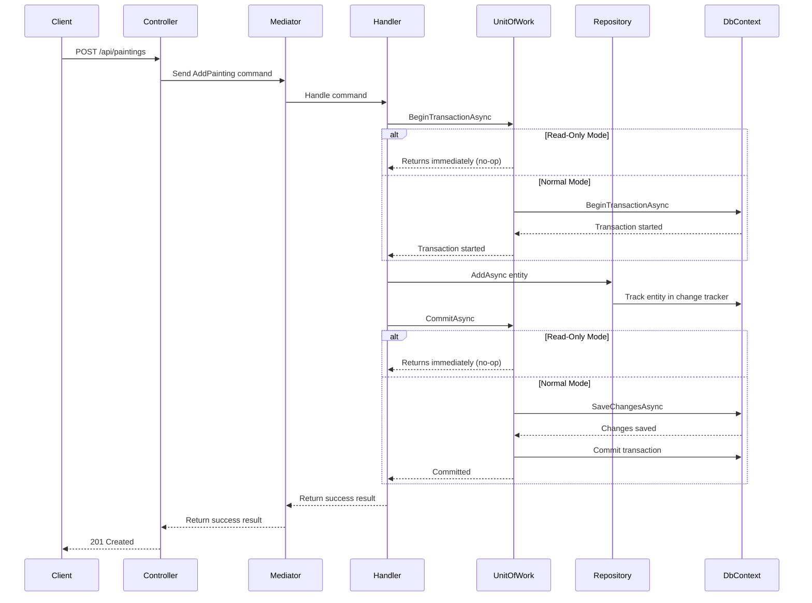
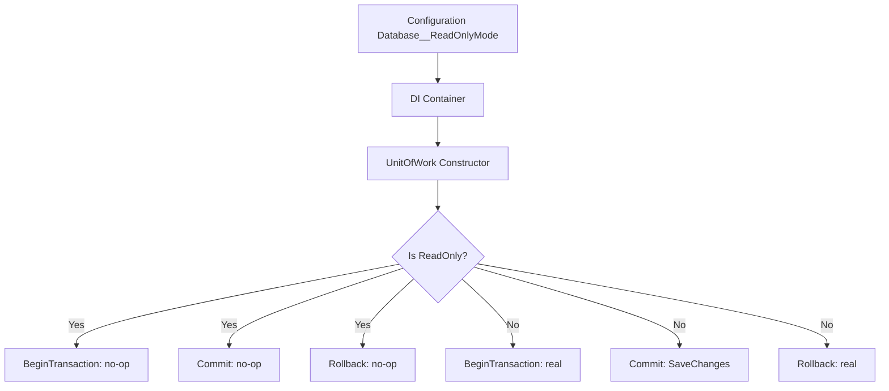

# Read-Only Mode Architecture Plan

## Overview

This plan describes the cleanest approach to disable all database-altering operations (Commands) in the CQRS architecture while still returning successful API responses. The solution uses a **no-op UnitOfWork** controlled via configuration.

## Architecture Analysis

### Current Command Flow

All command handlers follow a consistent pattern using `IUnitOfWork`:

```
Controller -> Mediator -> Command Handler -> IUnitOfWork.BeginTransaction() -> Repository Write -> IUnitOfWork.Commit()
```

**Command Handlers (13 total):**

| Handler | Return Type | Uses CommandHandlerBase |
|---------|-------------|------------------------|
| [`AddPaintingHandler`](ServerApp/ServerApp.Application/Commands/Handlers/AddPaintingHandler.cs) | `PaintingCreatedResult` | No |
| [`AddPaintingCategoryHandler`](ServerApp/ServerApp.Application/Commands/Handlers/AddPaintingCategoryHandler.cs) | `PaintingCategoryCreatedResult` | No |
| [`AddPageContentHandler`](ServerApp/ServerApp.Application/Commands/Handlers/AddPageContentHandler.cs) | `PageContentCreatedResult` | No |
| [`DeletePaintingHandler`](ServerApp/ServerApp.Application/Commands/Handlers/DeletePaintingHandler.cs) | `void` | No |
| [`DeletePaintingCategoryHandler`](ServerApp/ServerApp.Application/Commands/Handlers/DeletePaintingCategoryHandler.cs) | `void` | No |
| [`DeletePageContentHandler`](ServerApp/ServerApp.Application/Commands/Handlers/DeletePageContentHandler.cs) | `void` | No |
| [`UpdatePaintingHandler`](ServerApp/ServerApp.Application/Commands/Handlers/UpdatePaintingHandler.cs) | `CommandCompletionResponse` | Yes |
| [`UpdatePaintingCategoryHandler`](ServerApp/ServerApp.Application/Commands/Handlers/UpdatePaintingCategoryHandler.cs) | `CommandCompletionResponse` | Yes |
| [`UpdatePageContentHandler`](ServerApp/ServerApp.Application/Commands/Handlers/UpdatePageContentHandler.cs) | `CommandCompletionResponse` | Yes |
| [`UpdateAdminUserHandler`](ServerApp/ServerApp.Application/Commands/Handlers/UpdateAdminUserHandler.cs) | `CommandCompletionResponse` | Yes |
| [`AssignPaintingCategoryHandler`](ServerApp/ServerApp.Application/Commands/Handlers/AssignPaintingCategoryHandler.cs) | `CommandCompletionResponse` | Yes |
| [`ReassignPaintingsHandler`](ServerApp/ServerApp.Application/Commands/Handlers/ReassignPaintingsHandler.cs) | `CommandCompletionResponse` | Yes |
| [`LoginWithGoogleHandler`](ServerApp/ServerApp.Application/Commands/Handlers/LoginWithGoogleHandler.cs) | `GoogleAuthResponse` | No |

### Why UnitOfWork is the Best interception Point

1. **Single point of change** - All 13 command handlers use `IUnitOfWork`. Modifying the implementation affects all commands without touching handler code.
2. **No handler modifications needed** - Command handlers remain unchanged. They still execute validation, entity creation, and repository calls.
3. **Queries unaffected** - Read operations use `ReadDbContext` directly and are not impacted.
4. **Configuration-driven** - Enabled/disabled via `appsettings.json` or environment variables.
5. **Reversible** - No code changes needed to re-enable writes.

## Solution Design

### Approach: No-Op UnitOfWork

The [`UnitOfWork`](ServerApp/ServerApp.Infrastructure/Persistence/UnitOfWork.cs) implementation will check a `readOnlyMode` flag. When enabled:
- `BeginTransactionAsync()` does nothing (no transaction started)
- `CommitAsync()` does nothing (no `SaveChangesAsync` called)
- `RollbackAsync()` does nothing (no transaction to rollback)

Command handlers will still:
- Execute validation logic
- Create entity objects in memory
- Call repository methods (which add to EF change tracker)
- Return success responses with generated IDs/slugs

### Configuration

Add a new configuration section:

```json
{
  "Database": {
    "ReadOnlyMode": true
  }
}
```

Or via environment variable: `Database__ReadOnlyMode=true`

### Files to Modify

#### 1. [`UnitOfWork.cs`](ServerApp/ServerApp.Infrastructure/Persistence/UnitOfWork.cs)

Add a `readOnlyMode` field and guard all database operations:

```csharp
internal sealed class UnitOfWork : IUnitOfWork
{
    private readonly WriteDbContext _writeDbContext;
    private readonly bool _readOnlyMode;
    private IDbContextTransaction? _transaction;
    private bool _disposed;

    public UnitOfWork(WriteDbContext writeDbContext, bool readOnlyMode)
    {
        _writeDbContext = writeDbContext;
        _readOnlyMode = readOnlyMode;
    }

    public async Task BeginTransactionAsync(CancellationToken cancellationToken = default)
    {
        if (_readOnlyMode) return;  // No-op in read-only mode

        if (_transaction != null) return;
        _transaction = await _writeDbContext.Database.BeginTransactionAsync(cancellationToken);
    }

    public async Task CommitAsync(CancellationToken cancellationToken = default)
    {
        if (_readOnlyMode) return;  // No-op in read-only mode

        if (_transaction == null)
        {
            await _writeDbContext.SaveChangesAsync(cancellationToken);
            return;
        }

        await _writeDbContext.SaveChangesAsync(cancellationToken);
        await _transaction.CommitAsync(cancellationToken);
        await _transaction.DisposeAsync();
        _transaction = null;
    }

    public async Task RollbackAsync(CancellationToken cancellationToken = default)
    {
        if (_readOnlyMode) return;  // No-op in read-only mode

        if (_transaction == null) return;

        await _transaction.RollbackAsync(cancellationToken);
        await _transaction.DisposeAsync();
        _transaction = null;
    }

    // Dispose remains unchanged
}
```

#### 2. [`EF/Extensions.cs`](ServerApp/ServerApp.Infrastructure/EF/Extensions.cs)

Pass the `readOnlyMode` configuration value when registering `UnitOfWork`:

Current registration (line ~35 in [`Infrastructure/Extensions.cs`](ServerApp/ServerApp.Infrastructure/Extensions.cs)):
```csharp
services.AddScoped<IUnitOfWork, UnitOfWork>();
```

Updated registration:
```csharp
var readOnlyMode = configuration.GetValue<bool>("Database:ReadOnlyMode");
services.AddSingleton<bool>(readOnlyMode);
services.AddScoped<IUnitOfWork, UnitOfWork>();
```

The `bool` is registered as singleton since it won't change at runtime. DI will inject it into `UnitOfWork`.

### Behavior Summary

| Operation | Normal Mode | Read-Only Mode |
|-----------|-------------|----------------|
| GET endpoints (Queries) | Returns data from DB | Returns data from DB (unchanged) |
| POST/PATCH/DELETE (Commands) | Validates, writes to DB, returns success | Validates, skips DB write, returns success |
| Validation errors | Throws exception | Throws exception (validation still runs) |
| Generated IDs/slugs | Real values from entity factory | Real values from entity factory (in-memory) |
| Concurrency locking | Acquires/releases lock | Acquires/releases lock (unchanged) |
| Idempotency caching | Caches result | Caches result (unchanged) |

### Limitations

1. **Validation still runs**: If a command would fail validation (e.g., duplicate slug, missing entity), it will still throw an exception. This is intentional - the API should not pretend success for invalid operations.
2. **No actual persistence**: The returned IDs and slugs are generated in-memory but do not exist in the database. Frontend should not expect to query these entities back.
3. **LoginWithGoogleHandler**: This handler updates `LastLoginAt` and `IsActive` status. In read-only mode, these updates will be silently skipped but the JWT token will still be issued.

## Implementation Steps

1. Add `Database:ReadOnlyMode` configuration to [`appsettings.json`](ServerApp/ServerApp.Api/appsettings.json) (default `false`)
2. Modify [`UnitOfWork.cs`](ServerApp/ServerApp.Infrastructure/Persistence/UnitOfWork.cs) to accept and check `readOnlyMode`
3. Update [`EF/Extensions.cs`](ServerApp/ServerApp.Infrastructure/EF/Extensions.cs) or [`Infrastructure/Extensions.cs`](ServerApp/ServerApp.Infrastructure/Extensions.cs) to pass configuration value
4. Build and verify no compilation errors
5. Test by setting `Database__ReadOnlyMode=true` environment variable

## Mermaid Diagram





## Alternative Approaches Considered

| Approach | Pros | Cons | Verdict |
|----------|------|------|---------|
| **No-Op UnitOfWork** | Single file change, clean separation | Validation still runs | **Selected** |
| Middleware to intercept commands | Centralized | Would need to parse all command types, complex | Rejected |
| Modify each command handler | Full control | 13 files to change, error-prone | Rejected |
| No-Op write repositories | Keeps transactions working | 4 repository files to change | Rejected |
| Disable endpoints in Program.cs | Simple | Endpoints return 404, not success | Rejected |

## Rollback Instructions

To **disable** read-only mode and restore normal database writes:

### Option 1: Environment Variable (Docker)
In `docker-compose/docker-compose.prod.yml`, change or remove:
```yaml
# Change from:
Database__ReadOnlyMode: ${DATABASE_READ_ONLY_MODE:-true}
# To:
Database__ReadOnlyMode: ${DATABASE_READ_ONLY_MODE:-false}
```

Or set in `.env`:
```
DATABASE_READ_ONLY_MODE=false
```

### Option 2: Configuration Files
In both `ServerApp/ServerApp.Api/appsettings.json` and `ServerApp/ServerApp.Api/appsettings.Production.json`:
```json
"Database": {
    "ReadOnlyMode": false
}
```

### Option 3: Remove Feature Entirely
If the feature is no longer needed, revert these 3 files:

1. **[`UnitOfWork.cs`](ServerApp/ServerApp.Infrastructure/Persistence/UnitOfWork.cs)** - Remove `_readOnlyMode` field and the `if (_readOnlyMode)` guards from `BeginTransactionAsync`, `CommitAsync`, and `RollbackAsync`. Revert constructor to single `WriteDbContext` parameter.

2. **[`Extensions.cs`](ServerApp/ServerApp.Infrastructure/Extensions.cs)** - Remove `using ServerApp.Infrastructure.EF.Contexts;`, remove `readOnlyMode` variable, and revert to: `services.AddScoped<IUnitOfWork, UnitOfWork>();`

3. **[`docker-compose.prod.yml`](docker-compose/docker-compose.prod.yml)** - Remove `Database__ReadOnlyMode` environment variable line.

Then rebuild: `docker-compose -f docker-compose.prod.yml -f docker-compose.yml up -d --build`
