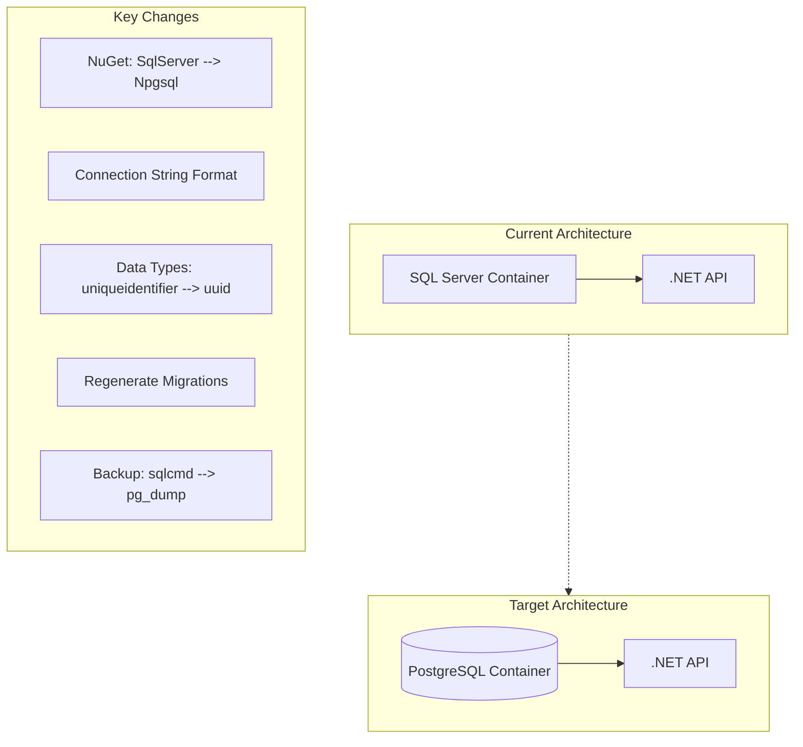

# SQL Server to PostgreSQL Migration Analysis

## Overview

This document outlines all the changes required to migrate the backend database from SQL Server to PostgreSQL. The application uses Entity Framework Core with a CQRS pattern (separate read/write DbContexts), making the migration primarily focused on the Infrastructure layer.

---

## 1. NuGet Package Changes

### File: [`ServerApp/ServerApp.Infrastructure/ServerApp.Infrastructure.csproj`](ServerApp/ServerApp.Infrastructure/ServerApp.Infrastructure.csproj:29)

| Current | Replace With |
|---------|--------------|
| `Microsoft.EntityFrameworkCore.SqlServer` (10.0.8) | `Npgsql.EntityFrameworkCore.PostgreSQL` (latest compatible with EF Core 10) |

---

## 2. EF Core Database Provider Configuration

### File: [`ServerApp/ServerApp.Infrastructure/EF/Extensions.cs`](ServerApp/ServerApp.Infrastructure/EF/Extensions.cs:42)

**Current:**
```csharp
services.AddDbContext<ReadDbContext>(ctx => ctx.UseSqlServer(connectionString));
services.AddDbContext<WriteDbContext>(ctx => ctx.UseSqlServer(connectionString));
```

**Change to:**
```csharp
services.AddDbContext<ReadDbContext>(ctx => ctx.UseNpgsql(connectionString));
services.AddDbContext<WriteDbContext>(ctx => ctx.UseNpgsql(connectionString));
```

Also consider renaming:
- Method `AddSQLServer()` -> `AddPostgreSQL()` or generic `AddDatabase()`
- Class `SQLServerOptions` -> `DatabaseOptions`
- Repository class names from `SQLServer*Repository` -> `Postgres*Repository` (optional, but cleaner)

---

## 3. Entity Configuration — Data Type Mappings

All four entity configurations use SQL Server-specific `HasColumnType()` values. These must be updated to PostgreSQL equivalents.

### Type Mapping Reference

| SQL Server Type | PostgreSQL Type | Notes |
|----------------|-----------------|-------|
| `uniqueidentifier` | `uuid` | PostgreSQL has native UUID support |
| `nvarchar(200)` | `varchar(200)` | Or `character varying(200)` |
| `nvarchar(256)` | `varchar(256)` | |
| `nvarchar(100)` | `varchar(100)` | |
| `nvarchar(50)` | `varchar(50)` | |
| `nvarchar(500)` | `varchar(500)` | |
| `nvarchar(max)` | `text` | PostgreSQL `text` has no length limit |
| `bit` | `boolean` | |
| `datetime2` | `timestamp` or `timestamptz` | Use `timestamptz` if timezone awareness is needed |
| `decimal(18, 2)` | `numeric(18, 2)` | Same concept, different name |
| `int` | `integer` | |

### Files Affected

#### [`PaintingConfiguration.cs`](ServerApp/ServerApp.Infrastructure/EF/Config/PaintingConfiguration.cs)
- Line 20: `uniqueidentifier` -> `uuid`
- Lines 26, 35, 44, 54, 63, 73: `nvarchar(...)` -> `varchar(...)`
- Lines 82, 90, 98, 116: `decimal(18, 2)` -> `numeric(18, 2)`
- Lines 107, 125, 134, 143: `bit` -> `boolean`, `int` -> `integer`
- Line 152: `uniqueidentifier` -> `uuid`

#### [`PaintingCategoryConfiguration.cs`](ServerApp/ServerApp.Infrastructure/EF/Config/PaintingCategoryConfiguration.cs)
- Line 19: `uniqueidentifier` -> `uuid`
- Lines 25, 34, 43: `nvarchar(...)` -> `varchar(...)`

#### [`AdminUserConfiguration.cs`](ServerApp/ServerApp.Infrastructure/EF/Config/AdminUserConfiguration.cs)
- Line 19: `uniqueidentifier` -> `uuid`
- Lines 25, 35, 44, 54: `nvarchar(...)` -> `varchar(...)`
- Lines 64, 73: `datetime2` -> `timestamptz`
- Line 82: `bit` -> `boolean`

#### [`PageContentConfiguration.cs`](ServerApp/ServerApp.Infrastructure/EF/Config/PageContentConfiguration.cs)
- Line 18: `uniqueidentifier` -> `uuid`
- Lines 23, 30, 39, 47: `nvarchar(...)` -> `varchar(...)` or `text`

---

## 4. Migrations — Complete Regeneration Required

All existing migrations are SQL Server-specific and **must be deleted and regenerated**:

### Files to Delete:
- [`ServerApp/ServerApp.Infrastructure/Migrations/20260402222754_InitialMigration.cs`](ServerApp/ServerApp.Infrastructure/Migrations/20260402222754_InitialMigration.cs)
- [`ServerApp/ServerApp.Infrastructure/Migrations/20260402222754_InitialMigration.Designer.cs`](ServerApp/ServerApp.Infrastructure/Migrations/20260402222754_InitialMigration.Designer.cs)
- [`ServerApp/ServerApp.Infrastructure/Migrations/20260518194137_AddAdminUser.cs`](ServerApp/ServerApp.Infrastructure/Migrations/20260518194137_AddAdminUser.cs)
- [`ServerApp/ServerApp.Infrastructure/Migrations/20260518194137_AddAdminUser.Designer.cs`](ServerApp/ServerApp.Infrastructure/Migrations/20260518194137_AddAdminUser.Designer.cs)
- [`ServerApp/ServerApp.Infrastructure/Migrations/20260522155449_AddIsCarouselPaintingToPaintingConfiguration.cs`](ServerApp/ServerApp.Infrastructure/Migrations/20260522155449_AddIsCarouselPaintingToPaintingConfiguration.cs)
- [`ServerApp/ServerApp.Infrastructure/Migrations/20260522155449_AddIsCarouselPaintingToPaintingConfiguration.Designer.cs`](ServerApp/ServerApp.Infrastructure/Migrations/20260522155449_AddIsCarouselPaintingToPaintingConfiguration.Designer.cs)
- [`ServerApp/ServerApp.Infrastructure/Migrations/20260602172350_AddPhotoUrlToPageContent.cs`](ServerApp/ServerApp.Infrastructure/Migrations/20260602172350_AddPhotoUrlToPageContent.cs)
- [`ServerApp/ServerApp.Infrastructure/Migrations/20260602172350_AddPhotoUrlToPageContent.Designer.cs`](ServerApp/ServerApp.Infrastructure/Migrations/20260602172350_AddPhotoUrlToPageContent.Designer.cs)
- [`ServerApp/ServerApp.Infrastructure/Migrations/WriteDbContextModelSnapshot.cs`](ServerApp/ServerApp.Infrastructure/Migrations/WriteDbContextModelSnapshot.cs)

### Key Changes in ModelSnapshot:
- Remove `SqlServerModelBuilderExtensions.UseIdentityColumns(modelBuilder)` call (line 23)
- All `HasColumnType("uniqueidentifier")` -> `HasColumnType("uuid")`
- All `HasColumnType("nvarchar(...)")` -> `HasColumnType("varchar(...)")`
- All `HasColumnType("bit")` -> `HasColumnType("boolean")`
- All `HasColumnType("datetime2")` -> `HasColumnType("timestamptz")`

After updating entity configurations, run:
```bash
dotnet ef migrations add InitialPostgresMigration --context WriteDbContext
```

---

## 5. Connection String Updates

### Development — [`appsettings.Development.json`](ServerApp/ServerApp.Api/appsettings.Development.json:9)

**Current:**
```json
"DefaultConnection": "Server=(localdb)\\MSSQLLocalDB;Database=ArtGallery;Trusted_Connection=True;TrustServerCertificate=True;"
```

**Change to:**
```json
"DefaultConnection": "Host=localhost;Database=artgallery;Username=postgres;Password=your_password;"
```

### Production — [`docker-compose.prod.yml`](docker-compose/docker-compose.prod.yml:42)

**Current:**
```yaml
ConnectionStrings__DefaultConnection: Server=sqlserver,1433;Database=ArtGallery;User Id=sa;Password=${SQLSERVER_SA_PASSWORD};TrustServerCertificate=True;
```

**Change to:**
```yaml
ConnectionStrings__DefaultConnection: Host=postgres;Database=artgallery;Username=postgres;Password=${POSTGRES_PASSWORD};
```

---

## 6. Docker Compose Changes

### [`docker-compose.prod.yml`](docker-compose/docker-compose.prod.yml:2)

#### Replace SQL Server service with PostgreSQL:

**Current:**
```yaml
sqlserver:
  image: mcr.microsoft.com/mssql/server:2025-latest
  container_name: artgallery-sql-prod
  environment:
    ACCEPT_EULA: "Y"
    MSSQL_SA_PASSWORD_FILE: /run/secrets/sqlserver_sa_password
    MSSQL_PID: Express
  volumes:
    - sqlserver_data:/var/opt/mssql
    - ${BACKUP_DIR:-./backups}:/var/opt/mssql/backup:ro
  secrets:
    - sqlserver_sa_password
  healthcheck:
    test: ["CMD-SHELL", "/opt/mssql-tools18/bin/sqlcmd -S localhost -U sa -P $$(cat /run/secrets/sqlserver_sa_password) -C -Q 'SELECT 1' -b -o /dev/null 2>&1 || exit 1"]
```

**Replace with:**
```yaml
postgres:
  image: postgres:17-alpine
  container_name: artgallery-postgres-prod
  environment:
    POSTGRES_DB: artgallery
    POSTGRES_USER: postgres
    POSTGRES_PASSWORD_FILE: /run/secrets/postgres_password
  volumes:
    - postgres_data:/var/lib/postgresql/data
    - ${BACKUP_DIR:-./backups}:/backups:ro
  secrets:
    - postgres_password
  healthcheck:
    test: ["CMD-SHELL", "pg_isready -U postgres -d artgallery"]
    interval: 15s
    timeout: 10s
    retries: 20
    start_period: 30s
```

#### Update API service depends_on:
```yaml
# Change from:
depends_on:
  sqlserver:
    condition: service_healthy
# To:
depends_on:
  postgres:
    condition: service_healthy
```

#### Update volumes section:
```yaml
# Change from:
volumes:
  sqlserver_data:
# To:
volumes:
  postgres_data:
```

#### Update secrets section:
```yaml
# Change from:
secrets:
  sqlserver_sa_password:
    file: ./secrets/sqlserver_sa_password
# To:
secrets:
  postgres_password:
    file: ./secrets/postgres_password
```

### [`docker-compose.yml`](docker-compose/docker-compose.yml:31)

Update volumes reference:
```yaml
# Change from:
volumes:
  sqlserver_data:
# To:
volumes:
  postgres_data:
```

### [`docker-compose/.env.example`](docker-compose/.env.example:7)

Update environment variable documentation:
```bash
# Change from:
# SQL Server Configuration
# SQLSERVER_SA_PASSWORD=ChangeMeToASecurePassword123!
# To:
# PostgreSQL Configuration
# POSTGRES_PASSWORD=ChangeMeToASecurePassword123!
```

---

## 7. Backup and Restore Scripts — Complete Rewrite

### [`docker-compose/scripts/backup.sh`](docker-compose/scripts/backup.sh)

**Current approach:** Uses `sqlcmd` to run `BACKUP DATABASE` T-SQL command inside SQL Server container, producing `.bak` files.

**New approach:** Use `pg_dump` to produce SQL dump or custom format backups.

**Key changes:**
- Replace `sqlcmd` commands with `pg_dump`
- Change container name from `artgallery-sql-prod` to `artgallery-postgres-prod`
- Change backup file extension from `.bak` to `.sql.gz` or `.dump`
- Use `pg_dump -Fc` for custom format (compressed, faster restore)

**Example backup command:**
```bash
docker exec "$CONTAINER_NAME" pg_dump -U postgres -Fc -f /tmp/$BACKUP_FILE artgallery
```

### [`docker-compose/scripts/restore.sh`](docker-compose/scripts/restore.sh)

**Current approach:** Uses `sqlcmd` with `RESTORE DATABASE` T-SQL command.

**New approach:** Use `pg_restore` for custom format or `psql` for SQL dumps.

**Key changes:**
- Replace `sqlcmd` commands with `pg_restore` or `psql`
- Remove `SINGLE_USER` / `MULTI_USER` mode switching (not needed in PostgreSQL)
- Use `pg_restore -c` to clean (drop) existing objects before restoring

**Example restore command:**
```bash
docker exec -i "$CONTAINER_NAME" pg_restore -U postgres -c -d artgallery /tmp/$FILENAME
```

### [`docker-compose/scripts/install-backup-cron.sh`](docker-compose/scripts/install-backup-cron.sh)

Update container name and backup command references.

### [`docker-compose/scripts/backup.config.example`](docker-compose/scripts/backup.config.example)

Update configuration template:
```bash
# Change from:
CONTAINER_NAME="artgallery-sql-prod"
# SQLSERVER_SA_PASSWORD=...
# To:
CONTAINER_NAME="artgallery-postgres-prod"
# POSTGRES_PASSWORD=...
```

---

## 8. AppInitializer — Check for SQL Server Specifics

### [`ServerApp/ServerApp.Infrastructure/Services/AppInitializer.cs`](ServerApp/ServerApp.Infrastructure/Services/AppInitializer.cs)

Review for any SQL Server-specific initialization logic. The `Database.Migrate()` call is provider-agnostic, but check for any raw SQL execution.

---

## 9. PostgreSQL-Specific Considerations

### UUID Generation
PostgreSQL has native `uuid` type with `gen_random_uuid()` function. Ensure EF Core Npgsql is configured to use database-generated UUIDs:

```csharp
// In DbContext OnModelCreating or entity configuration:
builder.Property(e => e.Id).HasDefaultValueSql("gen_random_uuid()");
```

Alternatively, keep client-side GUID generation (current behavior with `ValueGeneratedOnAdd()`).

### Case Sensitivity
- PostgreSQL folds unquoted identifiers to **lowercase** by default
- SQL Server is **case-insensitive** by default
- Current code uses PascalCase table/column names (e.g., `Paintings`, `ImageUrl`)
- **Option A:** Keep PascalCase with quoted identifiers (Npgsql does this by default)
- **Option B:** Use lowercase convention: `builder.ConfigureNamingConvention(new PostgresNpgsqlNameRewritingConvention())`

### String Comparison
- SQL Server: Case-insensitive by default (CI collation)
- PostgreSQL: Case-sensitive by default
- If case-insensitive queries are needed, use `ILike()` instead of `Contains()` or configure C collation with citext extension

### Sequence vs Identity
- SQL Server: `IDENTITY` columns
- PostgreSQL: `SERIAL` or `GENERATED ALWAYS AS IDENTITY`
- Current code uses GUIDs, so this is not a concern

---

## 10. Seed Data Considerations

### [`DatabaseSeeder.cs`](ServerApp/ServerApp.Infrastructure/Services/DatabaseSeeder.cs)

Review for any SQL Server-specific SQL or assumptions. The seeder uses EF Core, so it should be provider-agnostic. However, verify that GUID generation works correctly with PostgreSQL.

---

## Migration Checklist

### Phase 1: Code Changes
- [ ] Replace `Microsoft.EntityFrameworkCore.SqlServer` with `Npgsql.EntityFrameworkCore.PostgreSQL` in `.csproj`
- [ ] Update `UseSqlServer()` to `UseNpgsql()` in [`EF/Extensions.cs`](ServerApp/ServerApp.Infrastructure/EF/Extensions.cs)
- [ ] Update all `HasColumnType()` values in entity configurations:
  - [ ] [`PaintingConfiguration.cs`](ServerApp/ServerApp.Infrastructure/EF/Config/PaintingConfiguration.cs)
  - [ ] [`PaintingCategoryConfiguration.cs`](ServerApp/ServerApp.Infrastructure/EF/Config/PaintingCategoryConfiguration.cs)
  - [ ] [`AdminUserConfiguration.cs`](ServerApp/ServerApp.Infrastructure/EF/Config/AdminUserConfiguration.cs)
  - [ ] [`PageContentConfiguration.cs`](ServerApp/ServerApp.Infrastructure/EF/Config/PageContentConfiguration.cs)
- [ ] Delete existing migrations folder contents
- [ ] Generate new migrations for PostgreSQL
- [ ] Update connection strings in `appsettings.Development.json`
- [ ] Optionally rename `SQLServer*` classes to `Postgres*` or generic names

### Phase 2: Docker Changes
- [ ] Replace `sqlserver` service with `postgres` in [`docker-compose.prod.yml`](docker-compose/docker-compose.prod.yml)
- [ ] Update `depends_on` references from `sqlserver` to `postgres`
- [ ] Update volume names from `sqlserver_data` to `postgres_data`
- [ ] Update secret names from `sqlserver_sa_password` to `postgres_password`
- [ ] Update [`docker-compose.yml`](docker-compose/docker-compose.yml) volume references
- [ ] Update [`docker-compose/.env.example`](docker-compose/.env.example) with PostgreSQL variables
- [ ] Create `secrets/postgres_password` file (or update existing)

### Phase 3: Script Changes
- [ ] Rewrite [`backup.sh`](docker-compose/scripts/backup.sh) to use `pg_dump`
- [ ] Rewrite [`restore.sh`](docker-compose/scripts/restore.sh) to use `pg_restore`
- [ ] Update [`install-backup-cron.sh`](docker-compose/scripts/install-backup-cron.sh) container references
- [ ] Update [`backup.config.example`](docker-compose/scripts/backup.config.example)

### Phase 4: Testing
- [ ] Test local development with PostgreSQL container
- [ ] Test database migrations run correctly
- [ ] Test database seeder populates data correctly
- [ ] Test backup and restore scripts
- [ ] Test all CRUD operations through the API
- [ ] Verify case sensitivity behavior matches expectations

---

## Risk Assessment

| Risk | Level | Mitigation |
|------|-------|------------|
| Data type incompatibility | Low | EF Core Npgsql handles most mappings automatically |
| Case sensitivity differences | Medium | Review all queries for case-sensitive string comparisons |
| UUID generation | Low | PostgreSQL `gen_random_uuid()` is well-supported |
| Migration data loss | High | Export existing data before migration; test with copy of production data |
| Backup/restore script failure | Medium | Thoroughly test new scripts before deploying to production |
| Performance differences | Low | PostgreSQL is generally faster for read-heavy workloads |

---

## Architecture Diagram



---

## Estimated Scope

This migration affects approximately **15-20 files** across the Infrastructure layer, Docker configuration, and backup scripts. The domain and application layers remain untouched. The EF Core abstraction layer makes this migration straightforward, as the primary changes are:

1. **Provider swap** (1 NuGet package, 2 method calls)
2. **Type mappings** (4 entity configuration files)
3. **Docker service replacement** (2 docker-compose files)
4. **Script rewrite** (2 bash scripts)
5. **Migration regeneration** (delete and recreate)
