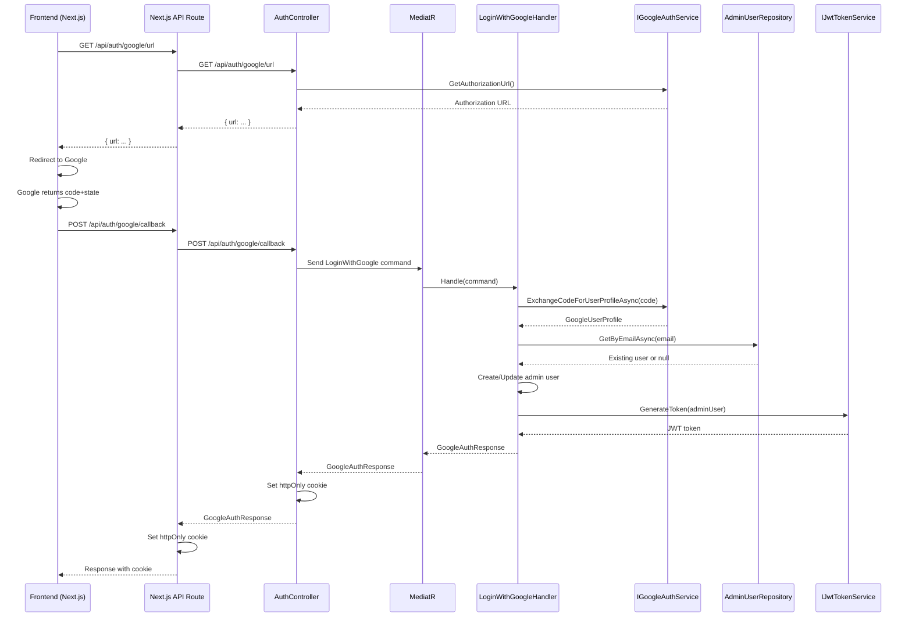

# Yahoo OAuth2 Integration Plan

## Overview

This document outlines the changes required to add Yahoo OAuth2 authentication as an additional provider alongside the existing Google OAuth2 authentication.

## CRITICAL ISSUES IDENTIFIED FROM AI RESPONSE REVIEW

The following issues were discovered when cross-referencing the AI's suggested approach against the actual codebase:

### Issue 1: AI Assumes ASP.NET Core Built-in Authentication Middleware - **WRONG**

The AI response suggests using `AddOAuth()` or `AspNet.Security.OAuth.Yahoo` NuGet package. **This project does NOT use ASP.NET Core's built-in authentication middleware at all.** The search for `AddAuthentication`, `AddGoogle`, or `AddOAuth` in the codebase returns zero results. Instead, this project implements a **custom OAuth flow** using:
- Manual HTTP calls via `HttpClient` in [`GoogleAuthService`](ServerApp/ServerApp.Infrastructure/Services/GoogleAuthService.cs:10)
- MediatR CQRS pattern for command handling
- Custom JWT token generation via [`JwtTokenService`](ServerApp/ServerApp.Infrastructure/Services/JwtTokenService.cs:13)

**Impact:** The AI's suggested approach with `AddOAuth()` is completely irrelevant. The Yahoo implementation must follow the existing custom pattern.

### Issue 2: AI Assumes NextAuth.js/Auth.js - **WRONG**

The AI suggests using `next-auth/providers/yahoo`. **This project does NOT use NextAuth.js.** The search for `next-auth`, `NextAuth`, or `@auth` returns zero results. Instead, the frontend uses:
- Custom Next.js API routes in [`/clientapp/src/app/api/auth/`](clientapp/src/app/api/auth/) that proxy to the .NET backend
- Manual `fetch()` calls in the login page
- httpOnly cookies managed by the backend

**Impact:** The Yahoo frontend implementation must follow the existing custom proxy pattern, not NextAuth.

### Issue 3: CRITICAL - `GoogleSubjectId` is NON-NULLABLE

The current [`AdminUser`](ServerApp/ServerApp.Domain/Entities/AdminUser.cs:12) entity has `GoogleSubjectId` configured as **required** (`.IsRequired()` in [`AdminUserConfiguration`](ServerApp/ServerApp.Infrastructure/EF/Config/AdminUserConfiguration.cs:55)). The initial migration creates it as `nullable: false`. **Yahoo-only users cannot be created without modifying this constraint.**

**Impact:** The `GoogleSubjectId` column MUST be made nullable before Yahoo users can be added. This is a **breaking database change** that requires a migration.

### Issue 4: Yahoo Userinfo Endpoint Discrepancy

The AI claims Yahoo supports OpenID Connect at `https://api.login.yahoo.com/openidconnect/v1/userinfo`. **This is misleading.** Yahoo's OAuth2 flow works differently:
- The token response contains a `guid` field
- User profile is fetched via: `https://social.yahooapis.com/v1/user/{guid}/profile?format=json`
- The original plan's endpoint was correct; the AI's OIDC endpoint may not be reliable

### Issue 5: Yahoo HTTPS Redirect URI Requirement

The AI correctly notes that **Yahoo requires HTTPS redirect URIs**, even in development. The current `.env.example` shows Google redirect URIs using `http://localhost` patterns. Yahoo will require either:
- A tunneling solution (ngrok, cloudflared) for local development
- Or Yahoo's local testing exception (if available)

### Issue 6: Refresh Token Handling Not Applicable

The AI discusses refresh token storage and a "provider column" pattern. **This project does NOT store or use refresh tokens.** The current implementation:
- Exchanges the OAuth code for an access token
- Fetches the user profile once
- Generates a JWT token
- Does NOT persist the OAuth access token or refresh token

**Impact:** No refresh token infrastructure is needed. The AI's discussion of this is irrelevant.

## Current Architecture

The existing Google OAuth flow follows a clean layered architecture with **custom OAuth implementation** (no built-in middleware):



### Key Components

| Layer | Component | Purpose |
|-------|-----------|---------|
| Domain | [`AdminUser`](ServerApp/ServerApp.Domain/Entities/AdminUser.cs:7) | Entity with `AdminGoogleSub` value object (**currently non-nullable**) |
| Domain | [`AdminGoogleSub`](ServerApp/ServerApp.Domain/ValueObjects/Admin/AdminGoogleSub.cs:5) | Value object for Google subject ID |
| Domain | [`IAdminUserFactory`](ServerApp/ServerApp.Domain/Factories/IAdminUserFactory.cs:6) | Factory with Google-specific `AdminGoogleSub` parameter |
| Application | [`IGoogleAuthService`](ServerApp/ServerApp.Application/Services/IGoogleAuthService.cs:3) | Interface with `GetAuthorizationUrl()` and `ExchangeCodeForUserProfileAsync()` |
| Application | [`LoginWithGoogle`](ServerApp/ServerApp.Application/Commands/LoginWithGoogle.cs:6) | Command record |
| Application | [`LoginWithGoogleHandler`](ServerApp/ServerApp.Application/Commands/Handlers/LoginWithGoogleHandler.cs:15) | Handler with email authorization check |
| Application | [`GoogleAuthRequest`](ServerApp/ServerApp.Application/DTOs/GoogleAuthRequest.cs:3) / [`GoogleAuthResponse`](ServerApp/ServerApp.Application/DTOs/GoogleAuthResponse.cs:3) | DTOs |
| Infrastructure | [`GoogleAuthService`](ServerApp/ServerApp.Infrastructure/Services/GoogleAuthService.cs:10) | **Custom** implementation with Google-specific URLs (no middleware) |
| Infrastructure | [`JwtTokenService`](ServerApp/ServerApp.Infrastructure/Services/JwtTokenService.cs:13) | Custom JWT generation (no ASP.NET auth middleware) |
| API | [`AuthController`](ServerApp/ServerApp.Api/Controllers/AuthController.cs:15) | Endpoints for `/google/url` and `/google/callback` |
| Frontend | [`login/page.tsx`](clientapp/src/app/(admin)/admin/login/page.tsx:20) | Login page with Google button |
| Frontend | [`route.ts`](clientapp/src/app/api/auth/google/callback/route.ts:7) | Next.js API route proxying to backend |

## Design Approach

**Recommended: Parallel Implementation Pattern**

Rather than abstracting the existing Google implementation, we will add Yahoo as a parallel implementation. This approach:
- Minimizes risk to existing working code
- Follows the existing codebase patterns
- Keeps Google and Yahoo implementations independent
- Allows future abstraction if a third provider is needed

## Yahoo OAuth2 Endpoints

| Purpose | URL |
|---------|-----|
| Authorization | `https://api.login.yahoo.com/oauth2/request_auth` |
| Token Exchange | `https://api.login.yahoo.com/oauth2/get_token` |
| User Info | `https://social.yahooapis.com/v1/user/{guid}/profile?format=json` |

Yahoo returns a `guid` (unique user identifier) in the token response, which is then used to fetch the user profile. The profile contains `email`, `givenName`, `familyName`, and `image`.

**IMPORTANT:** Yahoo requires HTTPS redirect URIs. For local development, a tunneling solution (ngrok, cloudflared) will be needed.

## Required Changes

### Phase 1: Backend - Domain Layer

#### 1.1 Make `GoogleSubjectId` Nullable - **CRITICAL PREREQUISITE**

**Modify:** [`AdminUser`](ServerApp/ServerApp.Domain/Entities/AdminUser.cs:12)

Change `GoogleSubjectId` from non-nullable to nullable. Currently it is defined as:
```csharp
public AdminGoogleSub GoogleSubjectId { get; private set; } = default!;
```

Change to:
```csharp
public AdminGoogleSub? GoogleSubjectId { get; private set; }
```

**Modify:** [`AdminUserConfiguration`](ServerApp/ServerApp.Infrastructure/EF/Config/AdminUserConfiguration.cs:55)

Change from `.IsRequired()` to `.IsRequired(false)`:
```csharp
// Line 55: .IsRequired()  ->  .IsRequired(false)
```

Also add nullable conversion for the property (similar to `PictureUrl` pattern on line 47):
```csharp
builder.Property(e => e.GoogleSubjectId)
    .HasColumnName("GoogleSubjectId")
    .HasColumnType("varchar(100)")
    .IsRequired(false)
    .HasConversion(
        new ValueConverter<AdminGoogleSub?, string?>(
            v => v == null ? null : v.Value,
            v => v == null ? null : new AdminGoogleSub(v)));
```

**Generate new EF migration:** This creates a migration that alters the `GoogleSubjectId` column to allow NULL values. This is a **non-breaking change** since existing Google users already have values in this column.

#### 1.2 Add `AdminYahooGuid` Value Object

**New file:** `ServerApp/ServerApp.Domain/ValueObjects/Admin/AdminYahooGuid.cs`

```csharp
namespace ServerApp.Domain.ValueObjects.Admin;

using ServerApp.Shared.Domain;

public record AdminYahooGuid : StringValueObject
{
    public const int MaxLength = 100;

    public AdminYahooGuid() : base() { }

    public AdminYahooGuid(string value) : base(value, MaxLength) { }

    public static implicit operator AdminYahooGuid(string yahooGuid) => new(yahooGuid);
}
```

#### 1.3 Update `AdminUser` Entity

**Modify:** [`AdminUser`](ServerApp/ServerApp.Domain/Entities/AdminUser.cs:7)

Add nullable `AdminYahooGuid` property:
```csharp
public AdminYahooGuid? YahooGuid { get; private set; }
```

Update constructor to accept optional provider identifiers:
```csharp
internal AdminUser(AdminID id, AdminEmail email, AdminName displayName,
    AdminPictureUrl? pictureUrl, AdminGoogleSub? googleSubjectId = null,
    AdminYahooGuid? yahooGuid = null)
{
    Id = id.Value;
    Email = email;
    DisplayName = displayName;
    PictureUrl = pictureUrl;
    GoogleSubjectId = googleSubjectId;
    YahooGuid = yahooGuid;
    // ... rest unchanged
}
```

#### 1.4 Update `IAdminUserFactory` and `AdminUserFactory`

**Modify:** [`IAdminUserFactory`](ServerApp/ServerApp.Domain/Factories/IAdminUserFactory.cs:6)

Update `Create` method signature:
```csharp
AdminUser Create(
    AdminEmail email,
    AdminName displayName,
    AdminPictureUrl? pictureUrl,
    AdminGoogleSub? googleSubjectId = null,
    AdminYahooGuid? yahooGuid = null);
```

**Modify:** [`AdminUserFactory`](ServerApp/ServerApp.Domain/Factories/AdminUserFactory.cs:6)

Update implementation to pass both provider identifiers to constructor.

### Phase 2: Backend - Application Layer

#### 2.1 Create `IYahooAuthService` Interface

**New file:** `ServerApp/ServerApp.Application/Services/IYahooAuthService.cs`

```csharp
namespace ServerApp.Application.Services;

public interface IYahooAuthService
{
    string GetAuthorizationUrl();
    Task<YahooUserProfile?> ExchangeCodeForUserProfileAsync(string code);
}

public record YahooUserProfile(
    string Email,
    string DisplayName,
    string? PictureUrl,
    string YahooGuid);
```

#### 2.2 Create `LoginWithYahoo` Command

**New file:** `ServerApp/ServerApp.Application/Commands/LoginWithYahoo.cs`

```csharp
namespace ServerApp.Application.Commands;

using MediatR;
using ServerApp.Application.DTOs;

public record LoginWithYahoo(
    string Code,
    string State
) : IRequest<GoogleAuthResponse>;  // Reuse existing response type
```

#### 2.3 Create `LoginWithYahooHandler`

**New file:** `ServerApp/ServerApp.Application/Commands/Handlers/LoginWithYahooHandler.cs`

Mirrors [`LoginWithGoogleHandler`](ServerApp/ServerApp.Application/Commands/Handlers/LoginWithGoogleHandler.cs:15) but uses `IYahooAuthService` and `YahooGuid`.

Key differences from Google handler:
- Uses `_yahooAuthService` instead of `_googleAuthService`
- Creates `AdminYahooGuid` instead of `AdminGoogleSub`
- Sets `GoogleSubjectId` to null (or empty) for Yahoo users

### Phase 3: Backend - Infrastructure Layer

#### 3.1 Create `YahooAuthService` Implementation

**New file:** `ServerApp/ServerApp.Infrastructure/Services/YahooAuthService.cs`

Implements `IYahooAuthService` with Yahoo-specific OAuth2 flow:

1. `GetAuthorizationUrl()` - Builds Yahoo authorization URL with client_id, redirect_uri, scope, and state
2. `ExchangeCodeForUserProfileAsync(code)`:
   - Exchange code for access token at Yahoo token endpoint
   - Extract `guid` from token response
   - Fetch user profile using GUID
   - Map Yahoo profile fields to `YahooUserProfile` record

#### 3.2 Register Yahoo Service in DI Container

**Modify:** [`InfrastructureExtensions`](ServerApp/ServerApp.Infrastructure/Extensions.cs:59)

Add registration alongside Google service:

```csharp
services.AddScoped<IYahooAuthService, YahooAuthService>();
```

#### 3.3 Add EF Migration for YahooGuid Column

Generate new migration to add nullable `YahooGuid` column to `AdminUsers` table.

**Modify:** [`AdminUserConfiguration`](ServerApp/ServerApp.Infrastructure/EF/Config/AdminUserConfiguration.cs:11)

Add configuration for `YahooGuid` property.

### Phase 4: Backend - API Layer

#### 4.1 Update `AuthController`

**Modify:** [`AuthController`](ServerApp/ServerApp.Api/Controllers/AuthController.cs:15)

Add Yahoo-specific endpoints:

```csharp
[HttpGet("yahoo/url")]
public ActionResult<Dictionary<string, string>> GetYahooAuthorizationUrl()

[HttpPost("yahoo/callback")]
public async Task<ActionResult<GoogleAuthResponse>> LoginWithYahoo([FromBody] GoogleAuthRequest request)
```

Inject `IYahooAuthService` into constructor.

### Phase 5: Frontend

#### 5.1 Update Login Page

**Modify:** [`login/page.tsx`](clientapp/src/app/(admin)/admin/login/page.tsx:48)

Add Yahoo login button alongside Google button:
- `handleYahooLogin()` function calling `/api/auth/yahoo/url`
- Yahoo callback handling in `useEffect`
- Yahoo-branded button with appropriate icon

#### 5.2 Create Yahoo Callback API Route

**New file:** `clientapp/src/app/api/auth/yahoo/callback/route.ts`

Mirrors [`google/callback/route.ts`](clientapp/src/app/api/auth/google/callback/route.ts:7) but proxies to `/auth/yahoo/callback`.

#### 5.3 Update API Service Functions

**Modify:** `clientapp/src/lib/api.ts`

Add `yahooAuthUrl()` and `yahooAuthCallback()` functions mirroring existing Google functions.

### Phase 6: Configuration

#### 6.1 Environment Variables

Add to `docker-compose/.env.example`:

```env
YahooAuth__ClientId=your_yahoo_client_id
YahooAuth__ClientSecret=your_yahoo_client_secret
YahooAuth__RedirectUri=http://localhost:5000/api/auth/yahoo/callback
```

#### 6.2 AppSettings

Add to `ServerApp/ServerApp.Api/appsettings.Development.json`:

```json
"YahooAuth": {
    "ClientId": "",
    "ClientSecret": "",
    "RedirectUri": "http://localhost:5000/api/auth/yahoo/callback"
}
```

## Files Summary

### New Files
| File | Layer | Description |
|------|-------|-------------|
| `ServerApp/ServerApp.Domain/ValueObjects/Admin/AdminYahooGuid.cs` | Domain | Value object for Yahoo GUID |
| `ServerApp/ServerApp.Application/Services/IYahooAuthService.cs` | Application | Yahoo auth service interface |
| `ServerApp/ServerApp.Application/Commands/LoginWithYahoo.cs` | Application | Yahoo login command |
| `ServerApp/ServerApp.Application/Commands/Handlers/LoginWithYahooHandler.cs` | Application | Yahoo login handler |
| `ServerApp/ServerApp.Infrastructure/Services/YahooAuthService.cs` | Infrastructure | Yahoo OAuth2 implementation |
| `clientapp/src/app/api/auth/yahoo/url/route.ts` | Frontend | Next.js API route for Yahoo auth URL |
| `clientapp/src/app/api/auth/yahoo/callback/route.ts` | Frontend | Next.js API route for Yahoo callback |

### Modified Files
| File | Layer | Change |
|------|-------|--------|
| `ServerApp/ServerApp.Domain/Entities/AdminUser.cs` | Domain | Make `GoogleSubjectId` nullable, add `YahooGuid` property |
| `ServerApp/ServerApp.Domain/Factories/IAdminUserFactory.cs` | Domain | Make `googleSubjectId` optional, add `yahooGuid` parameter |
| `ServerApp/ServerApp.Domain/Factories/AdminUserFactory.cs` | Domain | Update `Create` method with optional provider IDs |
| `ServerApp/ServerApp.Infrastructure/Extensions.cs` | Infrastructure | Register `IYahooAuthService` |
| `ServerApp/ServerApp.Infrastructure/EF/Config/AdminUserConfiguration.cs` | Infrastructure | Make `GoogleSubjectId` nullable, add `YahooGuid` column config |
| `ServerApp/ServerApp.Api/Controllers/AuthController.cs` | API | Add Yahoo endpoints, inject `IYahooAuthService` |
| `clientapp/src/app/(admin)/admin/login/page.tsx` | Frontend | Add Yahoo login button and callback handling |
| `clientapp/src/lib/api.ts` | Frontend | Add Yahoo API functions |
| `docker-compose/.env.example` | Config | Add Yahoo env vars |
| `ServerApp/ServerApp.Api/appsettings.Development.json` | Config | Add Yahoo config section |

## Risk Assessment

| Risk | Level | Mitigation |
|------|-------|------------|
| Breaking existing Google auth | **Medium** | Making `GoogleSubjectId` nullable affects existing entity. All existing Google users have values, but the factory and handler need careful testing. |
| Yahoo API changes | Medium | Yahoo OAuth2 is stable; abstracted behind interface |
| Email authorization conflict | Low | Same `_authorizedEmails` list used for both providers |
| Database migration downtime | **Medium** | Two migrations needed: (1) Make `GoogleSubjectId` nullable, (2) Add `YahooGuid` column. Both are non-breaking but require careful ordering. |
| Yahoo HTTPS redirect URI | **High** | Yahoo requires HTTPS for redirect URIs. Local development requires tunneling (ngrok/cloudflared). This is a blocker for local testing. |

## AI Response Evaluation

### What the AI Got RIGHT

1. **Parallel implementation approach** - Correctly identified that Yahoo should be added as a parallel provider, not replacing Google.
2. **Yahoo OAuth2 endpoints** - Correctly identified the authorization and token endpoints.
3. **HTTPS redirect URI requirement** - Correctly flagged that Yahoo requires HTTPS, which is a real constraint.
4. **Scopes differ from Google** - Correctly noted that Yahoo scope names and available data differ.
5. **Account linking logic** - Correctly identified that email-based matching is the key linking strategy.

### What the AI Got WRONG or MISLEADING

1. **Assumed ASP.NET Core Authentication Middleware** - The AI suggested using `AddOAuth()` or `AspNet.Security.OAuth.Yahoo`. This project uses a **custom OAuth implementation** with manual `HttpClient` calls, MediatR CQRS, and custom JWT generation. The AI's middleware-based approach is completely irrelevant.

2. **Assumed NextAuth.js** - The AI suggested using `next-auth/providers/yahoo`. This project uses **custom Next.js API routes** that proxy to the .NET backend, with manual `fetch()` calls and httpOnly cookie management. No NextAuth.js is used.

3. **Missed the `GoogleSubjectId` non-nullable constraint** - The AI did not identify that `GoogleSubjectId` is currently `.IsRequired()` in the EF configuration. This is the **most critical prerequisite** for adding Yahoo users, since Yahoo-only users would have a NULL `GoogleSubjectId`.

4. **Missed the Yahoo URL API route** - The AI only mentioned the callback route. The existing architecture also has a `/api/auth/google/url` route that needs a Yahoo counterpart.

5. **Refresh token discussion is irrelevant** - The AI discussed refresh token storage and a "provider column" pattern. This project does NOT store OAuth refresh tokens at all. The flow is: exchange code → get profile → generate JWT → done.

6. **Userinfo endpoint discrepancy** - The AI mentioned `https://api.login.yahoo.com/openidconnect/v1/userinfo` as the userinfo endpoint. Yahoo's OAuth2 flow actually returns a `guid` in the token response, and the profile is fetched via `https://social.yahooapis.com/v1/user/{guid}/profile?format=json`. The OIDC endpoint may not be reliable.

### What the AI MISSED ENTIRELY

1. **EF Migration requirements** - No mention of the database migrations needed to make `GoogleSubjectId` nullable and add `YahooGuid` column.
2. **Domain layer changes** - No mention of the `AdminUser` entity changes, factory updates, or value object creation.
3. **MediatR command/handler pattern** - No mention of the CQRS pattern used for authentication commands.
4. **Environment variable configuration** - No mention of the `.env.example` and `appsettings.Development.json` updates.
5. **Custom JWT token generation** - No mention of how JWT tokens are generated and validated in this project.

## Yahoo OAuth2 Registration Steps

1. Go to [Yahoo Developer Network](https://developer.yahoo.com/)
2. Create a new app or use existing app
3. Configure OAuth2 permissions for `profile` and `email` scopes
4. Set redirect URI to match your backend callback URL
5. Copy Client ID and Client Secret to environment configuration

## Testing Strategy

1. **Unit Tests:** Test `YahooAuthService` with mocked HTTP client
2. **Integration Tests:** Test full OAuth flow with Yahoo sandbox environment
3. **E2E Tests:** Test login page with both Google and Yahoo buttons
4. **Regression Tests:** Verify Google auth still works after changes

## Future Considerations

If a third provider (e.g., Microsoft, Apple) is added in the future, consider abstracting the auth service into a provider-generic interface:

```csharp
public interface IOAuthService
{
    string ProviderName { get; }
    string GetAuthorizationUrl();
    Task<OAuthUserProfile?> ExchangeCodeForUserProfileAsync(string code);
}

public record OAuthUserProfile(
    string Email,
    string DisplayName,
    string? PictureUrl,
    string ProviderSubjectId,
    string ProviderName);
```

This would allow a single `LoginWithOAuth` command and handler that accepts a provider identifier.
